Hello! I am [Bérénice](http://bebatut.fr/), the author of following slides.

<small>
This slide does not exist in original deck. It is useful if you are not familiar with [Reveal.JS](https://github.com/hakimel/reveal.js), used here.
</small>

The easiest way to navigate this slide deck is by hitting `[space]`on your keyboard.

---

### Reductive genome evolution of bacterial genomes

*in silico* evolution experiments  and comparative genomics analyses

Bérénice Batut

<small>
University of Freiburg  Backofen lab meeting  February 2017
</small>

Note: 

---

## Evolution

----

### How most people see evolution?

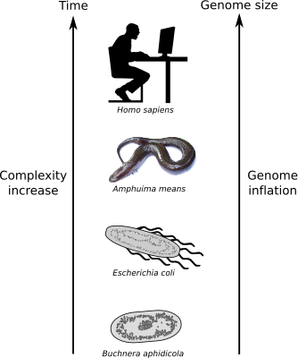

But it's WRONG!

----

### Facts about evolution

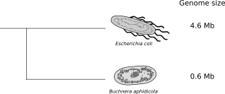

- Same evolution time for all organisms
- No correlation between complexity and genome size
- Reductive genome evolution case

How to explain the actual differences in genome size?

---

## Reductive genome evolution in endosymbionts
### Example of *Buchnera aphidicola*

----

### Genome degeneration syndrom

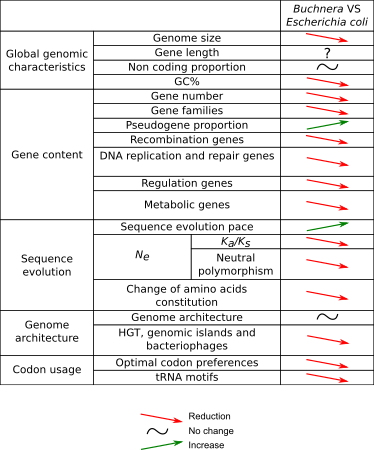

<small>Adapted from [Batut et al, 2014](http://www.nature.com/nrmicro/journal/v12/n12/abs/nrmicro3331.html)</small>

----

### Muller's ratchet

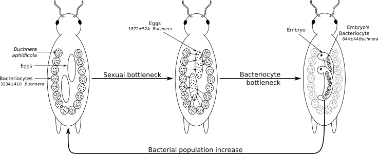

<small>Adapted from [Mira & Moran, 2002](http://link.springer.com/article/10.1007/s00248-002-0012-9)</small>

- Small population size with frequent bottlenecks
- No recombination

----

### Smallest genomes in the smallest populations?

<small>Relation between effective population size and genome size Figure inspired from [Kuo et al, 2009](http://genome.cshlp.org/content/19/8/1450.short)</small>

---

## Reductive genome evolution in *Prochlorococcus*
### An counter-intuitive case 

----

### *Prochlorococcus*

<small>Figure adapted from [Flombaum et al, 2013](http://www.pnas.org/content/110/24/9824.short)</small>

----

### *Prochlorococcus*

<small>Table adapted from [Batut et al, 2014](http://www.nature.com/nrmicro/journal/v12/n12/abs/nrmicro3331.html)</small>

----

### Changes during *Prochlorococcus* evolution

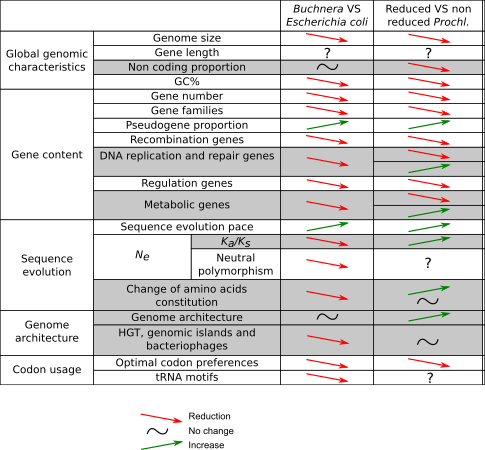

<small>Table adapted from [Batut et al, 2014](http://www.nature.com/nrmicro/journal/v12/n12/abs/nrmicro3331.html)</small>

----

### Hypotheses for reductive genome evolution

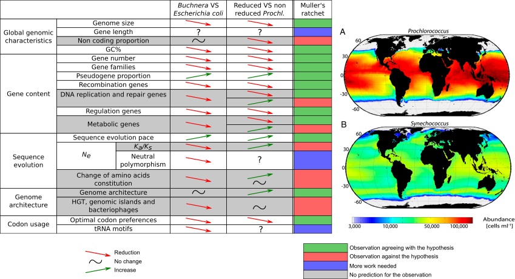

<small> Figures adapted from [Flombaum et al, 2013](http://www.pnas.org/content/110/24/9824.short)</small>

----

### Hypotheses for reductive genome evolution

<small>Hypothesis from [Rocap et al, 2003](http://www.nature.com/nature/journal/v424/n6952/abs/nature01947.html), [Dufresne et al, 2005](https://genomebiology.biomedcentral.com/articles/10.1186/gb-2005-6-2-r14), [Giovannoni et al, 2005](http://science.sciencemag.org/content/309/5738/1242), [Kettler et al, 2007](http://journals.plos.org/plosgenetics/article?id=10.1371/journal.pgen.0030231), and other Table adapted from [Batut et al, 2014](http://www.nature.com/nrmicro/journal/v12/n12/abs/nrmicro3331.html)</small>

----

### Hypotheses for reductive genome evolution

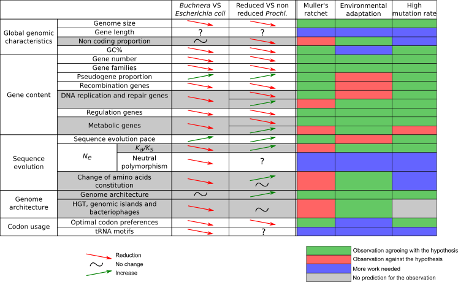

<small>Hypothesis from [Marais et al, 2008](http://link.springer.com/article/10.1007/s10709-007-9226-6) and [Partensky & Garczarek, 2010](http://annualreviews.org/doi/abs/10.1146/annurev-marine-120308-081034) Table adapted from [Batut et al, 2014](http://www.nature.com/nrmicro/journal/v12/n12/abs/nrmicro3331.html)</small>

----

### Hypotheses for reductive genome evolution

<small>Hypothesis from [Moris et al, 2012](http://mbio.asm.org/content/3/2/e00036-12.short) Table adapted from [Batut et al, 2014](http://www.nature.com/nrmicro/journal/v12/n12/abs/nrmicro3331.html)</small>

----

## Reductive genome evolution in *Prochlorococcus*

- No hypotheses to explain all genome characteristics for *Prochlorococcus*
- Need for supplementary studies
  - Tests of hypotheses using *in silico* experimental evolution
  - Study of genomic characteristics of *Prochlorococcus* genomes with comparative genomics approach

---

## *in silico* experimental evolution

----

### *in silico* experimental evolution?

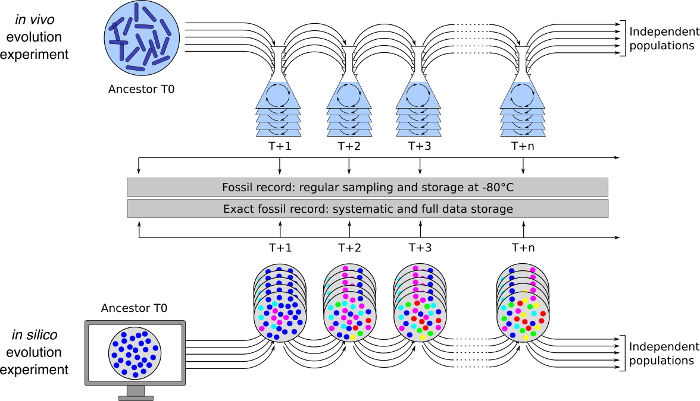

<small>Adapted from [Hindré et al, 2012](http://www.nature.com/nrmicro/journal/v10/n5/abs/nrmicro2750.html)</small>

----

### [*aevol*](http://aevol.fr/)

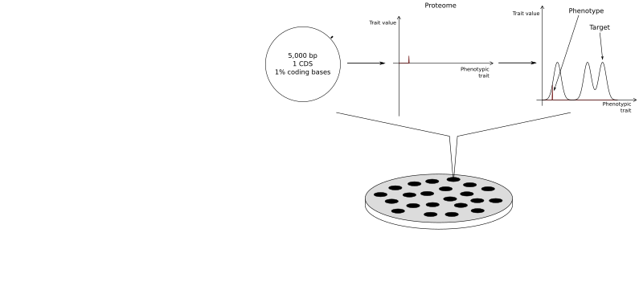

----

### [*aevol*](http://aevol.fr/)

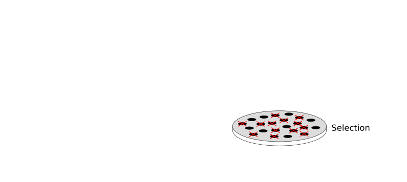

----

### [*aevol*](http://aevol.fr/)

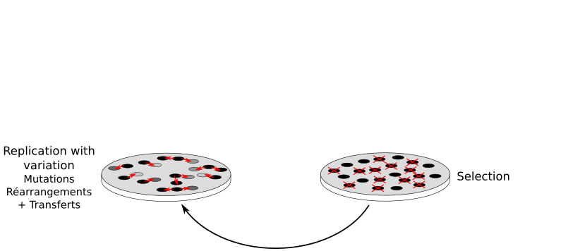

----

### [*aevol*](http://aevol.fr/)

----

### [*aevol*](http://aevol.fr/)

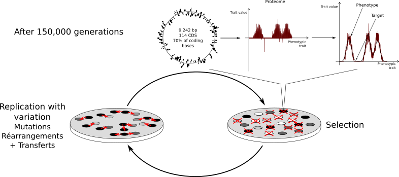

----

### An organism in *aevol*

A structured genome with

- A variable number of genes in a random order
- A variable quantity of non coding sequences
- A variable number of operons
- ...

~ A structure of a bacterial genome

----

### Using *aevol* to test evolution scenarios

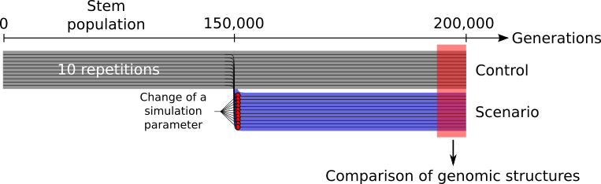

<small>Adapted from [Batut et al, 2013](https://bmcbioinformatics.biomedcentral.com/articles/10.1186/1471-2105-14-S15-S11)</small>

----

### And to test reductive genome evolution?

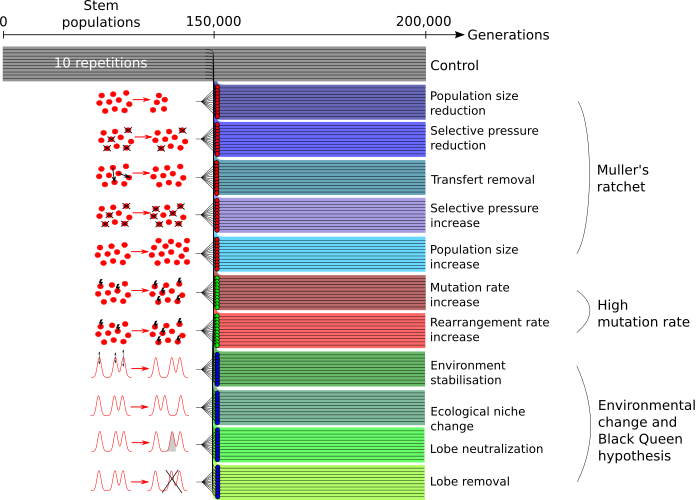

---

## Comparative genomics analyses of *Prochlorococcus*

----

### Genome architecture evolution study using phylogenetic contrasts

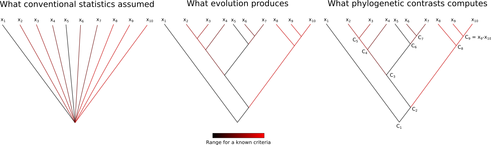

----

### Intergenic median distance and non coding bases proportion

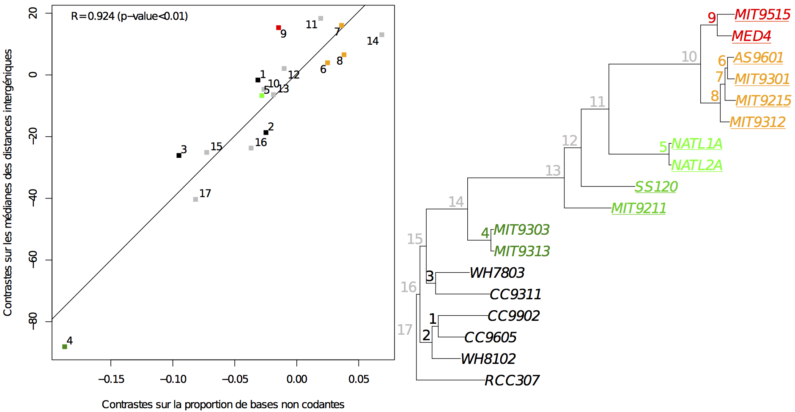

----

### Genome architecture evolution

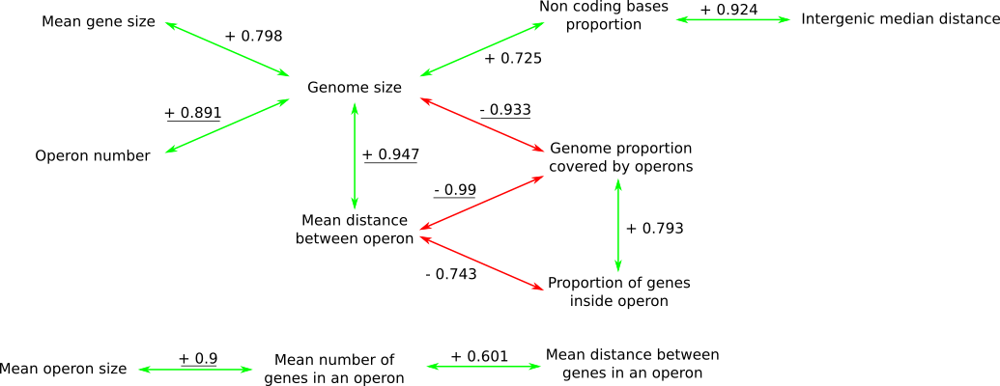

----

### Reconstruction of the gene losses and gains

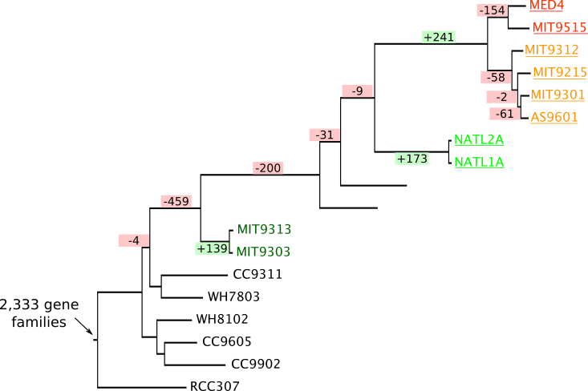

<small>Tree with gene losses and gains built with [Count](https://academic.oup.com/bioinformatics/article/26/15/1910/189891/Count-evolutionary-analysis-of-phylogenetic) on 3,778 gene families</small>

----

### Reconstruction of the gene length evolution

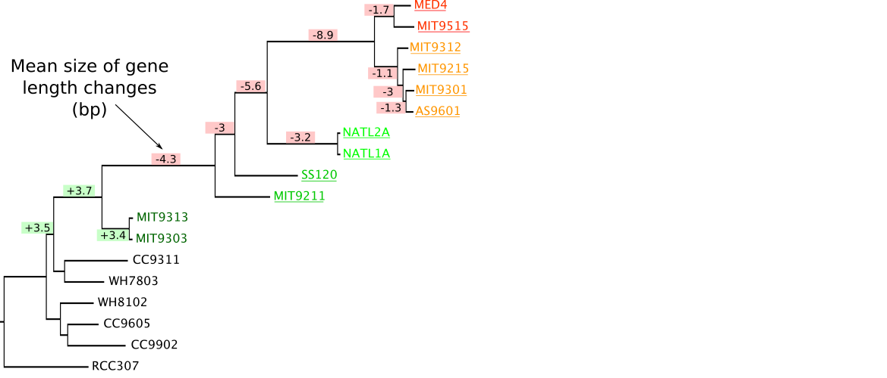

<small>Estimation of insertions and deletions inside 693 gene families using [Prank](https://www.ebi.ac.uk/goldman-srv/prank/prank/) after reconciliation between gene family and species trees using [Prunier](http://pbil.univ-lyon1.fr/software/prunier/)</small>

----

### Changes in selection?

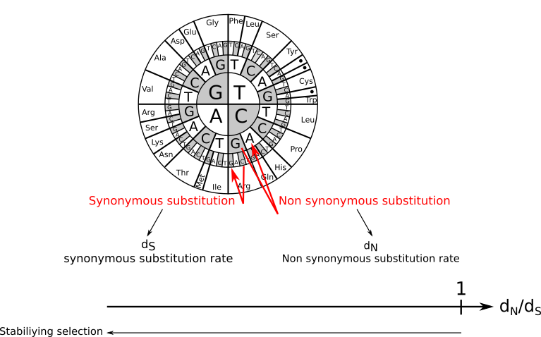

----

### Changes in selection? Previous estimations

<small>dN/dS estimated as in [Hu & Blanchard, 2009](http://mbe.oxfordjournals.org/content/26/1/5.short), [Yu et al, 2012](http://www.sciencedirect.com/science/article/pii/S1055790311004039), [Sun & Blanchard, 2014](http://journals.plos.org/plosone/article?id=10.1371/journal.pone.0088837)</small>

----

### Changes in selection? With correction of GC content

<small>dN/dS estimated using [Bio++](http://biopp.univ-montp2.fr/wiki/index.php/Main_Page) and [a specific model](https://smpgd2014.sciencesconf.org/conference/smpgd2014/pages/30011.pdf)</small>

----

### Analyses of *Prochlorococcus* reductive genome evolution

---

## Towards an hypothetical evolution story?
### Thanks to the combination of both approaches

----

### Hypothetical evolution story?

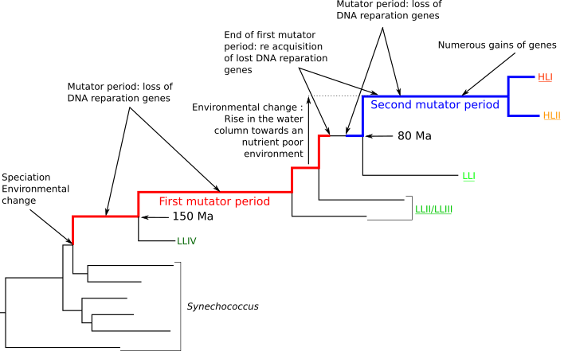

---

### Thank You!

