Hello! I am [Bérénice](http://bebatut.fr/), the author of following slides.

<small>
This slide does not exist in original deck. It is useful if you are not familiar with [Reveal.JS](https://github.com/hakimel/reveal.js), used here.
</small>

The easiest way to navigate this slide deck is by hitting `[space]`on your keyboard.

---

### Analyses of *Prochlorococcus* genomes in a phylogenetic framework

Determine the causes and characteristics of genome reduction

Bérénice Batut

<small>
University of Freiburg  Hess lab meeting  February 2017
</small>

---

### How to explain reductive genome evolution?

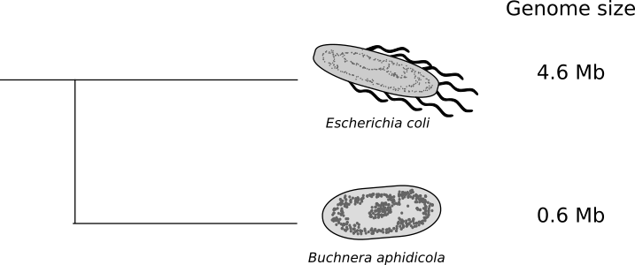

Why loosing what takes millions of years to evolution to build?

---

## Reductive genome evolution in endosymbionts
### Example of *Buchnera aphidicola*

----

### Genome degeneration syndrom

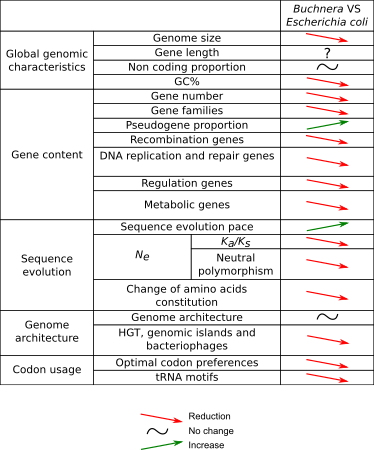

<small>Adapted from [Batut et al, 2014](http://www.nature.com/nrmicro/journal/v12/n12/abs/nrmicro3331.html)</small>

----

### Muller's ratchet

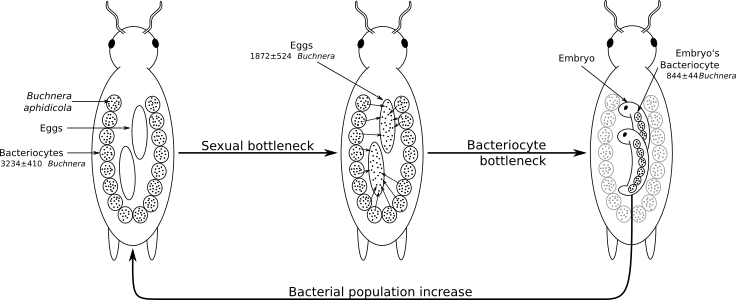

<small>Adapted from [Mira & Moran, 2002](http://link.springer.com/article/10.1007/s00248-002-0012-9)</small>

- Small population size with frequent bottlenecks
- No recombination

----

### Smallest genomes in the smallest populations?

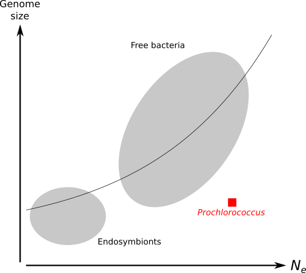

<small>Relation between effective population size and genome size Figure inspired from [Kuo et al, 2009](http://genome.cshlp.org/content/19/8/1450.short)</small>

---

## Reductive genome evolution in *Prochlorococcus*
### An counter-intuitive case 

----

### *Prochlorococcus*

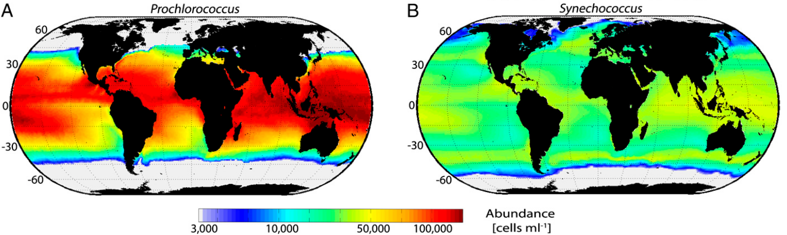

<small>Figure adapted from [Flombaum et al, 2013](http://www.pnas.org/content/110/24/9824.short)</small>

----

### *Prochlorococcus*

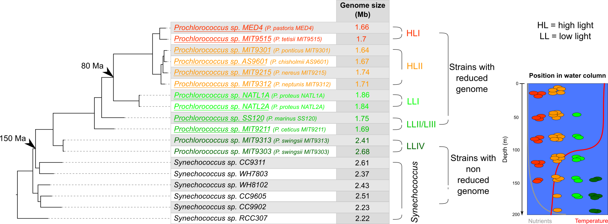

<small>Table adapted from [Batut et al, 2014](http://www.nature.com/nrmicro/journal/v12/n12/abs/nrmicro3331.html)</small>

----

### Changes during *Prochlorococcus* evolution

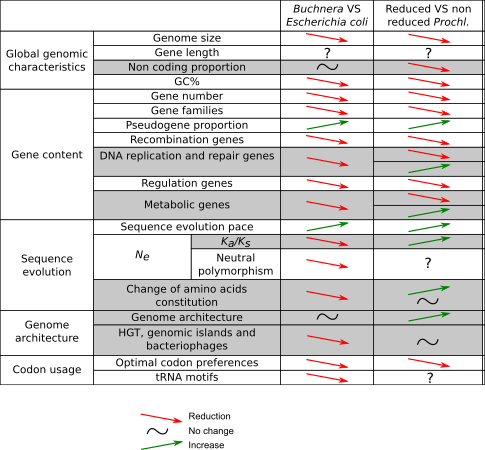

<small>Table adapted from [Batut et al, 2014](http://www.nature.com/nrmicro/journal/v12/n12/abs/nrmicro3331.html)</small>

----

### Hypotheses for reductive genome evolution

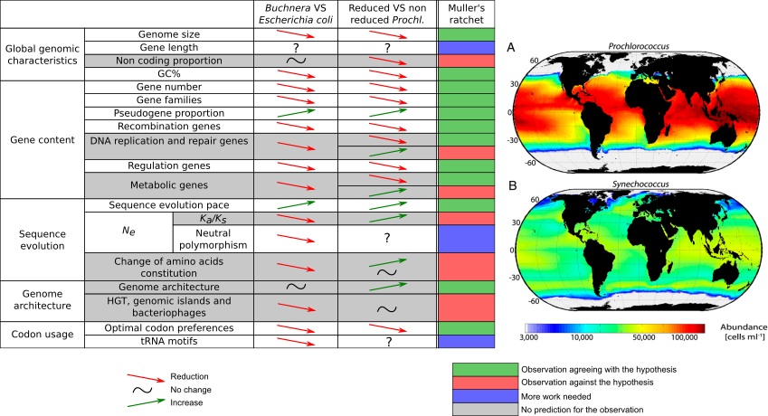

<small> Figures adapted from [Flombaum et al, 2013](http://www.pnas.org/content/110/24/9824.short)</small>

----

### Hypotheses for reductive genome evolution

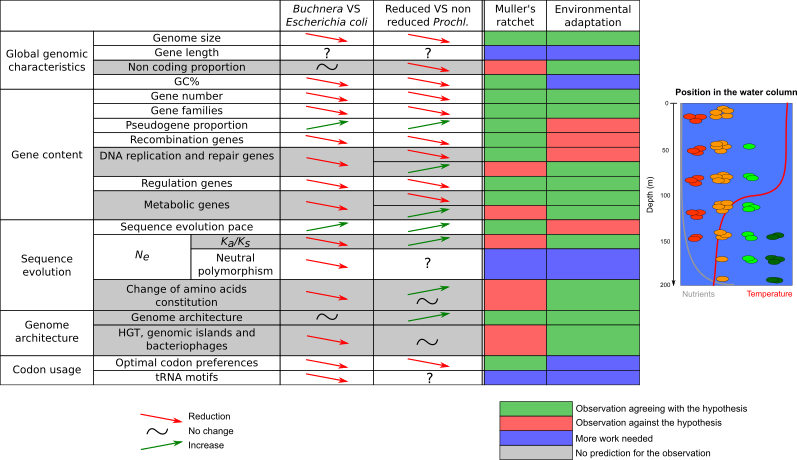

<small>Hypothesis from [Rocap et al, 2003](http://www.nature.com/nature/journal/v424/n6952/abs/nature01947.html), [Dufresne et al, 2005](https://genomebiology.biomedcentral.com/articles/10.1186/gb-2005-6-2-r14), [Giovannoni et al, 2005](http://science.sciencemag.org/content/309/5738/1242), [Kettler et al, 2007](http://journals.plos.org/plosgenetics/article?id=10.1371/journal.pgen.0030231), and other Table adapted from [Batut et al, 2014](http://www.nature.com/nrmicro/journal/v12/n12/abs/nrmicro3331.html)</small>

----

### Hypotheses for reductive genome evolution

<small>Hypothesis from [Marais et al, 2008](http://link.springer.com/article/10.1007/s10709-007-9226-6) and [Partensky & Garczarek, 2010](http://annualreviews.org/doi/abs/10.1146/annurev-marine-120308-081034) Table adapted from [Batut et al, 2014](http://www.nature.com/nrmicro/journal/v12/n12/abs/nrmicro3331.html)</small>

----

### Hypotheses for reductive genome evolution

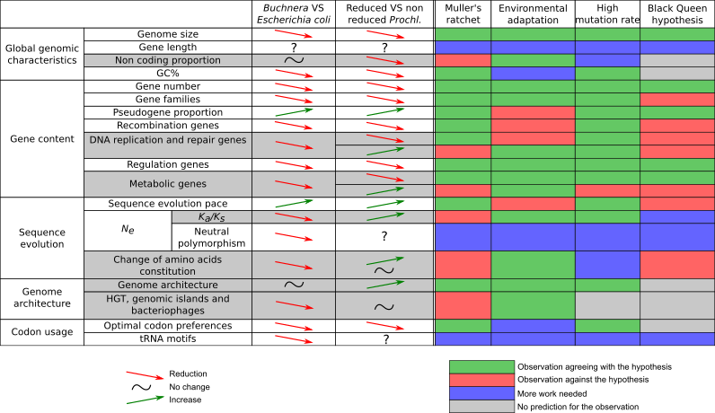

<small>Hypothesis from [Moris et al, 2012](http://mbio.asm.org/content/3/2/e00036-12.short) Table adapted from [Batut et al, 2014](http://www.nature.com/nrmicro/journal/v12/n12/abs/nrmicro3331.html)</small>

----

## Reductive genome evolution in *Prochlorococcus*

- No hypotheses to explain all genome characteristics for *Prochlorococcus*
- Need for supplementary studies

---

## Genome architecture  and reductive evolution

*Impact of genome reduction on the genome structure?*

----

### Study using phylogenetic contrasts

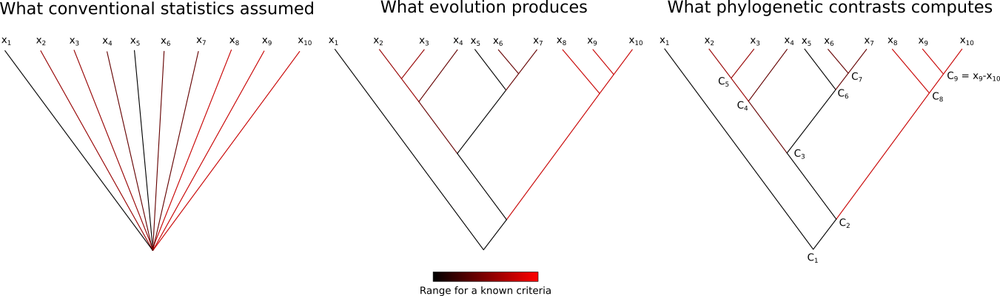

----

### Genome structure study

- Data
    - 12 *Prochlorococcus* genomes and 6 marine *Synechococcus* genomes
    - Phylogenetic tree built with [PhyML](http://www.atgc-montpellier.fr/phyml/) on 693 orthologous gene families aligned with [Prank](https://www.ebi.ac.uk/goldman-srv/prank/prank/) 
    - Gene positions extracted from NCBI database
    - Operon data from [Memon et al, 2013](http://link.springer.com/article/10.1007/s10482-012-9813-0)
- Methods
    - Phylogenetic contrasts

----

### Intergenic median distance and non coding bases proportion

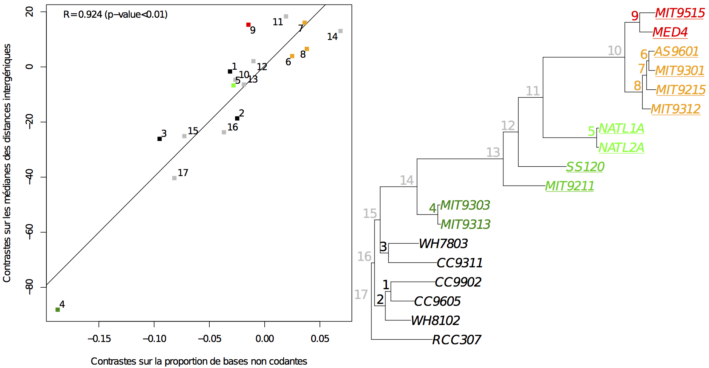

----

### Genome architecture evolution

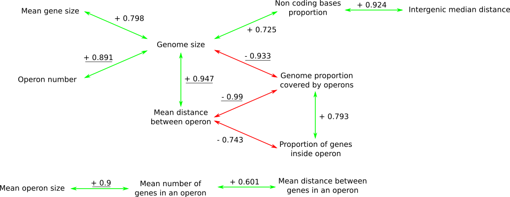

---

## Gene content evolution

*Were there only gene losses? Where were the genes mostly lost?*

----

### Previous studies

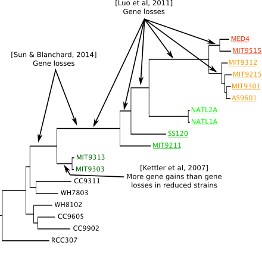

<small>Information extracted from [Kettler et al, 2007](http://journals.plos.org/plosgenetics/article?id=10.1371/journal.pgen.0030231), [Luo et al, 2011](http://mbe.oxfordjournals.org/content/28/10/2751.short) and [Sun & Blanchard, 2014](http://journals.plos.org/plosone/article?id=10.1371/journal.pone.0088837)  Methods using maximum parsimony</small>

----

### Reconstruction of the gene loss and gain tree

- Data
    - 12 *Prochlorococcus* genomes and 6 marine *Synechococcus* genomes
    - Phylogenetic tree built with [PhyML](http://www.atgc-montpellier.fr/phyml/) on 693 orthologous gene families aligned with [Prank](https://www.ebi.ac.uk/goldman-srv/prank/prank/) 
    - 3,778 gene families (with paralogous and orphan genes) extracted from [Hogenom6](http://doua.prabi.fr/databases/hogenom/home.php?contents=query)
- Methods
    - Computation of *a posteriori* gene families size for each internal node with [Count](https://academic.oup.com/bioinformatics/article/26/15/1910/189891/Count-evolutionary-analysis-of-phylogenetic)
    - Reconstruction of loss and gain gene tree

----

### Gene losses and gains

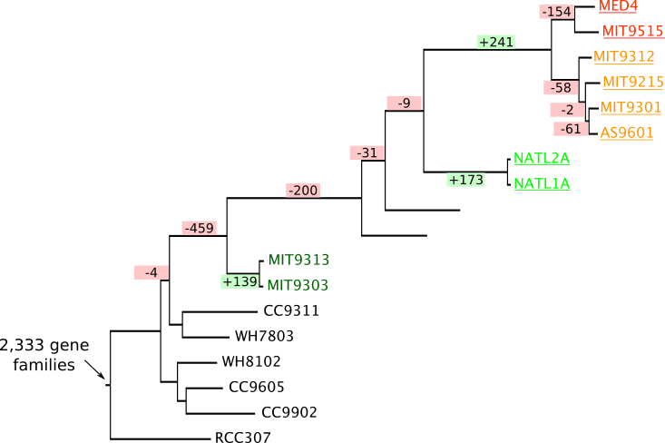

---

## Gene length evolution

*Are the gene lengths impacted by the genome reduction?*

----

## Gene length and Genome size

----

### Length gene evolution reconstruction

- Data
    - 12 *Prochlorococcus* genomes and 6 marine *Synechococcus* genomes
    - Phylogenetic tree built with [PhyML](http://www.atgc-montpellier.fr/phyml/) on 693 orthologous gene families aligned with [Prank](https://www.ebi.ac.uk/goldman-srv/prank/prank/) 
    - 693 orthologous gene families (one gene per genome) extracted from [Hogenom6](http://doua.prabi.fr/databases/hogenom/home.php?contents=query)
- Method
    - Estimation of insertions and deletions inside the gene families using [Prank](https://www.ebi.ac.uk/goldman-srv/prank/prank/)
    - Reconciliation between gene family and species trees using [Prunier](http://pbil.univ-lyon1.fr/software/prunier/)

----

### Reconstruction of the gene length evolution

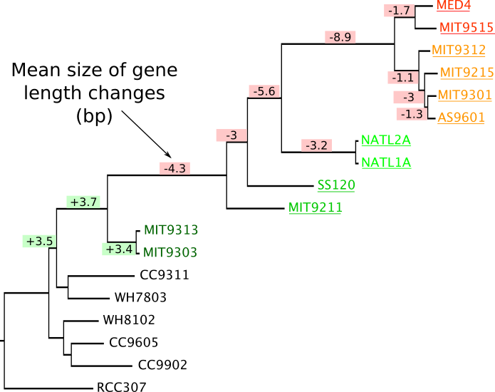

----

### Mean gene length change  since *Prochlorococcus* and *Synechococcus* CA

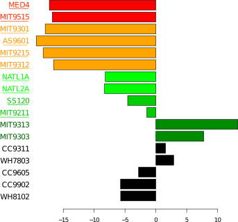

---

## Sequence evolution and selective pressures

*Is there changes in selective pressures to explain or as results of reductive genome evolution?*

----

### Sequence evolution speed

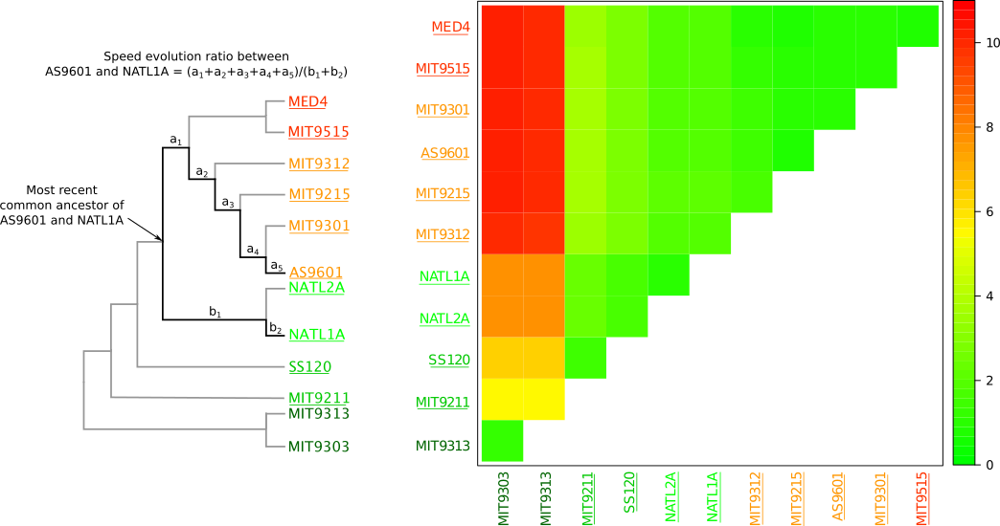

----

### Selective pressure estimation

----

### Previous estimations of selective pressures

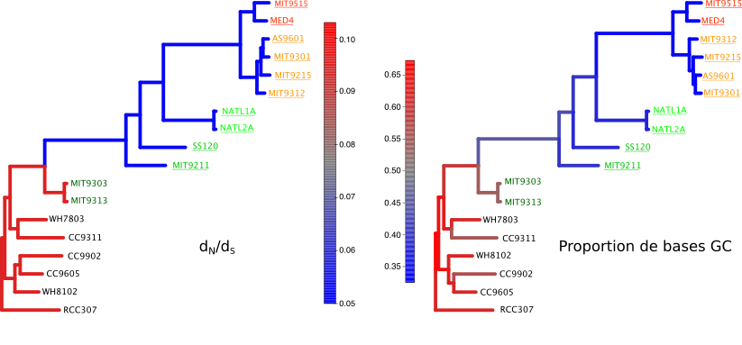

<small>dN/dS estimated as in [Hu & Blanchard, 2009](http://mbe.oxfordjournals.org/content/26/1/5.short), [Yu et al, 2012](http://www.sciencedirect.com/science/article/pii/S1055790311004039), [Sun & Blanchard, 2014](http://journals.plos.org/plosone/article?id=10.1371/journal.pone.0088837)</small>

----

### Selective pressure estimation

- Data
    - 12 *Prochlorococcus* genomes and 6 marine *Synechococcus* genomes
    - Phylogenetic tree built with [PhyML](http://www.atgc-montpellier.fr/phyml/) on 693 orthologous gene families aligned with [Prank](https://www.ebi.ac.uk/goldman-srv/prank/prank/) 
    - 693 orthologous gene families (one gene per genome) extracted from [Hogenom6](http://doua.prabi.fr/databases/hogenom/home.php?contents=query)
- Methods
    - dN/dS estimated using [Bio++](http://biopp.univ-montp2.fr/wiki/index.php/Main_Page) and [a specific model](https://smpgd2014.sciencesconf.org/conference/smpgd2014/pages/30011.pdf)

----

### Selective pressures

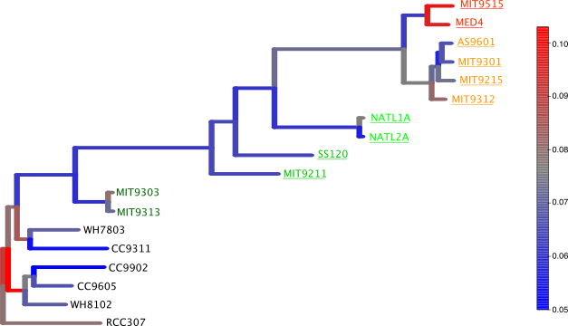

---

## Summary

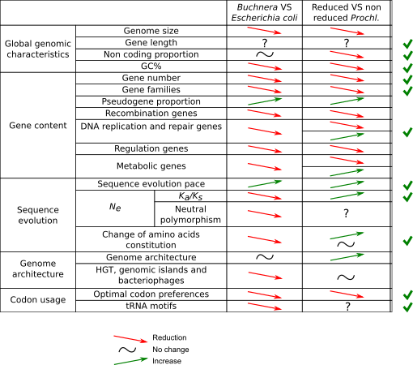

----

### *Prochlorococcus* reductive evolution

Hypothesis | For | Against
--- | --- | ---
Muller's ratchet | Gene losses, Gene shortening, High sequence evolution, AT base enrichment, Synonymous codon and amino acid changes | Intragenic recombination, No dN/dS changes, Gene gains
Black queen hypothesis | Loss of some genes | Loss of DNA repair genes
Adaptation to poor-nutrient environment | Loss of genes, Gene shortening, Gains of genes for adpatation to new environment, AT base enrichment | No genome reduction initiation, Repair gene losses
High mutation rate | High sequence evolution, AT base enrichment, Synonymous codon and amino acid changes, Loss of non necessary genes | No gain of all lost repair genes, Long term impact of high mutation rate  

---

## Hypothetical evolution story

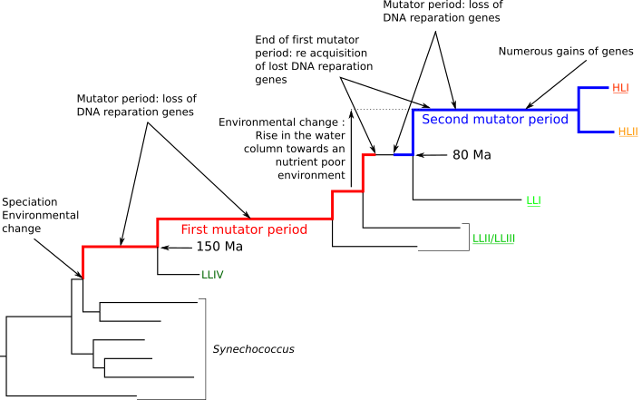

---

### Future work

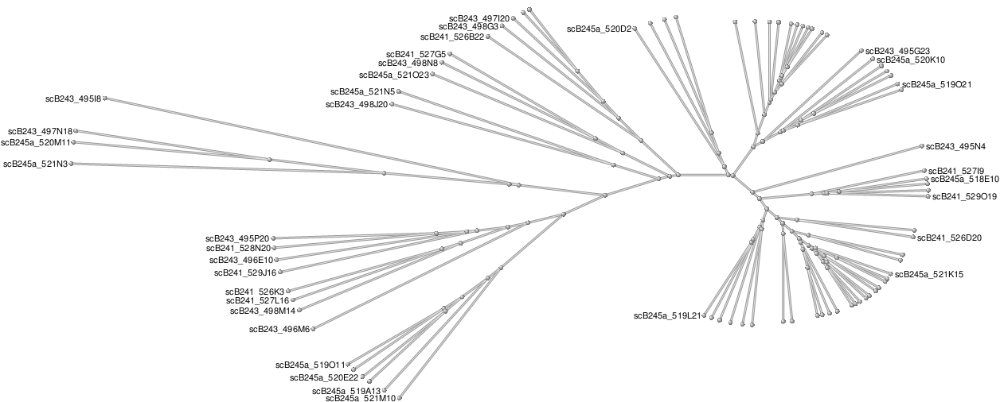

<small>121 genome assemblies on [NCBI](https://www.ncbi.nlm.nih.gov/genome/13712)</small>

- Integration of the draft and non annotated genomes ?
- Need to create a new dataset with orthologous gene family set

----

### Future work

- Genome structure
    - Looking at the transcriptome structure
    - Finding more reliable operonic data
- Gene losses and gains
    - Relating the lost and gained genes to annotation
- Gene length evolution
    - Relating gene length changes to biological annotations
    - Relating gene length changes to selective pressures
- GC content, synonymous codon usage, ...
    - Integrating more expression level data
- Selective pressures
    - Investigating the selective pressures with different models

---

## Thank You!

---

## GC content, codon usage,  tRNA genes and optimal codons

*What is the impact of AT enrichment? What is behind?*

----

### GC content evolution

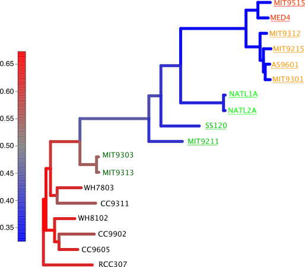

----

### Study of codon usage,  tRNA genes and optimal codons

- Data
    - 12 *Prochlorococcus* genomes and 6 marine *Synechococcus* genomes
    - Phylogenetic tree built with [PhyML](http://www.atgc-montpellier.fr/phyml/) on 693 orthologous gene families aligned with [Prank](https://www.ebi.ac.uk/goldman-srv/prank/prank/) 
    - 693 orthologous gene families (one gene per genome) extracted from [Hogenom6](http://doua.prabi.fr/databases/hogenom/home.php?contents=query)
    - Expression data for MED4 from [Wang et al, 2014](https://bmcmicrobiol.biomedcentral.com/articles/10.1186/1471-2180-14-11)
- Methods
    - Custom scripts to compute GCs, ENC, ENC', inter species analysis of amino acid and synonymous codon usage, optimal codons (2 methods)
    - Extraction of tRNA genes using [tRNAscan-SE](http://lowelab.ucsc.edu/tRNAscan-SE/)
    - tRNA gene losses and gains build using Wagner's parcimony

----

### Composition bias

----

### Effective number of codons

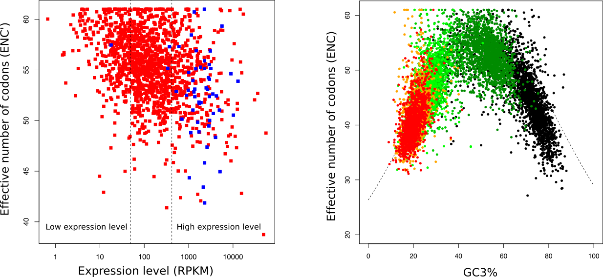

----

### Synonymous codon and amino acids usage

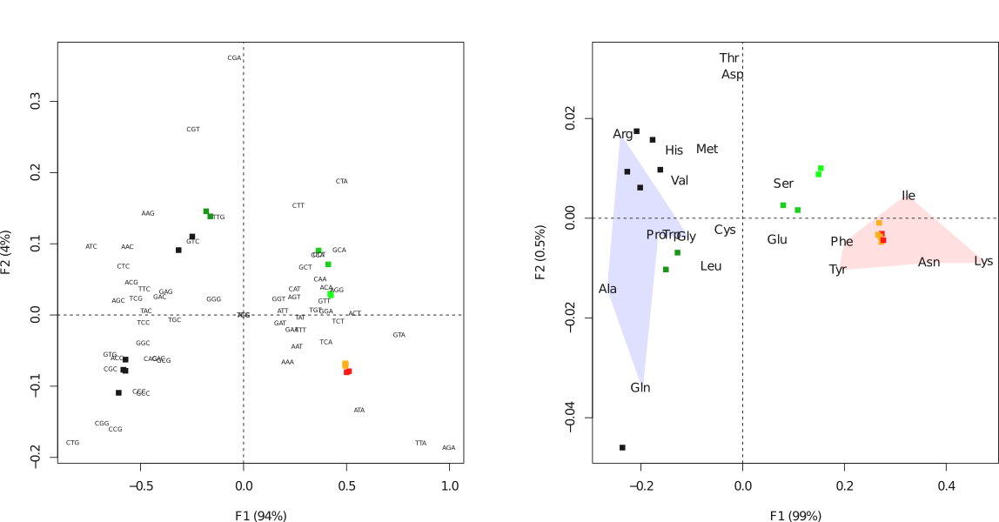

----

### tRNA genes

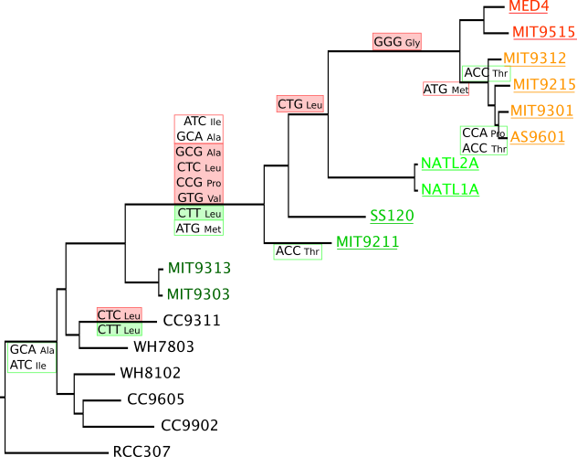

----

### tRNA genes and optimal codons

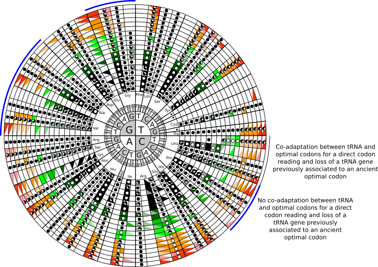

----

### Impact of AT enrichment on the CDS?

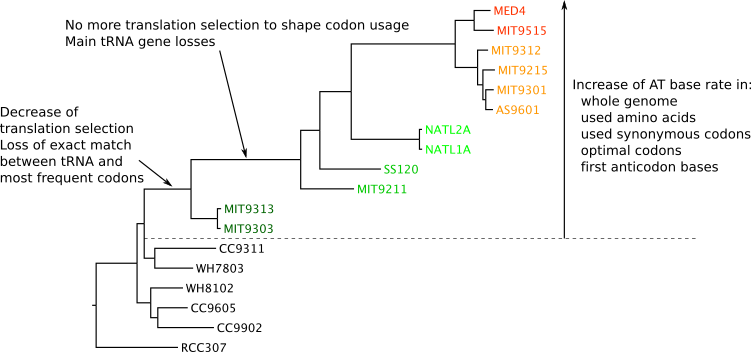
