Hello! I am [Bérénice](http://bebatut.fr/), the author of following slides.

<small>
This slide does not exist in original deck. It is useful if you are not familiar with [Reveal.JS](https://github.com/hakimel/reveal.js), used here.
</small>

The easiest way to navigate this slide deck is by hitting `[space]`on your keyboard.

---
### Building an open, collaborative, online infrastructure for bioinformatics training

<!-- .element height="55%" width="55%" -->

**Bérénice Batut**, Galaxy Training Network,  Dave Clements, Björn Grüning

<small>
BOSC  July 2017
</small>

---
<!-- .slide: data-background="images/freiburg_workshop.jpg" data-state="dim-background" -->
# Why caring about bioinformatics training?

----
### Need for bioinformatic training

> Bioinformatics has become too central to biology to be left to specialist bioinformaticians 

- Explosion of data to analyze
- Access to computational power
- Thousand of possible tools for specialized analyses

----
### An increasing demand  for learning bioinformatics

  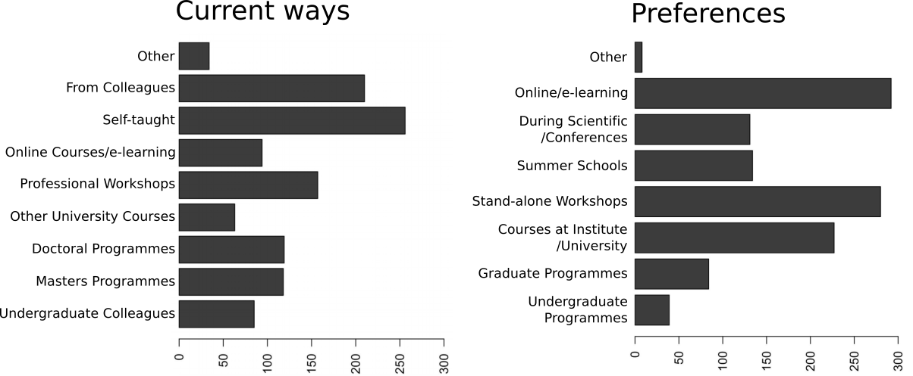
  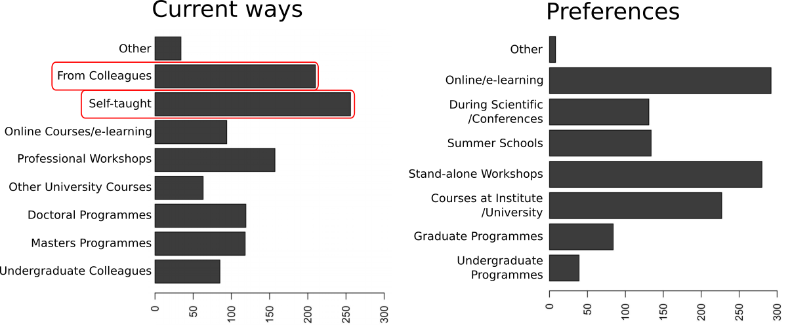
  

Graphs of [Brazas et al, 2017](http://biorxiv.org/content/early/2017/02/27/098996)

---
<!-- .slide: data-background="images/DSC_0630.jpg" data-state="dim-background" -->
# Galaxy a great solution !

----
### Computational knowledge: Not required!

 <!-- .element height="60%" width="60%" -->

- Web interface for numerous bioinformatics tools
- Scalable
- No issue with computer configuration during training

----
<!-- .slide: data-background="images/gtn_explanation.png" -->

----
### Quite a lot of events...

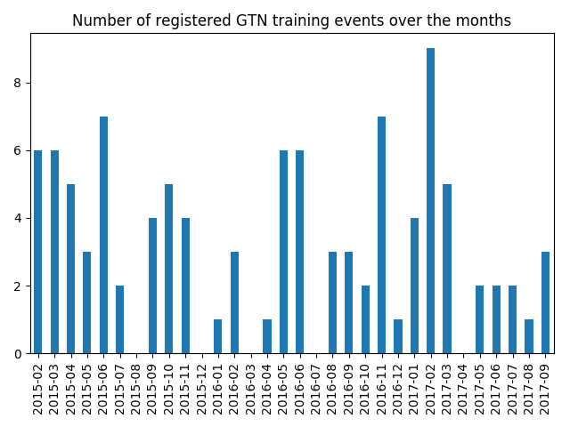

Note: Only the registered events, the Dark Matter probably higher

----
### Worldwide!

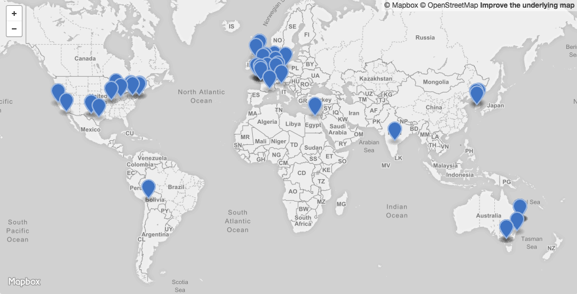

---
 <!-- .element height="40%" width="40%" -->

### Building a new **open**, **collaborative** and **FAIR** model for bioinformatics training

----
### Requirements

- Easy to use
- Support for effective training for
    - Individual users
    - Instructors
- Definition of technological infrastructure
- Limited redundancy

---
<!-- .slide: data-background="images/gearwheels.jpg" data-state="dim-background" -->
# The model

----
### One repository to collect everything

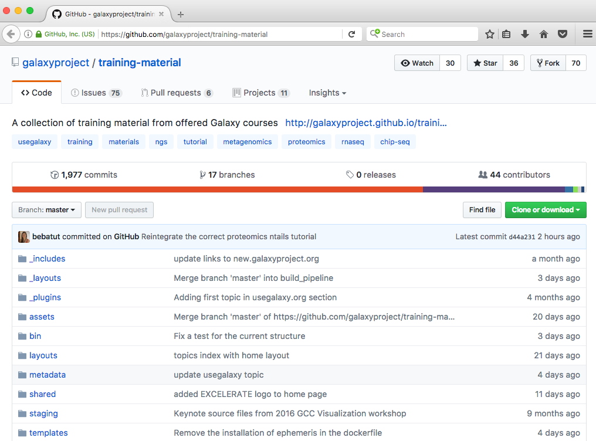 <!-- .element height="60%" width="60%" -->

GitHub: [galaxyproject/training-material](https://github.com/galaxyproject/training-material)

----
### Topics for different targeted users

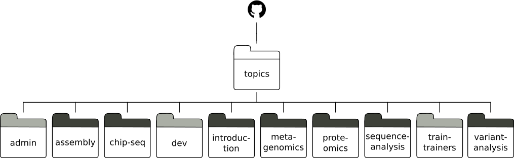

----
### Similar structure, content and formats

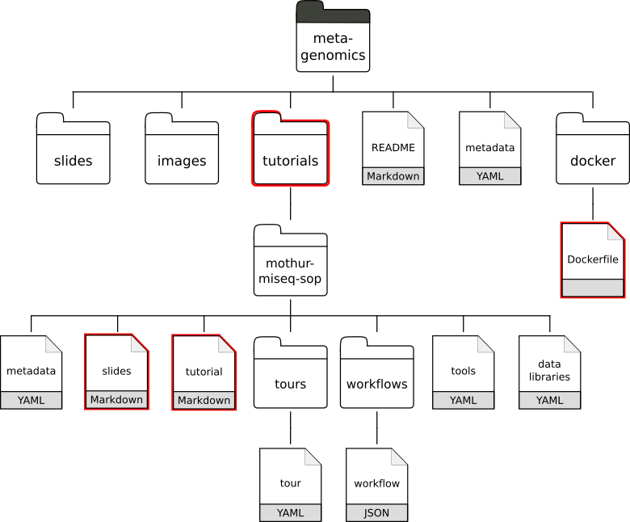 <!-- .element height="70%" width="70%" -->

Note: Less time here

----
### Separation between content and formatting

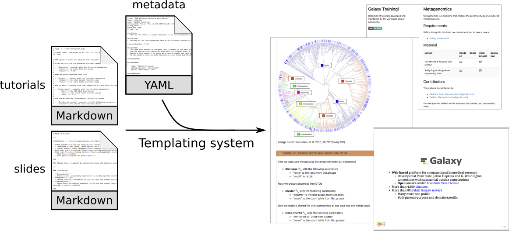

----
### Citable data & Credit

 <!-- .element height="90%" width="90%" -->

Note: To give credit to contributors and they are also in the declared in the metadata

----
### Definition of the technical infrastructure

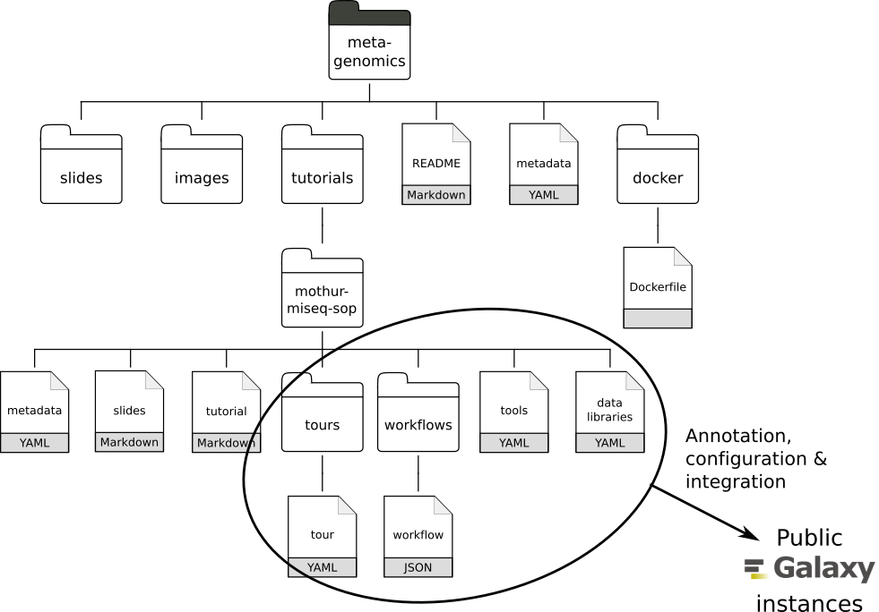 <!-- .element height="80%" width="80%" -->

----
### Definition of the technical infrastructure

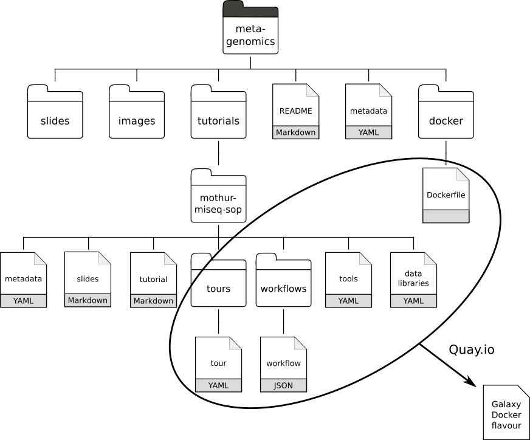 <!-- .element height="70%" width="70%" -->

Note: Model already successful applied by us over the last year.
We refine the content and think about the reviews

---

# model

----
###  Findable

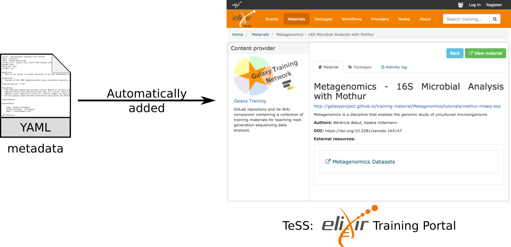 <!-- .element height="80%" width="80%" -->

[http://tess.elixir-europe.org/](http://tess.elixir-europe.org/)

----
###  Accessible

- Online
    
    [http://training.galaxyproject.org](http://galaxyproject.github.io/training-material/)

- Technical support
    - Self-training boxes with Galaxy Docker flavor
    - Annotated public Galaxy instances

Note: ...but also fitting face-to-face workshops

----
###  Interoperable

- Metadata description in YAML and integrating EDAM ontology
- Content for different targets (workshops and self-training)
- Technical support for different platforms

----
###  Reusable & Open

- [CC BY 4.0](https://creativecommons.org/licenses/by/4.0/) license
- DOI for the input datasets
- Open development process on GitHub & via Gitter
- Open education movement

Note: Build on top of what John explained before

---
<!-- .slide: data-background="images/osi.jpg"  data-state="dim-background"-->
# Community effort

----
### Numerous contributions

  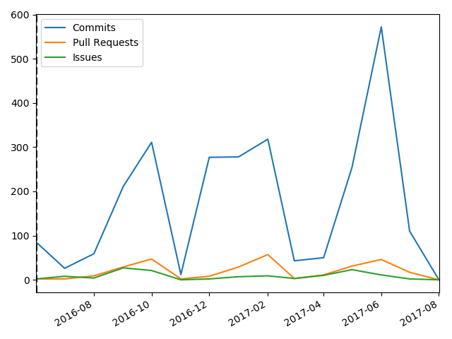
  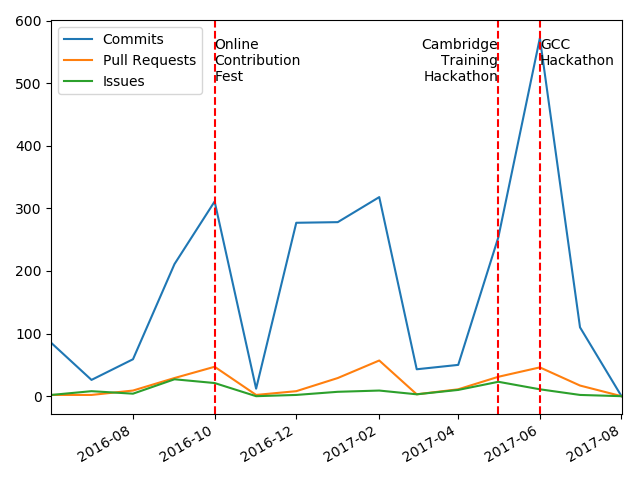

And 3 successful hackathons!

----
### Numerous discussions

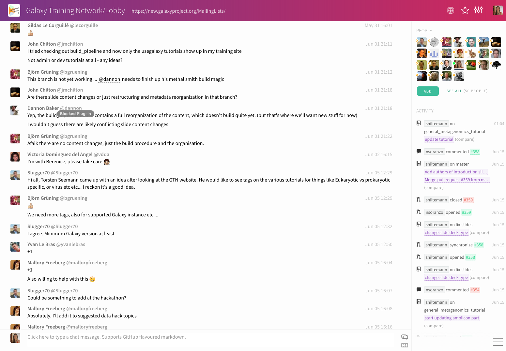 <!-- .element height="70%" width="70%" -->

Gitter: [Galaxy-Training-Network/Lobby](https://gitter.im/Galaxy-Training-Network/Lobby)

----
### A constantly growing community

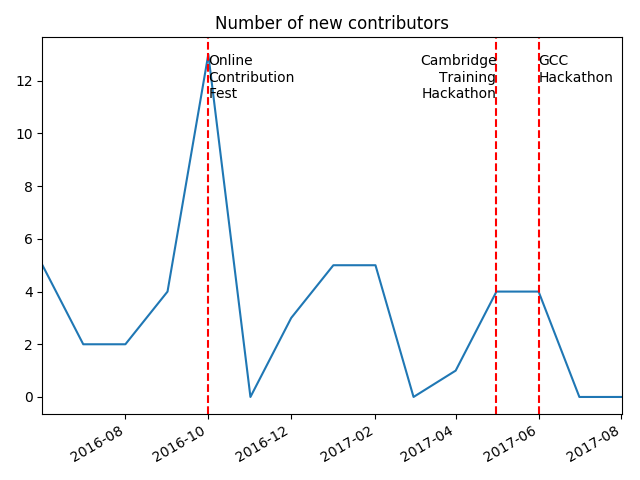

----
<!-- .slide: data-background-color="#000000" data-background="images/contributors.png" data-state="dim-background-2"-->

 
<h2 class="fragment" data-fragment-index="2">THANKS to all of them!</h2>

---

## Thank you!

[Poster A166](http://research.bebatut.fr/eccb_2017_training_poster/)
 
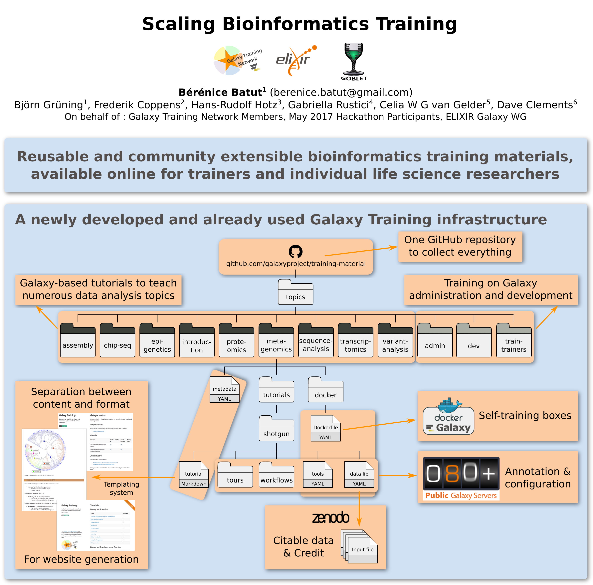 <!-- .element height="50%" width="50%" border="10px"-->

