Hello! I am [Bérénice](http://bebatut.fr/), the author of following slides.

<small>
This slide does not exist in original deck. It is useful if you are not familiar with [Reveal.JS](https://github.com/hakimel/reveal.js), used here.
</small>

The easiest way to navigate this slide deck is by hitting `[space]`on your keyboard.

---
### User-focused programming / development
### Example of

 <!-- .element width="50%" -->

Bérénice Batut

<small>
de.NBIer <br>October 2017
</small>

---
## 

(Biological) Data analysis for everyone

- Open, web-based platform
- Mindset: Accessible, reproducible, and transparent
- Community driven

Note:

Also used for citzen projects

- Philosophy
  - Accessible

    Users without programming experience can easily specify parameters and run tools and workflows
    Scientists to empower their analyses

  - Reproducible

    Galaxy captures information so that any user can repeat and understand a complete computational analysis

  - Transparent
    
    Users share and publish analyses via the web and create Pages, interactive, web-based documents that describe a complete analysis.
- Open-source

----

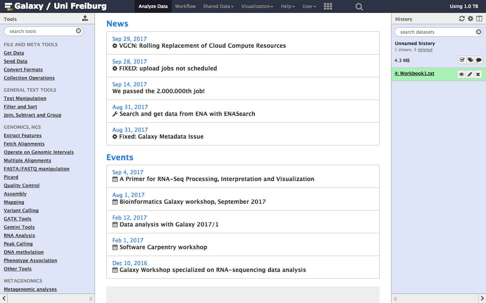 <!-- .element height="100%" width="100%" -->

Note:

- History on the right with data
- Tools on the left

----
### Tools inside Galaxy

 

Note:
- Choose of the input given its format
- Submission of the job 

----
### Tools inside Galaxy

```
<?xml version="1.0"?>
<tool id="datamash_ops" name="Datamash" version="1.0.6">
    <description>(operations on tabular data)</description>
    <requirements>
        <requirement type="package" version="1.0.6">datamash</requirement>
    </requirements>
    <command>
        <![CDATA[
            datamash
                $header_in
                #for $oper in $operations
                    ${oper.op_name}
                    ${oper.op_column}
                #end for
                < $in_file > '$out_file'
          ]]>
    </command>
    <inputs>
        <param format="tabular" help="" label="Input tabular dataset" name="in_file" type="data" />
        <param falsevalue="" help="--header-in" label="Input file has a header line" name="header_in" truevalue="--header-in" type="boolean" />
        <repeat default="1" min="1" name="operations" title="Operation to perform on each group">
            <param name="op_name" type="select" label="Type">
                <option value="count">count</option>
                <option value="sum">sum</option>
                </param>
            <param name="op_column" data_ref="in_file" label="On column" type="data_column" />
        </repeat>
    </inputs>
    <outputs>
        <data format="tabular" name="out_file" label="${tool.name} on ${on_string}" />
    </outputs>
    <help>
<![CDATA[
**Syntax**
This tools performs common operations (such as summing, counting, mean, standard-deviation) on input file, based on tabular data. The tool can also optionaly group the input based on a given field.
-----
]]>
    </help>
</tool>
```

Note:

- Wrappers of existing tools
- Description of the command
- Description of the inputs and outputs

----
### Tools inside Galaxy

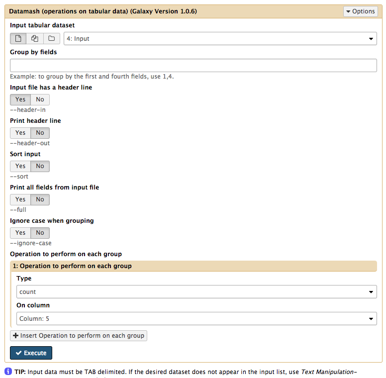 <!-- .element width="55%" -->

----
### Where to find tools ?

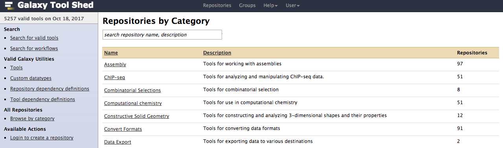

- Developed in many GitHub repositories
- Examples
  - Intergalactic Utilities Commission: https://github.com/galaxyproject/tools-iuc
  - Björn Grüning: https://github.com/bgruening/galaxytools

----
### Visualization


Note:

built-in genome browser

----
### Chart plugins


----
### Interactive environment


Note:
- Bring external analysis platform to the data instead of vice-versa
- How is it working?
  - Docker Containers are launched on-demand by users..
  - ..and killed automatically when users stop using them

----
### Interactive environment

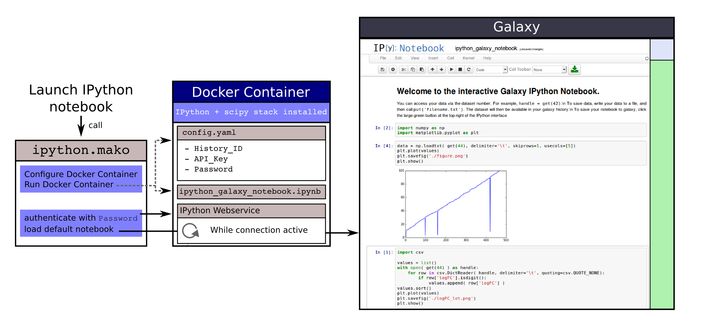

<small>Image from ["Galaxy Interactive Environments" tutorial](https://galaxyproject.github.io/training-material/topics/dev/tutorials/interactive-environments/slides.html)</small>

----
### Tools and visualization in Galaxy

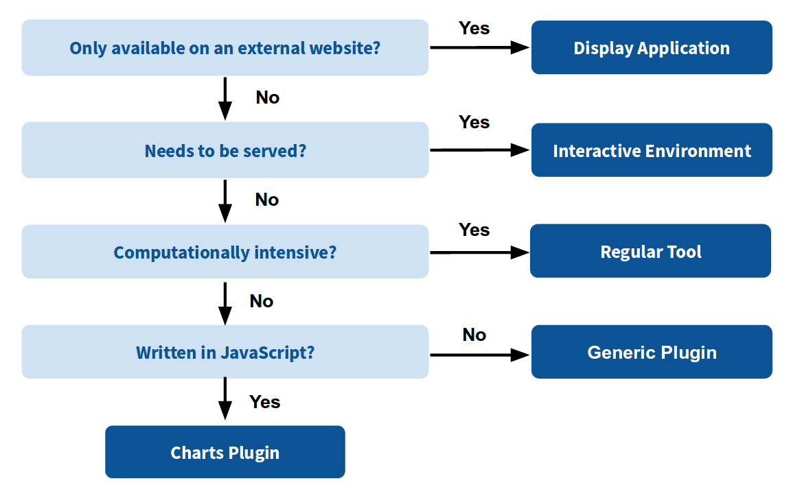 <!-- .element width="80%" -->

<small>Image from ["Galaxy Interactive Environments" tutorial](https://galaxyproject.github.io/training-material/topics/dev/tutorials/interactive-environments/slides.html)</small>

---
## Galaxy Training materials

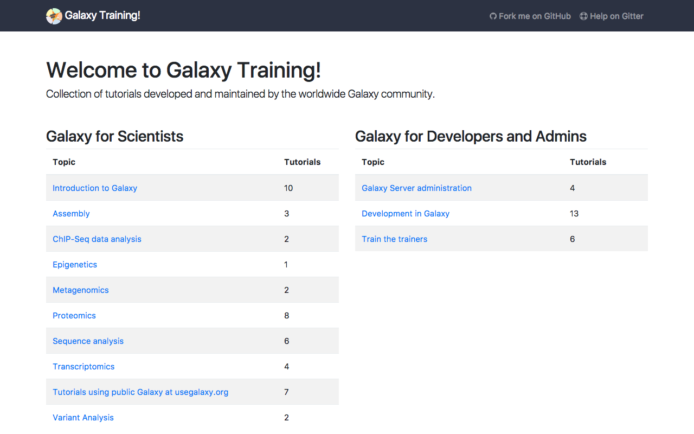 <!-- .element width="70%" -->

<<<<<<< HEAD
[http://training.galaxyproject.org](http://training.galaxyproject.org)
=======
[http://training.galaxyproject.org](http://training.galaxyproject.org) 
>>>>>>> b1224a5ea17d81521e1ac315ee8ca46f4dd57632

----
### An open, collaborative, FAIR, online infrastructure

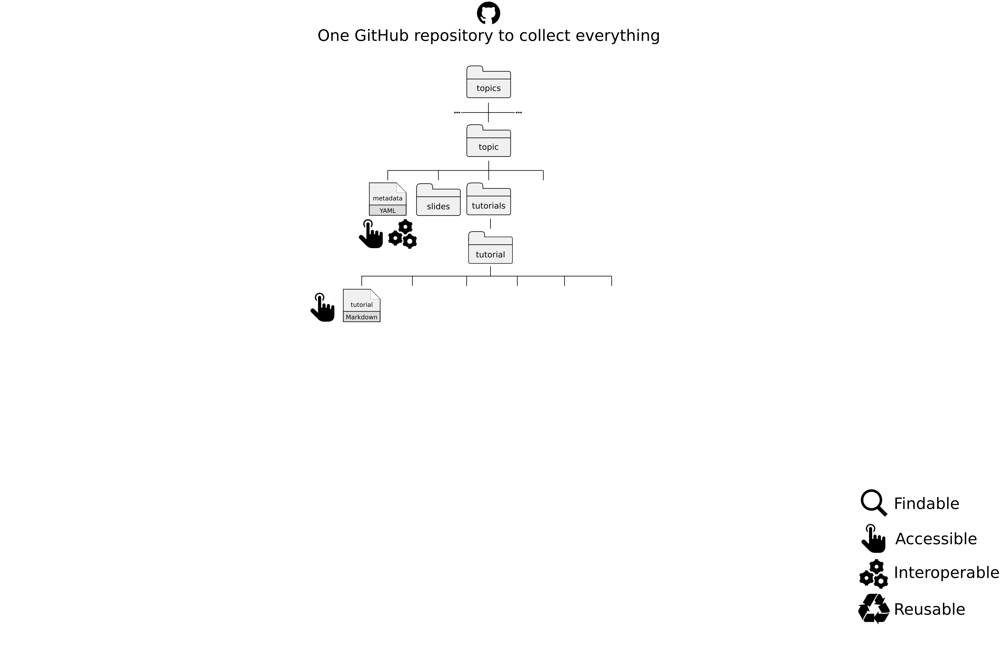 <!-- .element width="90%" -->

----
### An open, collaborative, FAIR, online infrastructure

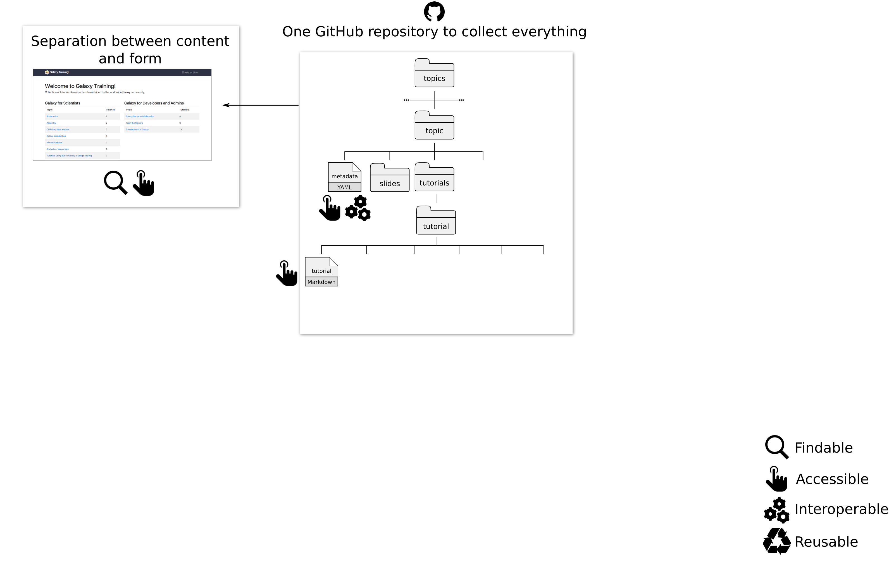 <!-- .element width="90%" -->

----
### An open, collaborative, FAIR, online infrastructure

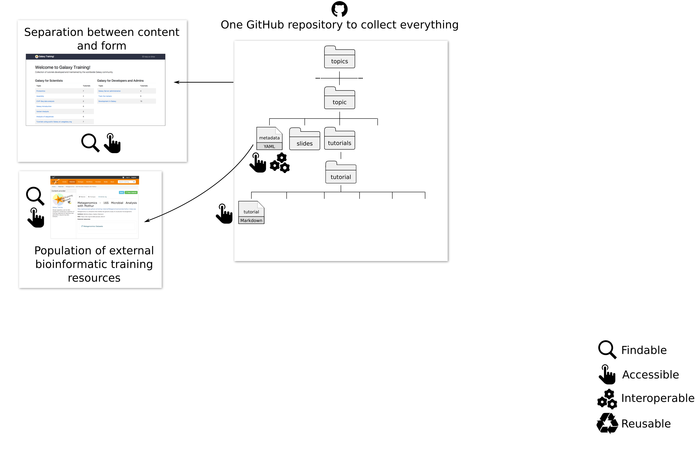 <!-- .element width="90%" -->

----
### An open, collaborative, FAIR, online infrastructure

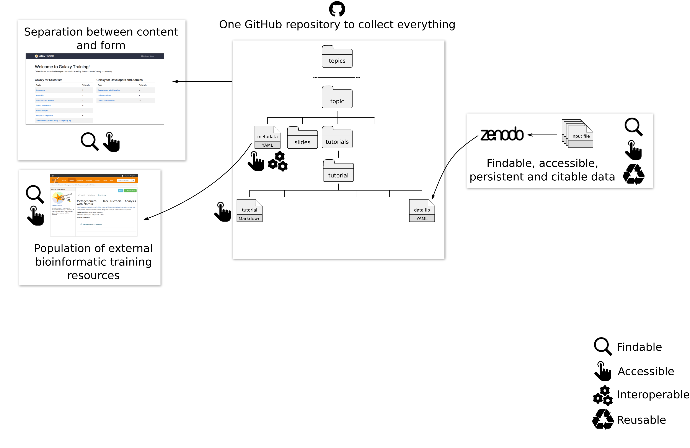 <!-- .element width="90%" -->

----
### An open, collaborative, FAIR, online infrastructure

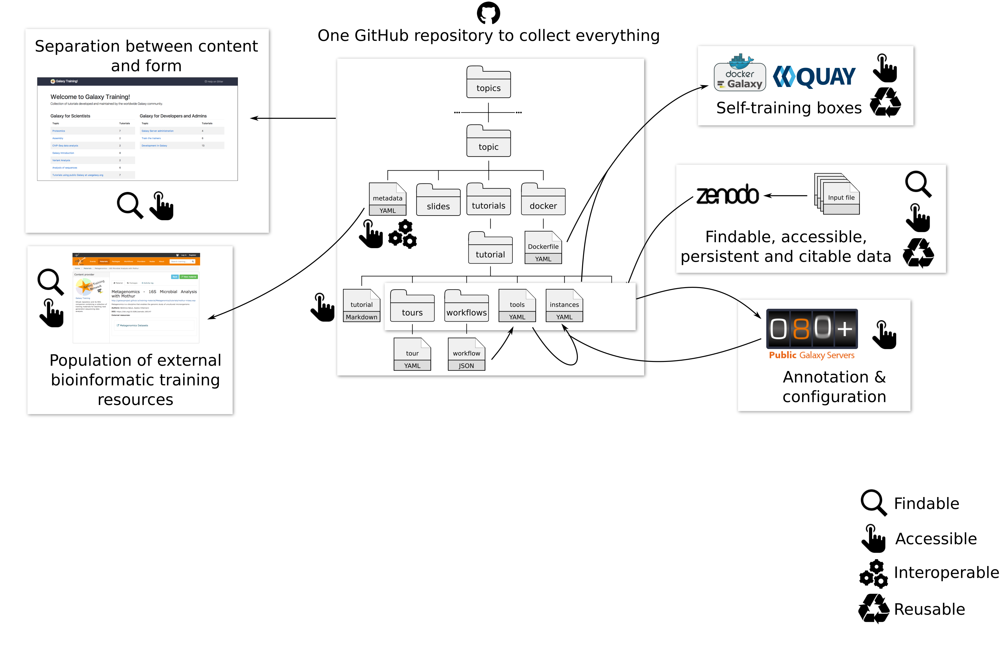 <!-- .element width="90%" -->

----
### An open, collaborative, FAIR, online infrastructure

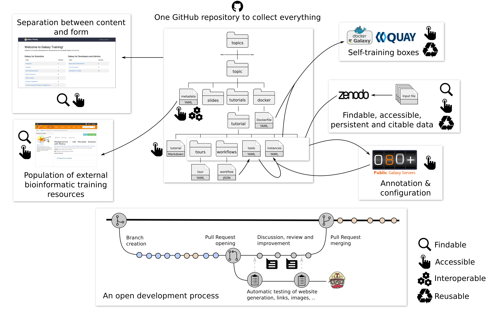 <!-- .element width="90%" -->

---
## Thank you!


