Hello! I am [Bérénice](http://bebatut.fr/), the author of following slides.

<small>
This slide does not exist in original deck. It is useful if you are not familiar with [Reveal.JS](https://github.com/hakimel/reveal.js), used here.
</small>

The easiest way to navigate this slide deck is by hitting `[space]`on your keyboard.

---
<!-- .slide: data-background-color="#feed00" -->

### Beer Decoded
#### Exploring the beer metagenome

 <!-- .element width="70%" -->

Bérénice Batut

<small>
Backofen Lab Meeting - November 2017
</small>

----
<!-- .slide: data-background-color="#feed00" -->

### Who's behind?

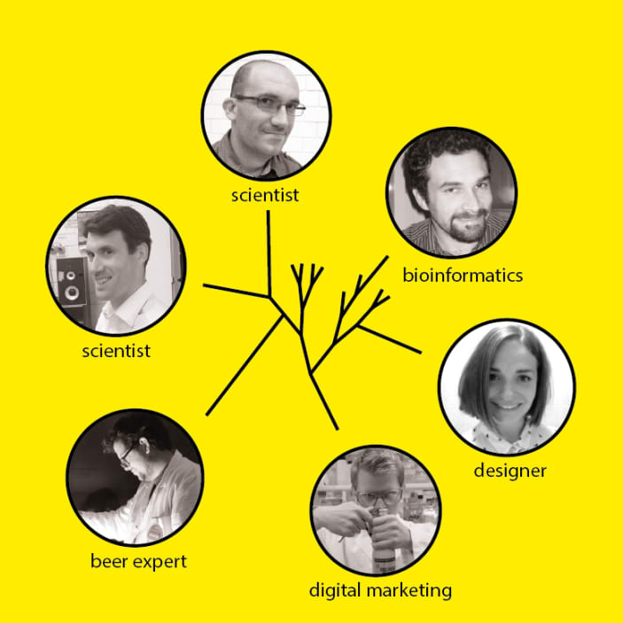 <!-- .element width="50%" -->

[Hackarium](http://www.hackuarium.ch/en/)

<aside class="notes">
An Open Laboratory for DIY Biology (and beyond)

At Hackuarium, we want to bring biology (and biologists) to the world, and the real world back to biology. Our laboratory is an excuse to meet and discuss, build and develop ideas in a neutral, open, noncompetitive and not-for-profit environment.

- Not a lab or linked to an university
- Projects in biology/science, bioart, education
- Workshops
- Citizen-science, DIY biology
- Communication
</aside>
----
<!-- .slide: data-background-color="#ffe92f" -->
### The project

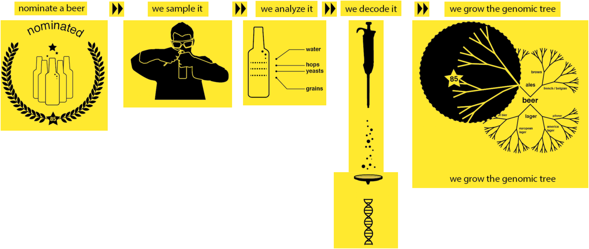 <!-- .element width="120%" -->

----
### Why a project based on beers?

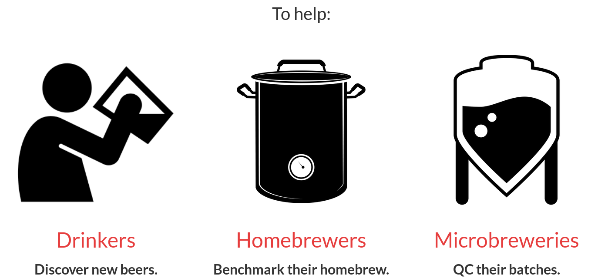 <!-- .element width="100%" -->

<small>http://www.genome.beer/<small>

---
### Communication & funding

<div id="left">
  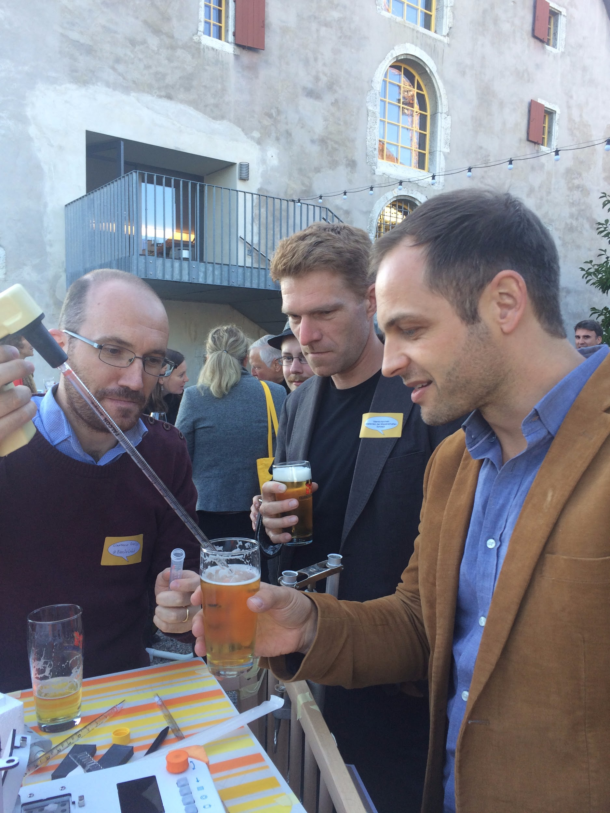 <!-- .element width="90%" -->
</div>
<div id="right">
  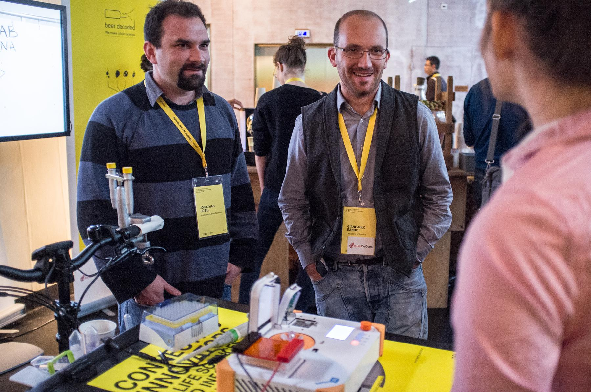 <!-- .element width="80%" -->
  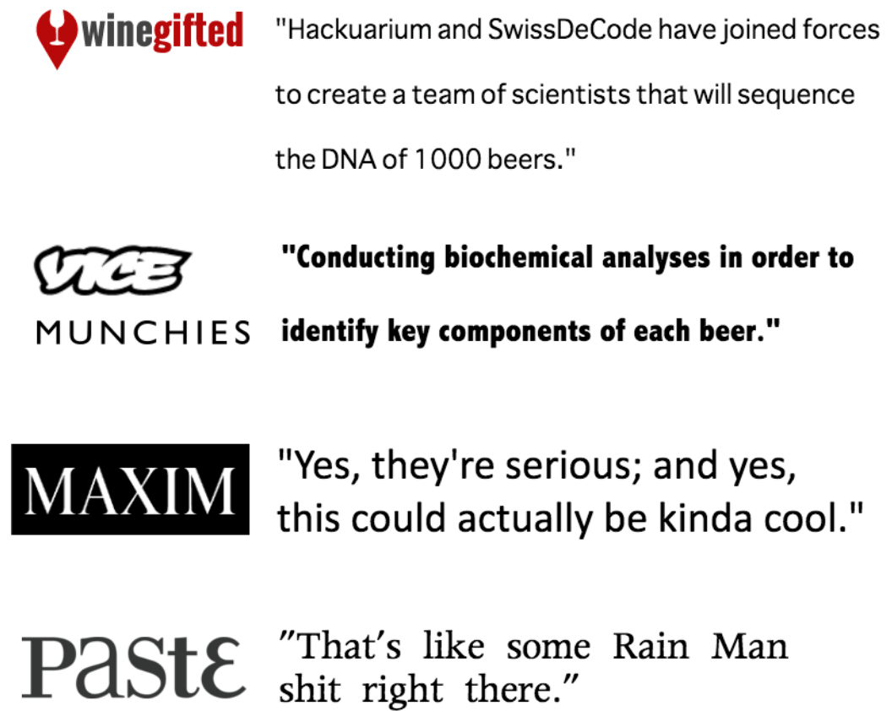 <!-- .element width="70%" -->
</div>

<aside class="notes">
- Meeting the citizen: Beer testing on a cargo bike
- Going to event:
  - Presentation of the Bento Lab
- Press release
</aside>

----
### Communication & funding

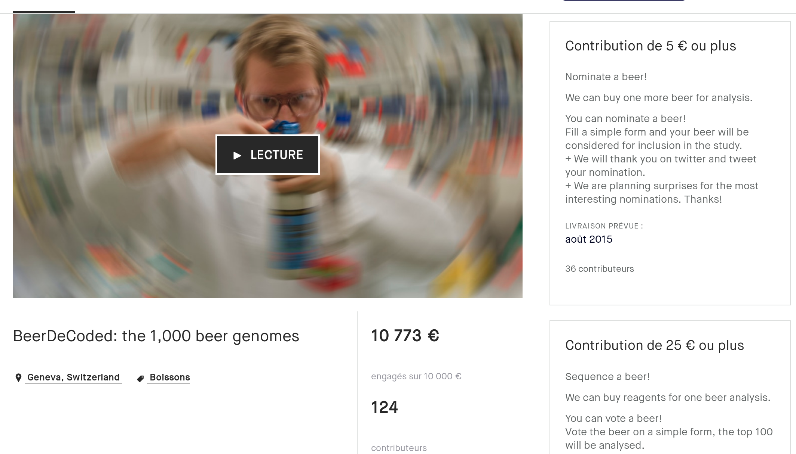 <!-- .element width="90%" -->

<small>
[Kickstarter](https://www.kickstarter.com/projects/489252126/beerdecoded-the-1000-beer-genomes?lang=fr)
</small>

<aside class="notes">
- more than 10,000 euros
</aside>

---
<!-- .slide: data-background-color="#ffe92f" -->
### Sampling, analyses and decoding

 <!-- .element width="120%" -->

----
### Beer DNA extraction

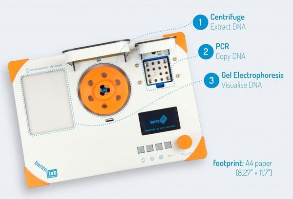 <!-- .element width="60%" -->

PCR: Amplification of Internal transcribed spacer (ITS) sequences

<aside class="notes">
- Extraction of ITS: fungus
- Sequencing:
  - MiSeq: University of Lausanne
  - In negociation for a MinION
</aside>
----
### Beer DNA extraction workshops

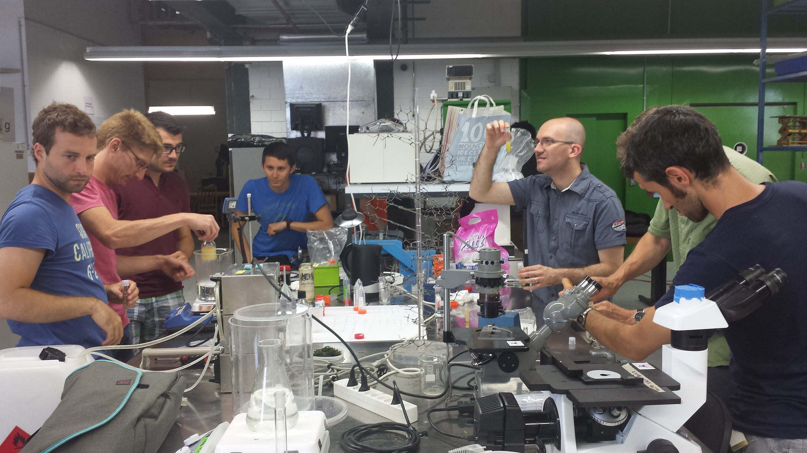 <!-- .element width="100%" -->

---
<!-- .slide: data-background-color="#ffe92f" -->
### Decoding & Genomic tree building

 <!-- .element width="120%" -->

----
### Bioinformatics analyses

ITS amplicon for 39 beer

1. Mapping with BWA against a curated set of ITS sequences (Refseq)
2. Sorting and indexing of the BAM files
3. Extraction of the number of ITS per beer and per Species

<aside class="notes">
only species with over 10 reads were taken into consideration
</aside>
----
### Results

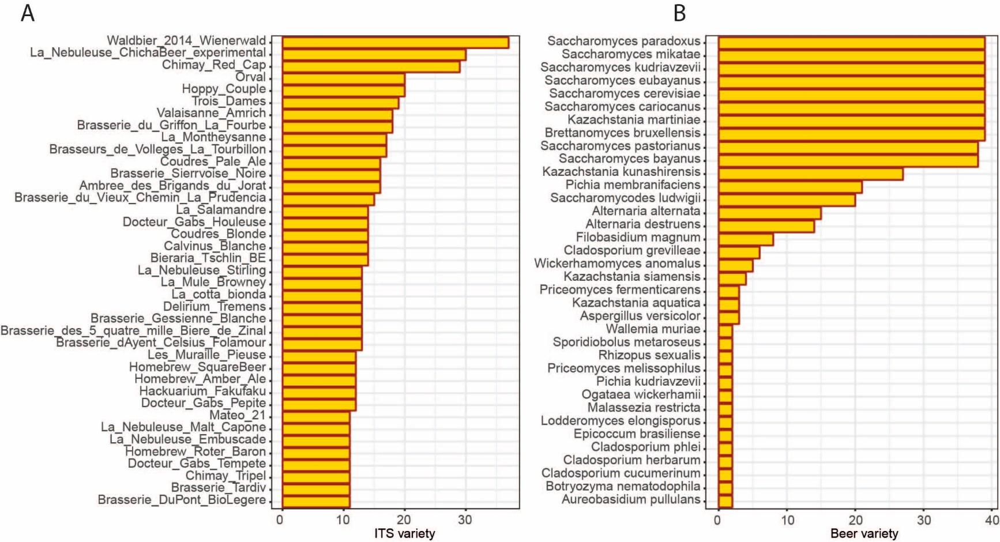 <!-- .element width="100%" -->

<aside class="notes">
1. the number of beers containing the species (n=36) occurring in at least two samples. Species (n=52) present in only one sample were excluded for clarity
2. Number of fungal species identified in each of the 39 bottled beers.
</aside>

----
### Results

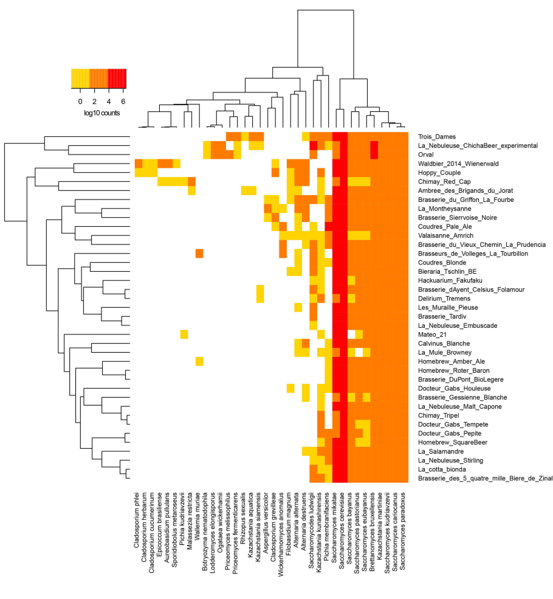 <!-- .element width="60%" -->

Number of reads per ITS per beer (in log 10 read counts)

<aside class="notes">
  Only ITS with more than 10 reads and present in at least two beers are shown
</aside>

----
### <i class="fa fa-thumbs-o-down" aria-hidden="true"></i> Not involving citizens

```
#!/bin/bash

#BSUB -L /bin/bash
#BSUB -o bwa.txt
#BSUB -e bwa.err
#BSUB -N
#BUSB -u jonathan.sobel@unil.ch
#BSUB -R rusage[mem=32000]
#BSUB -M 32000000

####BeerDecoded ITS Count per beers####

module add UHTS/Analysis/samtools/1.3;

for i in $( ls *_sorted.bam)
do
	SUBSTRING=$(echo $i| cut -d'.' -f 1)
	echo $SUBSTRING
	samtools view -q 3 $i|cut -f 3|sort|uniq -c|sed 's/|/ /g'|awk -v beer="$SUBSTRING" '{print $1, $5, beer}'| sort -n -r |sed 's/_sorted//g' >> Beer_results_all.txt
done

grep '>' ITS_sequence.fa| cut -d '|' -f 4,5|sed 's/; from TYPE material//g' > species_ID_mapping.txt
```

---

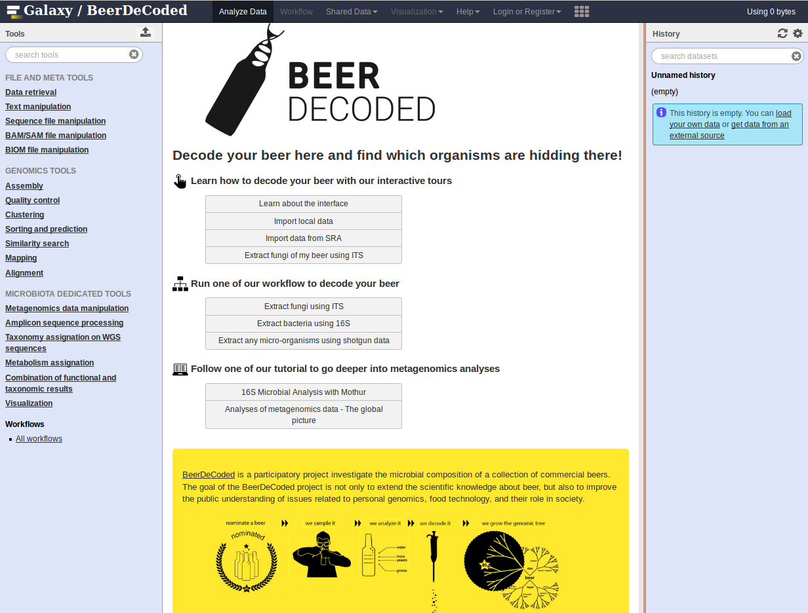 <!-- .element width="80%" -->

----
### A Galaxy Beer Decoded!

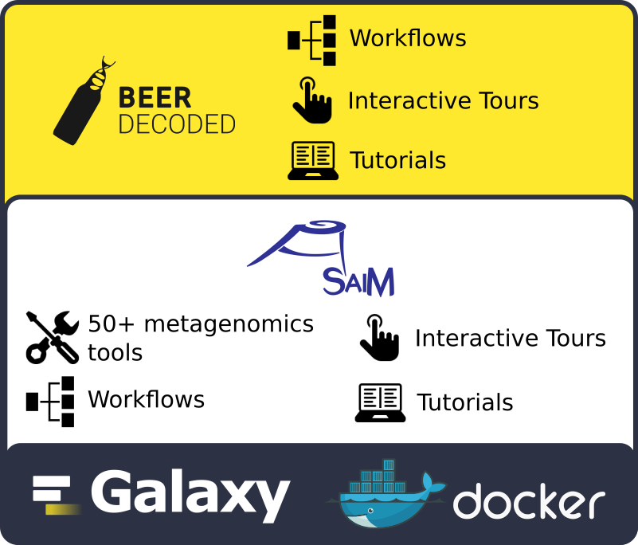 <!-- .element width="60%" -->


<aside class="notes">
Docker (bjoern) --> ASaiM --> Beer Decoded

Added:
- workflow
- tours
  - upload a dataset
  - run the Workflow
- training
</aside>

---
## Perspectives

- Training
  - In Lausanne
  - Using the data set to develop new training
- Deployment & Testing the Galaxy instance
- Create an instance here in Freiburg?
  - Freilab?
  - Who would be interested?

---
<!-- .slide: data-background-color="#ffe92f" -->
## Thank You!

 <!-- .element width="120%" -->

<small>
[Sobel, J., Henry, L., Rotman, N., & Rando, G. (2017). BeerDeCoded: the open beer metagenome project. F1000Research, 6.](https://f1000research.com/articles/6-1676/v1)
</small>
