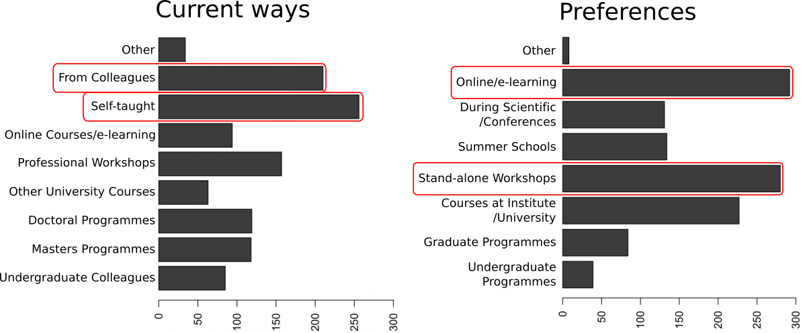
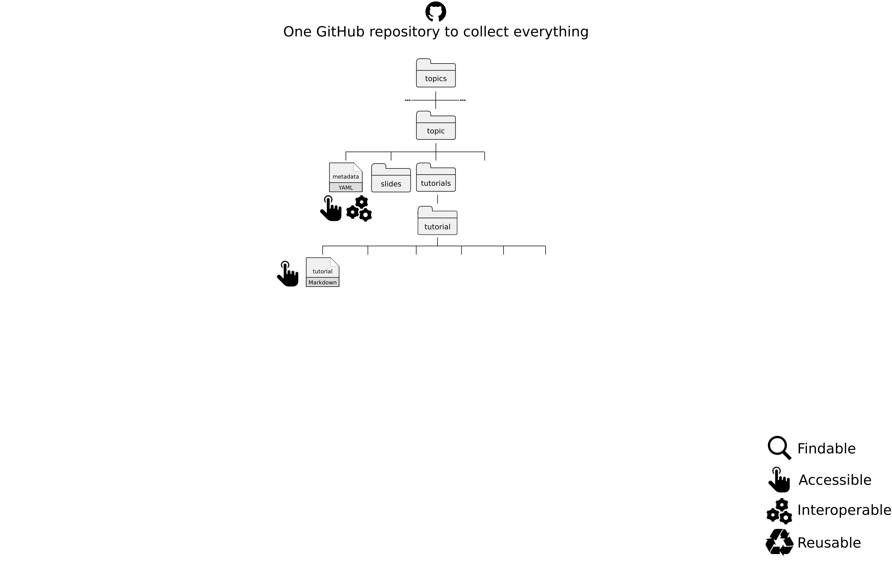
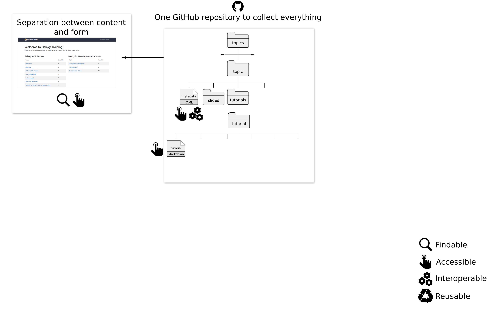
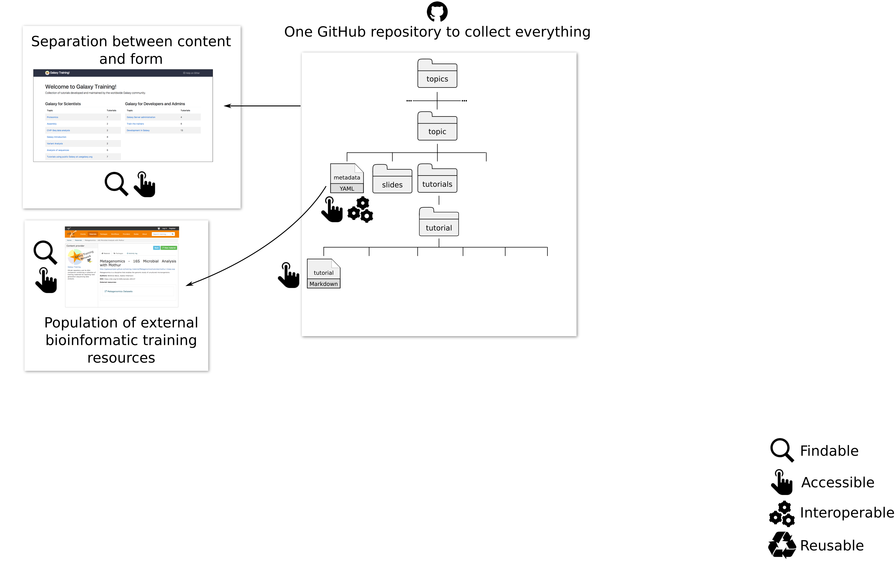
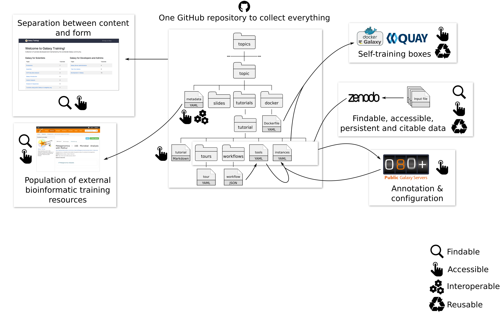
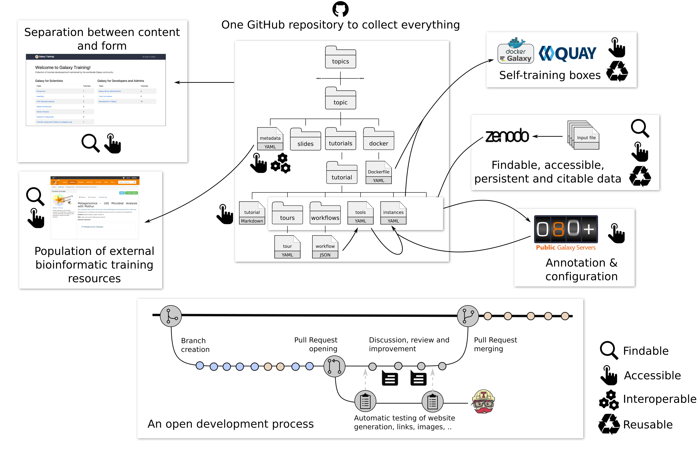
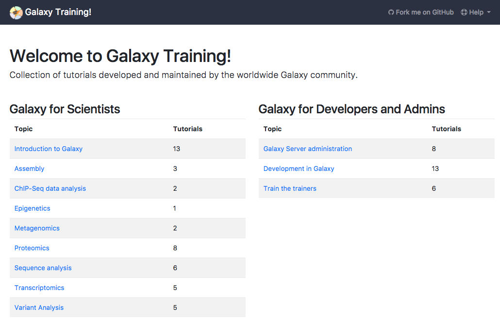
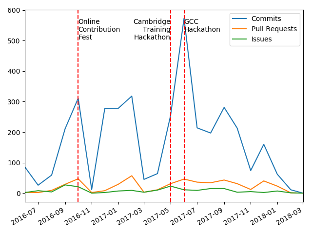
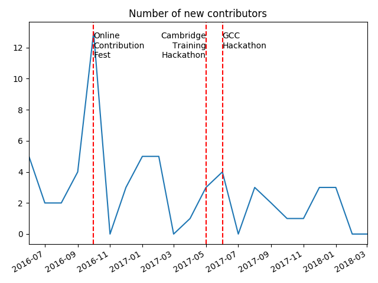

Hello! I am [Bérénice](http://bebatut.fr/), the author of following slides.

<small>
This slide does not exist in original deck. It is useful if you are not familiar with [Reveal.JS](https://github.com/hakimel/reveal.js), used here.
</small>

The easiest way to navigate this slide deck is by hitting `[space]`on your keyboard.

---
### Building an open, collaborative, online infrastructure for bioinformatics training

<!-- .element height="55%" width="55%" -->

Bérénice Batut

<small>
33rd TBI Winterseminar  Februar 2018
</small>

---
<!-- .slide: data-background="images/freiburg_workshop.jpg" data-state="dim-background" -->
# Why caring about bioinformatics training?

----
### Need for bioinformatic training

> Bioinformatics has become too central to biology to be left to specialist bioinformaticians 

- Explosion of data to analyze
- Access to computational power
- Thousand of possible tools for specialized analyses

----
### An increasing demand  for learning bioinformatics

 <!-- .element height="100%" width="100%" -->

Graphs of [Brazas et al, 2017](http://biorxiv.org/content/early/2017/02/27/098996)

---
<!-- .slide: data-background="images/DSC_0630.jpg" data-state="dim-background" -->
# Galaxy a great solution !

----
### Computational knowledge: Not required!

 <!-- .element height="60%" width="60%" -->

- Web interface for numerous bioinformatics tools
- Scalable
- No issue with computer configuration during training

---

 <!-- .element height="80%" width="80%" -->

### Building a new **open**, **collaborative** and **FAIR** model for bioinformatics training

----
### Requirements

- Easy to use
- Support for effective training for
    - Individual users
    - Instructors
- Definition of technological infrastructure
- Limited redundancy

----
### An open, collaborative, FAIR, online infrastructure

 <!-- .element width="90%" -->

----
### An open, collaborative, FAIR, online infrastructure

 <!-- .element width="90%" -->

----
### An open, collaborative, FAIR, online infrastructure

 <!-- .element width="90%" -->

----
### An open, collaborative, FAIR, online infrastructure

 <!-- .element width="90%" -->

----
### An open, collaborative, FAIR, online infrastructure

 <!-- .element width="90%" -->

----
### An open, collaborative, FAIR, online infrastructure

 <!-- .element width="90%" -->

----
## Galaxy Training materials

 <!-- .element width="70%" -->

[http://training.galaxyproject.org](http://training.galaxyproject.org)

----
<!-- .slide: data-background-color="#000000" data-background="images/contributors.png" data-state="dim-background-2"-->

 
<h2 class="fragment" data-fragment-index="2">THANKS to all of them!</h2>

---
## Thank you!

 <!-- .element width="90%" -->

---
<!-- .slide: data-background="images/osi.jpg"  data-state="dim-background"-->
# Community effort

----
### Numerous contributions

 <!-- .element width="65%" -->

3 successful hackathons and one planned in May!

----
### Numerous discussions

 <!-- .element height="70%" width="70%" -->

Gitter: [Galaxy-Training-Network/Lobby](https://gitter.im/Galaxy-Training-Network/Lobby)

----
### A constantly growing community

