Hello! I am [Bérénice](http://bebatut.fr/), the author of following slides.

<small>
This slide does not exist in original deck. It is useful if you are not familiar with [Reveal.JS](https://github.com/hakimel/reveal.js), used here.
</small>

The easiest way to navigate this slide deck is by hitting `[space]`on your keyboard.

---

### Community-driven training for biological data analysis with the Galaxy Training Network

 <!-- .element width="60%" -->

Bérénice Batut

<small>
Galaxy Africa - April 2018
</small>

---
<!-- .slide: data-background="images/freiburg_workshop.jpg" data-state="dim-background" -->
# Why caring about bioinformatics training?

----
### Need for bioinformatic training

> Bioinformatics has become too central to biology to be left to specialist bioinformaticians 

- Explosion of data to analyze
- Access to computational power
- Thousand of possible tools for specialized analyses

----
### An increasing demand  for learning bioinformatics

 <!-- .element height="100%" width="100%" -->

Graphs of [Brazas et al, 2017](http://biorxiv.org/content/early/2017/02/27/098996)

---
<!-- .slide: data-background="images/DSC_0630.jpg" data-state="dim-background" -->
# Galaxy a great solution !

----
### Computational knowledge: Not required!

 <!-- .element height="60%" width="60%" -->

- Web interface for numerous bioinformatics tools
- Scalable
- No issue with computer configuration during training

----

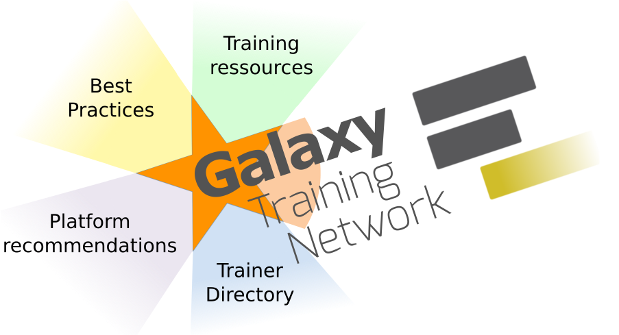 <!-- .element width="100%" -->

Note:

Growing network with currently 33 groups invested in Galaxy-based training

---

 <!-- .element width="50%" height="50%" -->

### Building an infrastructure facilitating data analysis training in life sciences

----
### Requirements for a training infrastructure

- Interactive learning platform
- Support for current research problems
- Usable for effective training for individual users & instructors
- Community driven (content creation and maintenance)
- FAIR: Findable, Accessible, Interoperable, Reusable
- Open

---

### Interactive learning via hands-on tutorials

 <!-- .element width="100%" -->

Note:

Designed to be interactive and built around Galaxy

----
### Hands-on tutorials built around a "research story"

<iframe src="http://galaxyproject.github.io/training-material/topics/transcriptomics/tutorials/ref-based/tutorial.html"
height="450" width="100%" style="border:2px solid grey;">
</iframe>

<small>[Transcriptomics - Reference-based RNA-Seq data analysis](http://galaxyproject.github.io/training-material/topics/transcriptomics/tutorials/ref-based/tutorial.html)</small>

Note:

Built around a "research story"
- Introduction
- Data upload (downsampling)
- Hands-on with different steps

Metadata to help trainees and instructors to keep track of the training goads
- Learning objectives
- Prerequisites
- Questions: Regular assessments with question boxes

----
### Hands-on also supported by Interative Tours

 <!-- .element width="100%" -->

----
### A collection of materials covering many topics

<iframe src="http://training.galaxyproject.org/"
height="450" width="100%" style="border:2px solid grey;">
</iframe>

https://training.galaxyproject.org

----
### A collection of materials covering many topics

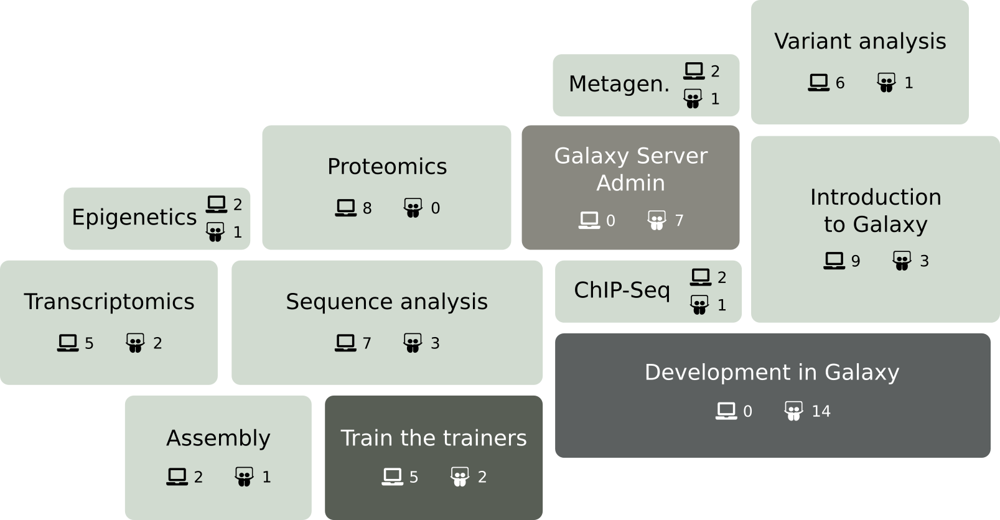 <!-- .element width="95%" -->

More than 80 tutorials!

Note:

Suppose that a researcher is interested in learning about transcriptomic data analyses

Categorie "Transcriptomics"
- A set of introductory slides
- ... hands-on tutorials
- 

----
### Used both by individual users

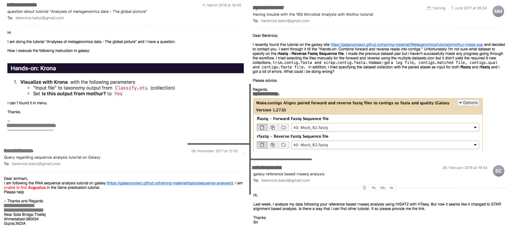 <!-- .element width="100%" -->

----
### Used both by individual users & instructors

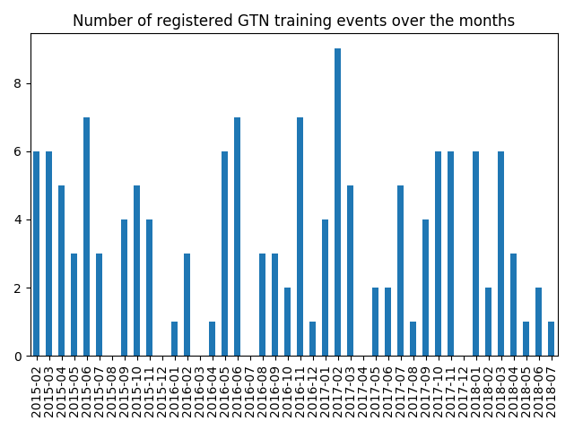 <!-- .element width="80%" -->

----
### Used both by individual users & instructors

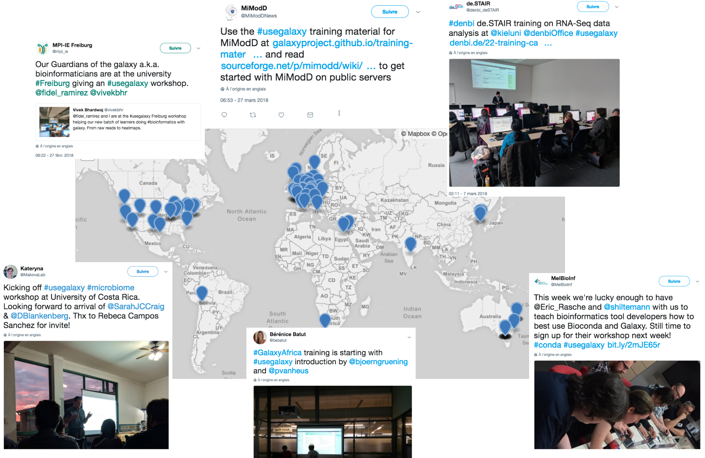 <!-- .element width="90%" -->

---
### Requirements for a training infrastructure

<ul class="requirements">
    <li>
        
<i class="fa fa-check-square-o"></i> Interactive learning platform

        
<i class="fa fa-check-square-o"></i> Support for current research problems

        
<i class="fa fa-check-square-o"></i> Usable for effective training for individual users & instructors

        
<i class="fa fa-square-o"></i> Community driven (content creation and maintenance)

        
<i class="fa fa-square-o"></i> FAIR: Findable, Accessible, Interoperable, Reusable

        
<i class="fa fa-square-o"></i> Open

    </li>
</ul>

---
### Building an infrastructure to facilitate community-led content development

- Makes tutorial creation a convenient, hassle-free process
- Enables transparent peer-review and curation to guarantee high-quality and current content

Note:

Inspiration from Software and Data Carpentry

----
### Separation between content and format

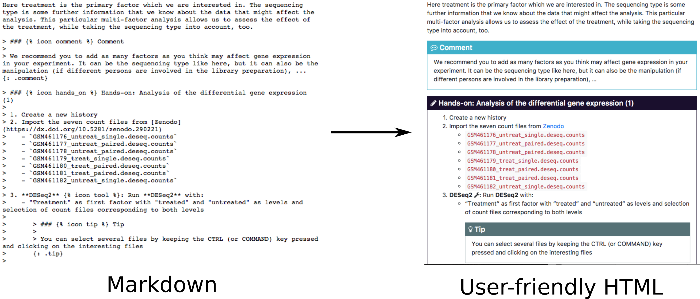 <!-- .element width="120%" -->

https://training.galaxyproject.org

----
### Creating a tutorial

<iframe src="http://galaxyproject.github.io/training-material/topics/training/"
height="450" width="100%" style="border:2px solid grey;">
</iframe>

http://galaxyproject.github.io/training-material/topics/training/

Note:

Creating a small tutorial

- Copy tutorial1 from the templates and put it into `sequence-analysis`
- Change the top metadata
- Change the topic metadata
    - `title: Similarity search with BLAST`
    - `type: "tutorial"`
    - `name: "similarity-search"`
    - `zenodo_link: ""` (we do not have data currently)
    - `galaxy_tour: no` (we do not have Galaxy Interactive Tour currently)
    - `hands_on: yes`
    - `slides: no`
    - `workflows: no`
    - `requirements`: a requirement to "Galaxy introduction" with internal link to `introduction`
- Serve the website locally
- Add the top metadata
    - questions:
      - "How to find similar sequences into a reference set of sequences?"
    - objectives:
      - "Search similar sequences with BLAST"
- Filling the tutorial
    - Finding a good toy dataset
    - filling the tutorial
        - small introduction
        - a hands-on box
        - a question box
        - an image

----
### One GitHub repository to collect everything

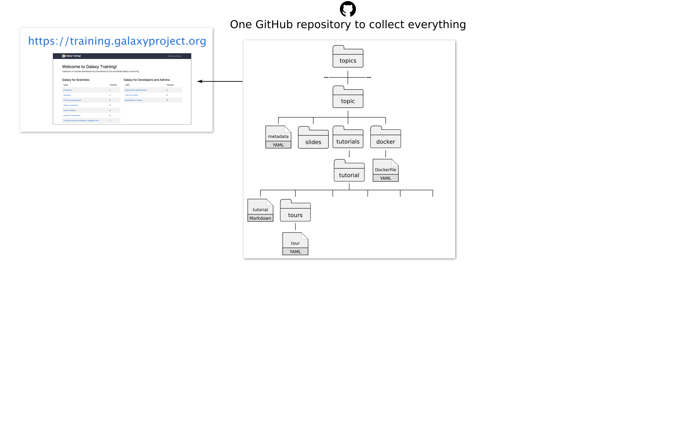 <!-- .element width="90%" -->

https://github.com/galaxyproject/training-material

----
### An open and accessible development process

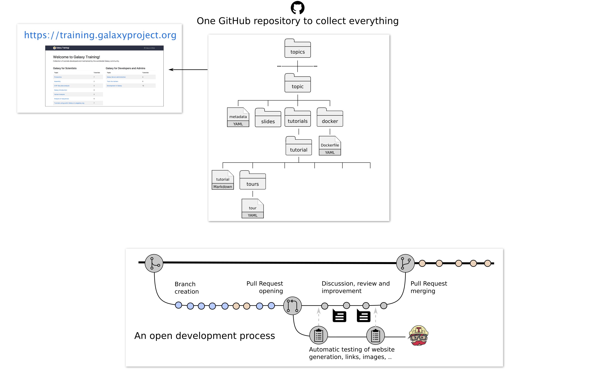 <!-- .element width="90%" -->

Note:

- Fork of the main repository
- Write content in markdown following our guide + metadata in YAML
- Pull request
- Suggestions
- Automatic testing
- Acceptation
    - new material becomes a part of the official training material 
    - website regeneration

----
### Community-driven

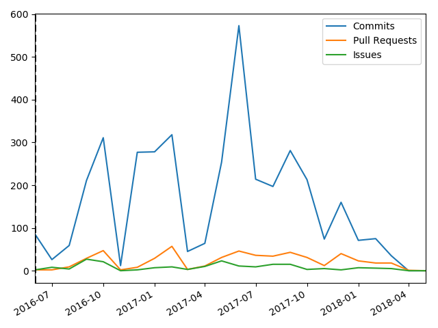 <!-- .element width="80%" -->

----
### Community-driven

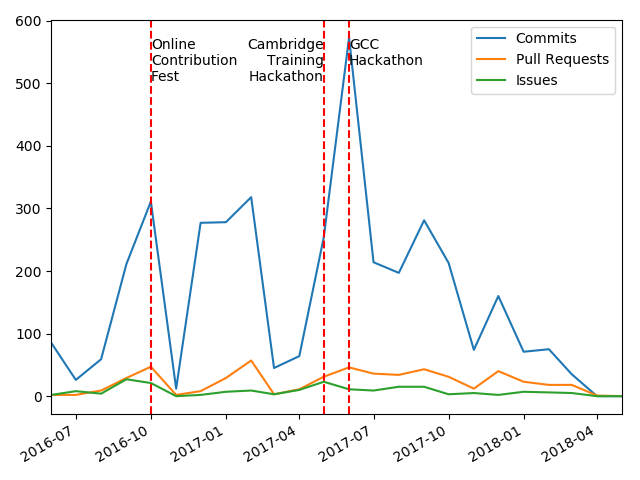 <!-- .element width="80%" -->

----
### A constant support

 <!-- .element height="70%" width="70%" -->

Gitter: [Galaxy-Training-Network/Lobby](https://gitter.im/Galaxy-Training-Network/Lobby)

----
### Galaxy Tour Builder
#### A web extension to develop interactive tours

 <!-- .element width="85%" -->

https://github.com/TailorDev/galaxy-tourbuilder

Note:

Demo
- New Env
- Upload: https://zenodo.org/record/1185122/files/Drosophila_melanogaster.BDGP6.87.gene_lengths
- Search tool

----
### Ensuring accessibility of tutorials

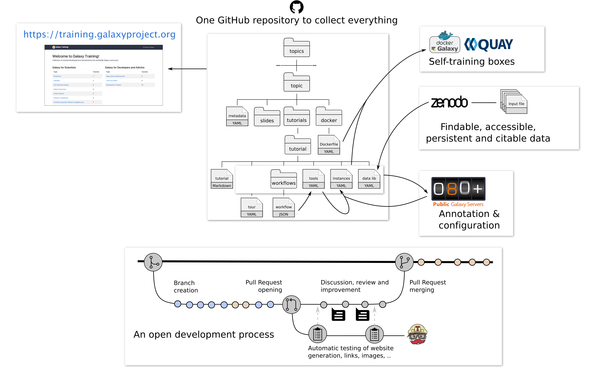 <!-- .element width="90%" -->

Note:

Every Galaxy instance 

- Tools
- Data
- Docker images

----
### TeSS: the ELIXIR's training portal

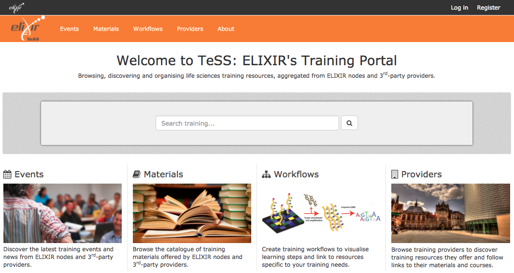 <!-- .element width="80%" -->

https://tess.elixir-europe.org/

----
### Findable, Accessible, Interoperable, Reusable

 <!-- .element width="90%" -->

Note:

- YAML
- TeSS
- EDAM

---
### Requirements for a training infrastructure

<ul class="requirements">
    <li>
        
<i class="fa fa-check-square-o"></i> Interactive learning platform

        
<i class="fa fa-check-square-o"></i> Support for current research problems

        
<i class="fa fa-check-square-o"></i> Usable for effective training for individual users & instructors

        
<i class="fa fa-check-square-o"></i> Community driven (content creation and maintenance)

        
<i class="fa fa-check-square-o"></i> FAIR: Findable, Accessible, Interoperable, Reusable

        
<i class="fa fa-check-square-o"></i> Open

    </li>
</ul>

---
<!-- .slide: data-background-color="#000000" data-background="images/contributors.png" data-state="dim-background-2"-->

---
## Thank you!

Sponsors

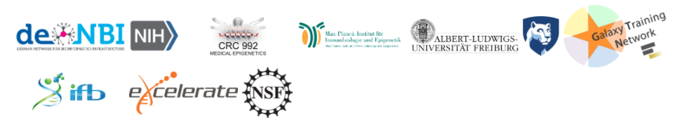 <!-- .element width="100%" -->

---

 <!-- .element width="75%" -->

<i class="ai ai-biorxiv"></i> [Community-driven data analysis training for biology](https://www.biorxiv.org/content/early/2017/11/29/225680) 
<i class="fa fa-globe"></i> [training.galaxyproject.org](http://training.galaxyproject.org)  
<i class="fa fa-github"></i> [github.com/galaxyproject/training-material](http://github.com/galaxyproject/training-material)
