Hello! I am [Bérénice](http://bebatut.fr/), the author of following slides.

<small>
This slide does not exist in original deck. It is useful if you are not familiar with [Reveal.JS](https://github.com/hakimel/reveal.js), used here.
</small>

The easiest way to navigate this slide deck is by hitting `[space]`on your keyboard.

---

### A journey through a RNA-Seq analysis   where germs, age and gender matter!

*Bérénice Batut*, Omar Mossad, Thomas Blank

<small>
Backofen Lab meeting - May 2018
</small>

---
### Microbiome–gut–brain axis

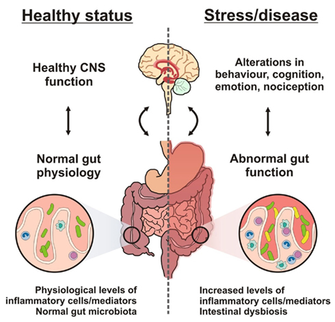 <!-- .element width="55%" -->

<small>
Figure 4 from [Grenham et al, 2011](https://www.frontiersin.org/articles/10.3389/fphys.2011.00094/full)
</small>

Note:

Role of the gut microbiota in the biochemical signaling events that take place between the GI tract and CNS

----
### Microbiome–gut–brain axis

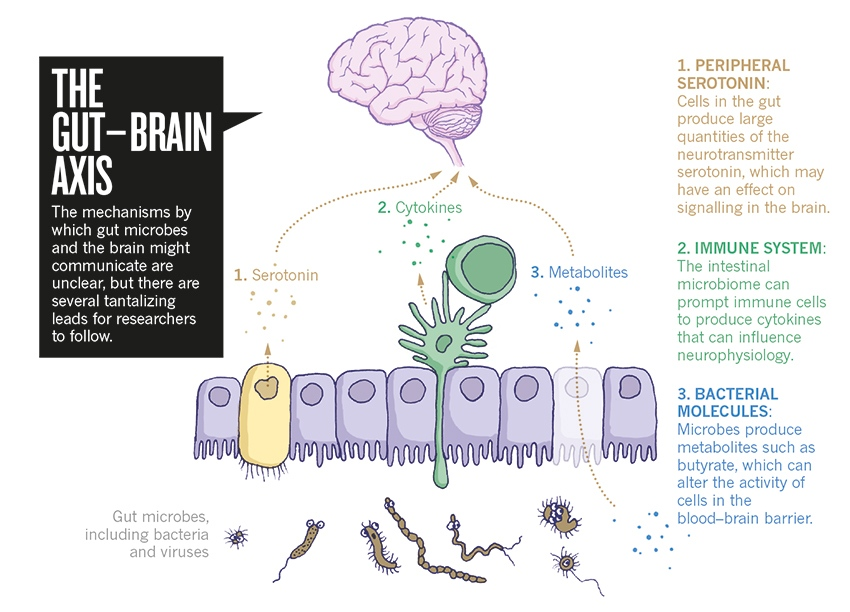 <!-- .element width="70%" -->

<small>
[Smith, 2015](https://www.nature.com/news/the-tantalizing-links-between-gut-microbes-and-the-brain-1.18557)
</small>

Note:

gut-brain axis includes
- the central nervous system
- neuroendocrine and neuroimmune systems with the hypothalamic–pituitary–adrenal axis (HPA axis), sympathetic and parasympathetic arms of the autonomic nervous system, including the enteric nervous system and the vagus nerve
- gut microbiota

----
### Neuroimmune system

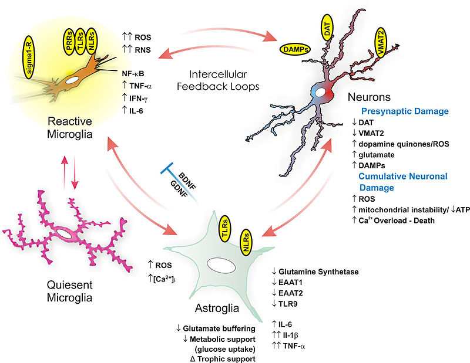 <!-- .element width="70%" -->

<small>
[Beardsley et al](https://commons.wikimedia.org/wiki/File:Glial_ntox_review.jpg)
</small>

----
### Microglia cells

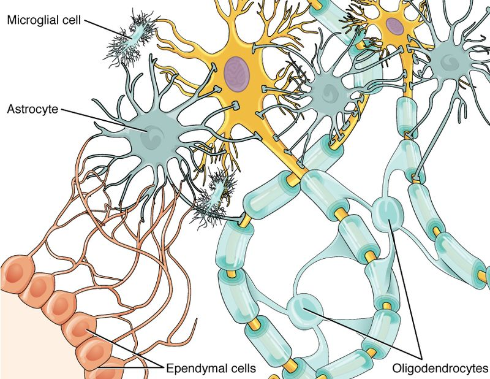 <!-- .element width="70%" -->

<small>
[OpenStax](https://commons.wikimedia.org/wiki/File:1209_Glial_Cells_of_the_CNS-02.jpg)
</small>

Note:

Microglia
- Embryonically seeded macrophages
- Contribute to brain development, homeostasis, and pathologies

It is thus essential to decipher how microglial properties are temporally regulated by intrinsic and extrinsic factors, such as sexual identity and the microbiome. 

----
### Question

- What is the impact of the microbiota on the microglia?
- Which genes and pathways are impacted?
- Is the impact different with aging?
- Is the impact different given the gender?

----
### Influence of microbiome on microglia

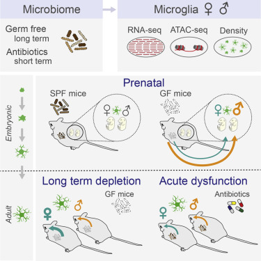 <!-- .element width="55%" -->

<small>
[Thion et al, 2017](https://www.sciencedirect.com/science/article/pii/S0092867417314320)
</small>

Note:

- Microglia undergo differentiation phases, different in adult males and females
- Time and sexually dimorphic impact of the absence of microbiome both prenatally and postnatally
    - microglia were more profoundly perturbed in male embryos and female adults
    - Antibiotic treatment of adult mice triggered sexually biased microglial responses revealing both acute and long-term effects of microbiota depletion

Microglia respond to environmental challenges in a sex- and time-dependent manner from prenatal stages

----

## Are these impacts the same on adult mices?

---
### RNA-seq data of microglya cells of mice

Type | Gender | Age | Replicates
---  | ---  | --- | ---
 <!-- .element width="35%" style="margin:0px 0px;" --> - SPF |  <!-- .element width="20%" style="margin:0px 0px;" --> | 2mth | 5
 | | 12mth | 6
 | | 24mth | 3
 |  <!-- .element width="30%" style="margin:0px 0px;" -->  | 2mth | 4
 | | 12mth | 5
 | | 24mth | 14
 <!-- .element width="30%" style="margin:0px 0px;" --> - GF |  <!-- .element width="20%" style="margin:0px 0px;" --> | 2mth | 5
 | | 12mth | 6
 | | 24mth | 3
 |  <!-- .element width="30%" style="margin:0px 0px;" --> | 2mth | 4
 | | 12mth | 4
 | | 24mth | 2

Note:

SPF = specific-pathogen-free

61 datasets

---
### Quality control and trimming

----
### Mapping
 
 <!-- .element width="90%" -->

----
### Gene counting
 
 <!-- .element width="100%" -->

----
### Gene count normalization

DESeq2 design

`gender + type + age + gender:type + gender:age + type:age`

Factor | Explanation (% of genes with LRT padj < 0.05)
--- | ---
`gender` | 17.37% - 21.83%
`type` | 8.9% - 9.5%
`age` | 17.92% - 23.13%
`gender:type` | 0.07% - 0.38%
`gender:age` | 11.36% - 12.43%
`type:age` | 3.59% - 4.31%

----
### Gene co-expression network

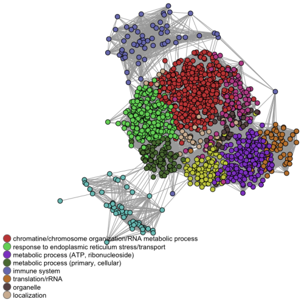 <!-- .element width="60%" -->

<small>`WGCNA`</small>

Note:

Tool???

----
### Differential gene expression analyses

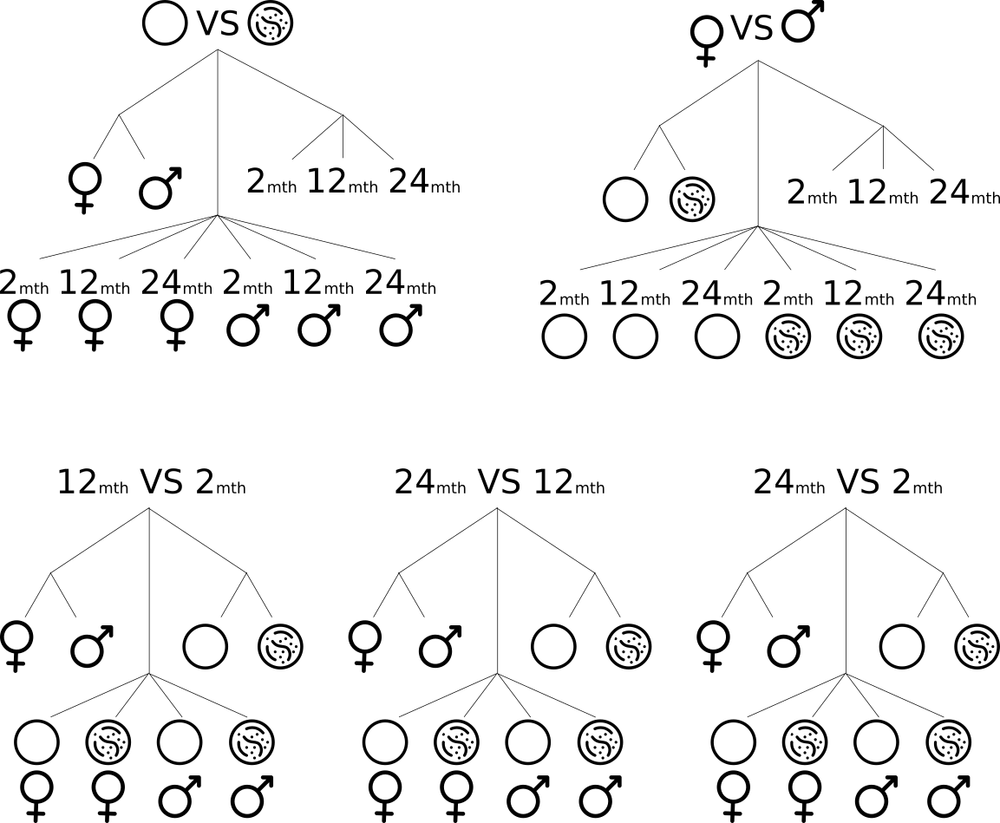 <!-- .element width="70%" -->

----
### DEG: Stats

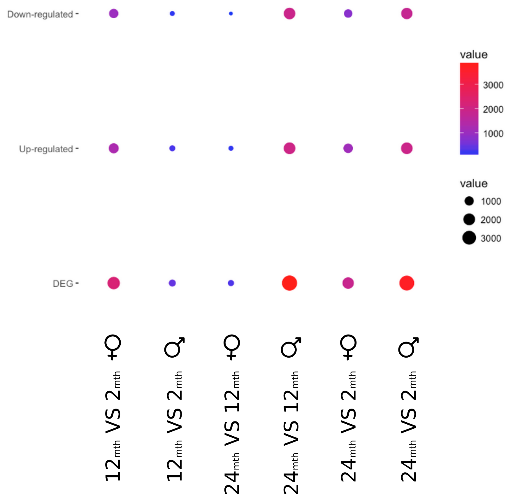 <!-- .element width="65%" -->

----
### DEG: Number comparison

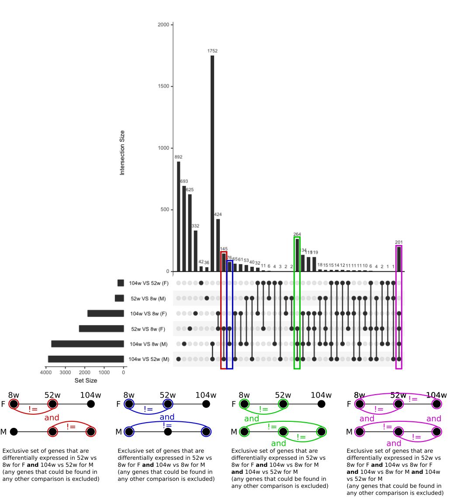 <!-- .element width="55%" -->

<small>`upset`</small>

----
### DEG: Co-expression network

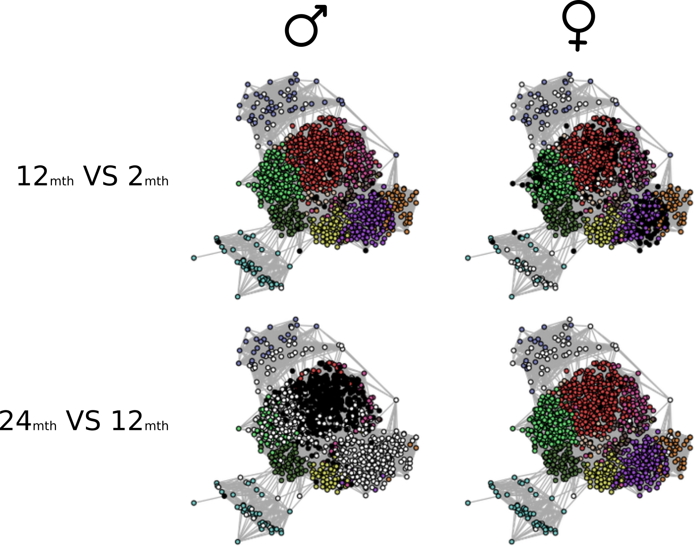 <!-- .element width="70%" -->

----
### GO enrichment analysis

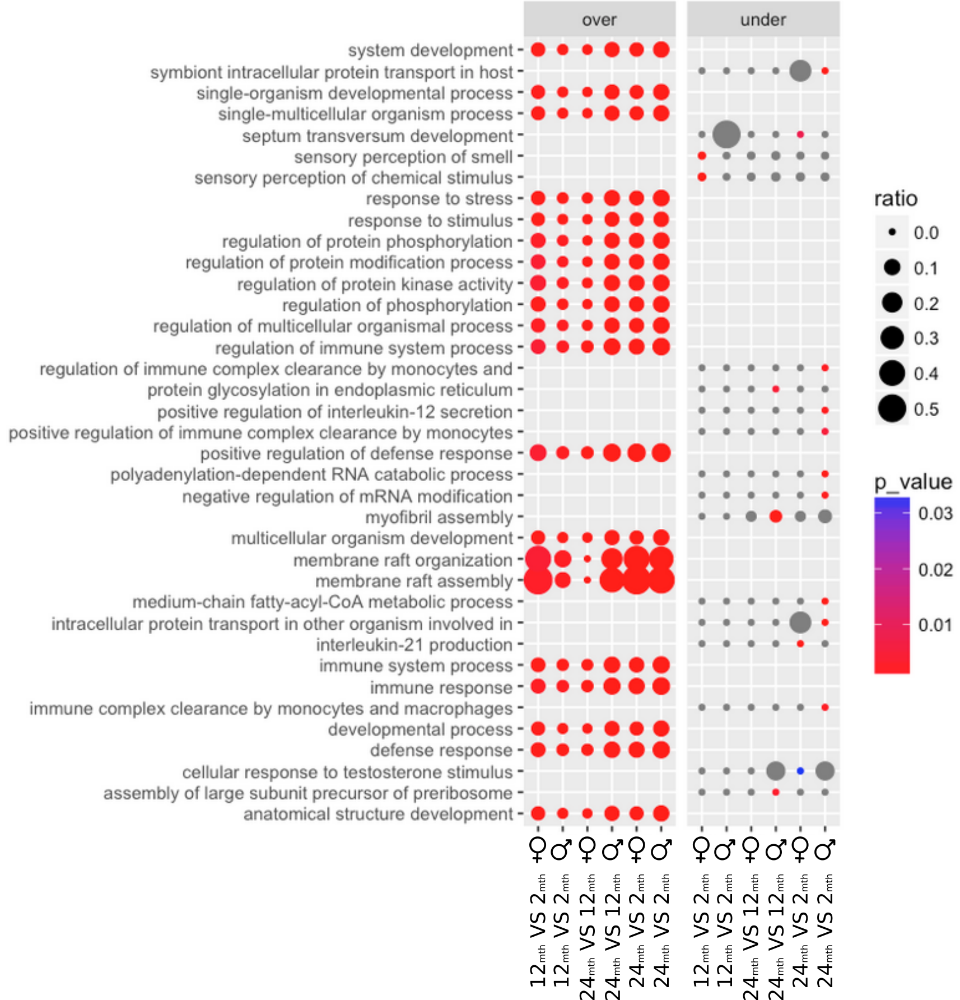 <!-- .element width="55%" -->

<small>`goseq`</small>

----
### GO enrichment analysis

 <!-- .element width="100%" -->

<small>`goseq`, `RamiGO`</small>

----
### KEGG enrichment analysis

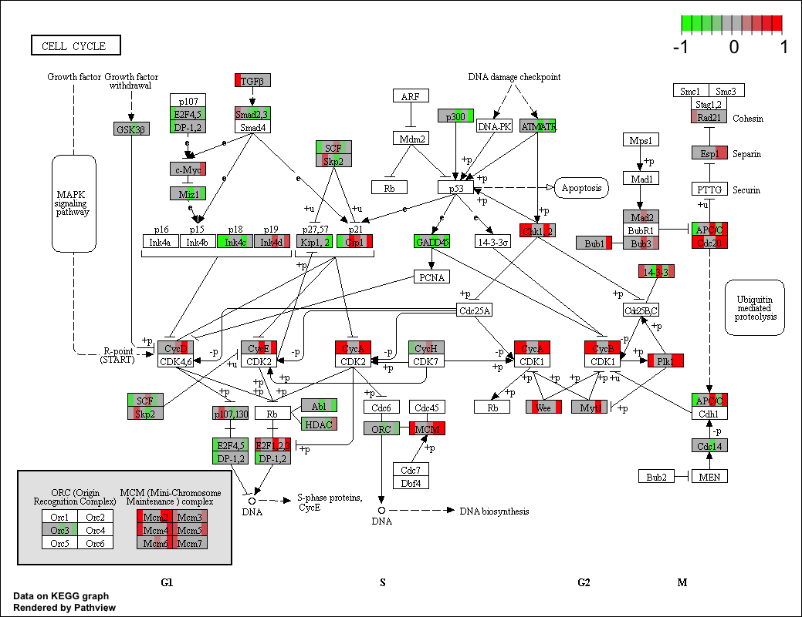 <!-- .element width="70%" -->

<small>`goseq`, `pathview`</small>

----
### And more specific questions

- What happen to SPF aging genes in GF samples?
- Are the same genes differentially expressed with aging as in Affymetrix data of [Grabert et al, 2016](https://www.nature.com/articles/nn.4222#methods)?
- Is there really a delay in differential expression in male compared to female?
- ...

---
### Type effect

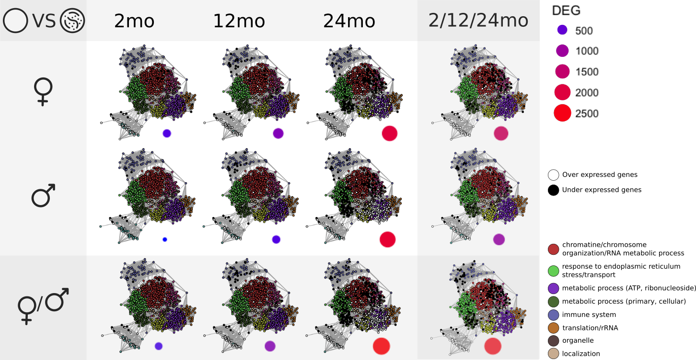 <!-- .element width="100%" -->

----
### Gender effect

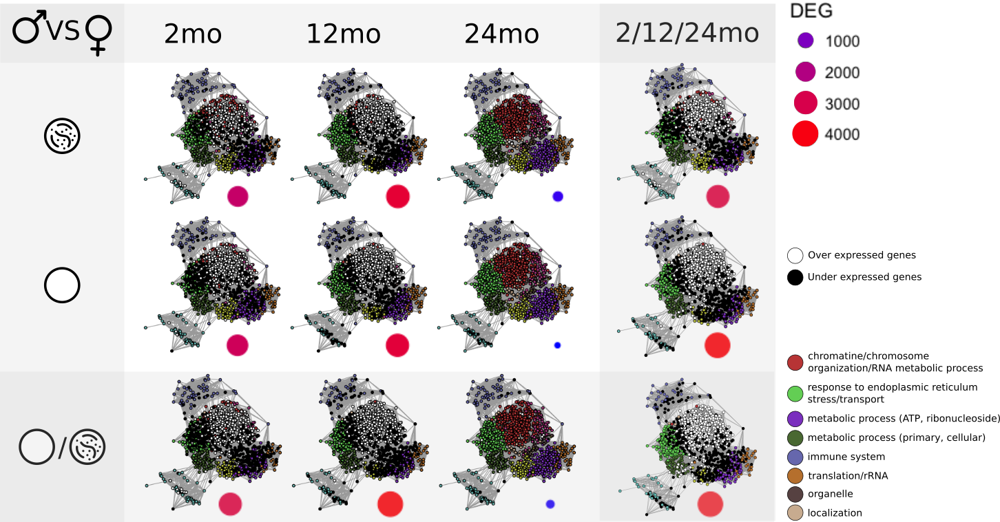 <!-- .element width="100%" -->

----
### Age effect

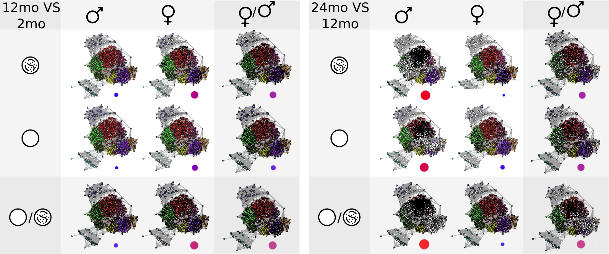 <!-- .element width="100%" -->

---
### Some technical comments

- Analysis
    - Until DESeq into Galaxy: data library, workflow, BioBlend
    - DESeq and after: several Jupyter notebooks with a shared functions
- Sharing with biologists
    - Private GitHub repository
    - Small website
        - Link to private data on the GitHub repo
        - Light HTML report of the Jupyter notebooks (hidden code)

---
### Next

- Integrate tools (`pathview`, `RamiGO`, `upset`, etc) into Galaxy
- Extend the current DESeq2 wrapper (interaction, contrasts, etc)
- Develop an advanced RNA-Seq tutorial
- Relate to metagenomic data of the gut

---
## Thank you!
