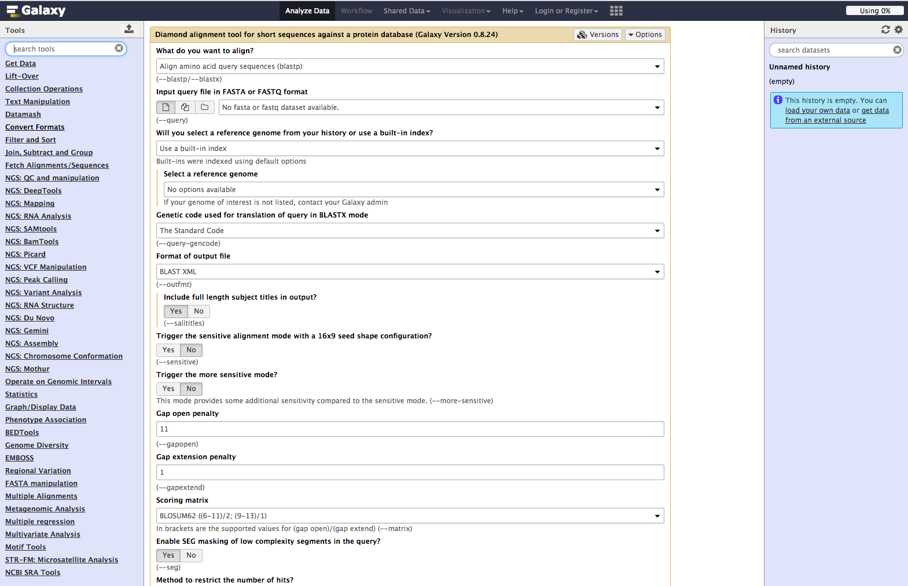
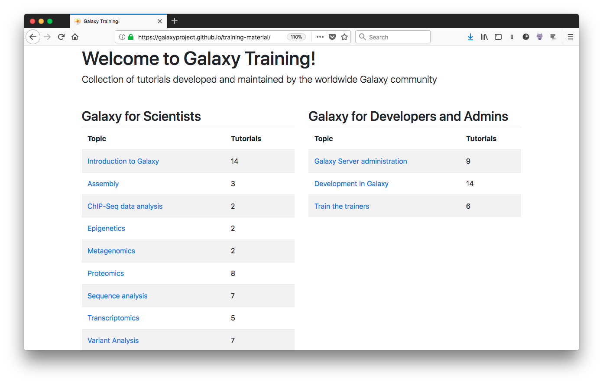
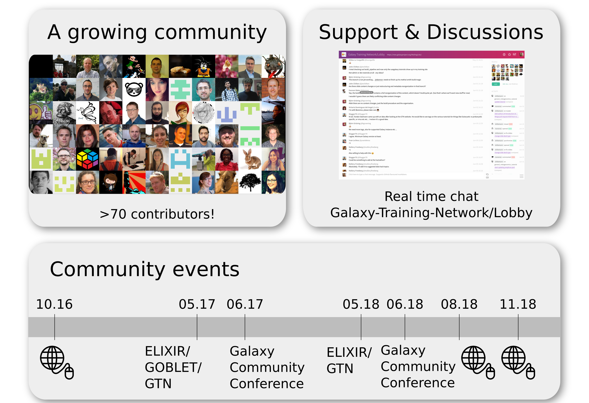

Hello! I am [Bérénice](http://bebatut.fr/), the author of following slides.

<small>
This slide does not exist in original deck. It is useful if you are not familiar with [Reveal.JS](https://github.com/hakimel/reveal.js), used here.
</small>

The easiest way to navigate this slide deck is by hitting `[space]`on your keyboard.

---

### Community-Driven Training for Biological Data Analysis with the Galaxy Training Network

 <!-- .element width="60%" -->

Bérénice Batut

<small>
CarpentryCon - May 2018
</small>

---
### Need and demand for bioinformatic training

> Bioinformatics has become too central to biology to be left to specialist bioinformaticians 

 <!-- .element width="80%" -->

<small>Graphs of [Brazas et al, 2017](http://biorxiv.org/content/early/2017/02/27/098996)</small>

---
### Galaxy: a great solution !

 <!-- .element width="60%" -->

- Web interface for numerous bioinformatics tools
- No issue with computer configuration during training

---
### Online training material covering many topics

 <!-- .element width="80%" -->

https://training.galaxyproject.org

---
### Interactive learning via hands-on tutorials built around a "research story"

 <!-- .element width="100%" -->

Note:

Designed to be interactive and built around Galaxy

Built around a "research story"
- Introduction
- Data upload (downsampling)
- Hands-on with different steps

Metadata to help trainees and instructors to keep track of the training goads
- Learning objectives
- Prerequisites
- Questions: Regular assessments with question boxes

---
### An effective training infrastructure

- Interactive learning platform
- Support for current research problems
- Usable for effective training for individual users & instructors
- FAIR (Findable, Accessible, Interoperable, Reusable) and Open
- Technical support (tools, data, etc)
- Community driven (content creation and maintenance)

---
### Community-driven

 <!-- .element width="85%" -->

---
## Thank you!

 <!-- .element width="80%" -->

<section style="text-align: left; margin-top: 2em;">

<i class="ai ai-biorxiv"></i> [Community-driven data analysis training for biology](https://www.biorxiv.org/content/early/2017/11/29/225680)  

<i class="fa fa-globe"></i> [training.galaxyproject.org](http://training.galaxyproject.org)  

<i class="fa fa-github"></i> [github.com/galaxyproject/training-material](http://github.com/galaxyproject/training-material)  
</section>

 <!-- .element width="100%" -->

