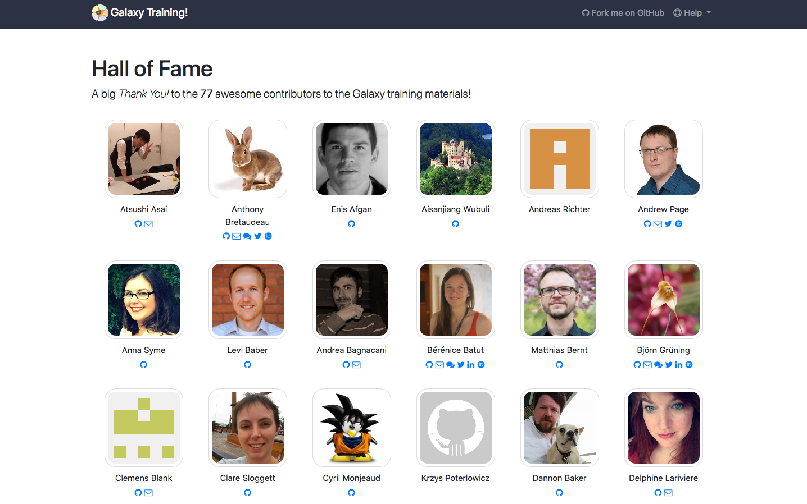
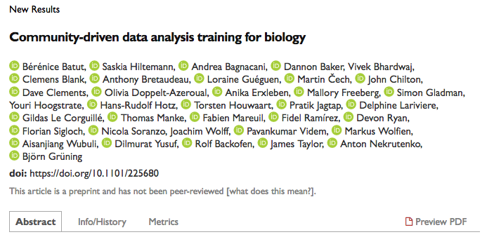

Hello! I am [Bérénice](http://bebatut.fr/), the author of following slides.

<small>
This slide does not exist in original deck. It is useful if you are not familiar with [Reveal.JS](https://github.com/hakimel/reveal.js), used here.
</small>

The easiest way to navigate this slide deck is by hitting `[space]`on your keyboard.

---

### A fruitful year for the Galaxy Training materials

 <!-- .element width="60%" -->

**Bérénice Batut**, Saskia Hiltemann, Björn Grüning  and the Galaxy Training Network

<small>
GCC/BOSC - June 2018
</small>

---
## Galaxy Training materials

 <!-- .element width="70%" -->

https://training.galaxyproject.org

<small>
One website, aggregating training material covering many current research topics
</small>

----
### Interactive learning via hands-on tutorials  built around a "research story"

 <!-- .element width="100%" -->

<small>
Usable for effective training for individual users & instructors
</small>

----
### Developed and maintained  by the community on GitHub

 <!-- .element width="75%" -->

https://github.com/galaxyproject/training-material

---
## Last year: 1st year of the project

<iframe
    src="https://bebatut-slides.github.io/gcc_06_17/#/1"
    height="450" width="100%" style="border:2px solid grey;">
</iframe>

Talks at [GCC](https://bebatut-slides.github.io/gcc_06_17/#/1) and [BOSC](https://bebatut-slides.github.io/bosc_07_17/#/1)

---
## A fruitful year:  more content

----
### New topics

<!-- .element width="80%" -->

----
### New tutorials and new content

Note:

Some tutorials has been restructured, improved or updated to use the state of the art tools

----
### Train the Trainers --> Contributing

<!-- .element width="90%" -->

Note:
- FAQ
 
---
## A fruitful year:  more technical support for training

----
### Galaxy Tour Builder

A web extension to develop interactive tours

 <!-- .element width="85%" -->

https://github.com/TailorDev/galaxy-tourbuilder

----
### Annotation with public Galaxy instances

 <!-- .element width="100%" -->

----
### Training Infrastructure as a Service (TIaaS)  on [usegalaxy.eu](usegalaxy.eu)

 <!-- .element width="80%" -->

---
## A fruitful year:  better website

 <!-- .element width="90%" -->

https://training.galaxyproject.org

Note:
- Expandable boxes
- tags
- Bio.schemas support

---
<!-- .slide: data-background="images/contributors.png" data-state="dim-background-2"-->
## A fruitful year:  a GREAT community!

Note:
- number of new contributors since last year?

----
### Hall of fame

 <!-- .element width="80%" -->

https://training.galaxyproject.org/hall-of-fame

----
### Contribution Fests

---
## A fruitful year:  An (unexpected) great article

 <!-- .element width="60%" -->

Published today!

<i class="ai ai-biorxiv"></i> [Community-driven data analysis training for biology](https://www.biorxiv.org/content/early/2017/11/29/225680)  

---
### A next fruitful year

- Contribution Fests
    - every 3 months
    - BioHackathon in Paris
- Mentorship
- Improvement of the contribution experience
- Train the trainers with ELIXIR and The Carpentries (??)
- Internationalization

Note:
- Survey

---
## Thank you!

 <!-- .element width="80%" -->

<section style="text-align: left; margin-top: 2em;">

Poster & BoF  

<i class="ai ai-biorxiv"></i> [Community-driven data analysis training for biology](https://www.biorxiv.org/content/early/2017/11/29/225680)  

<i class="fa fa-globe"></i> [training.galaxyproject.org](http://training.galaxyproject.org)  

<i class="fa fa-github"></i> [github.com/galaxyproject/training-material](http://github.com/galaxyproject/training-material)  
</section>

 <!-- .element width="110%" -->

