Hello! I am [Bérénice](http://bebatut.fr/), the author of following slides.

<small>
This slide does not exist in original deck. It is useful if you are not familiar with [Reveal.JS](https://github.com/hakimel/reveal.js), used here.
</small>

The easiest way to navigate this slide deck is by hitting `[space]`on your keyboard.

---
### A fruitful year for the Galaxy Training materials

 <!-- .element width="60%" -->

**Bérénice Batut**, Saskia Hiltemann, Björn Grüning  and the Galaxy Training Network

<small>
GCC/BOSC - June 2018
</small>

---
### Galaxy Training materials

 <!-- .element width="70%" -->

https://training.galaxyproject.org

<small>
One website, aggregating training material covering many current research topics
</small>

----
### Interactive learning via hands-on tutorials  built around a "research story"

 <!-- .element width="100%" -->

<small>
Usable by individual users & instructors
</small>

----
### Developed and maintained  by the community on GitHub

 <!-- .element width="75%" -->

https://github.com/galaxyproject/training-material

---
### Last year: 1st year of the project

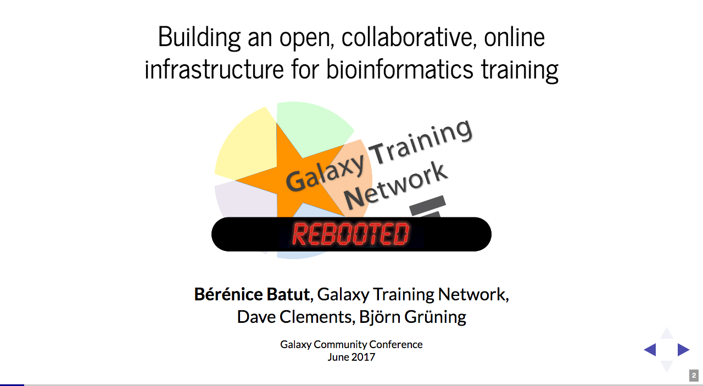<!-- .element width="90%" -->

Talks at [GCC](https://bebatut-slides.github.io/gcc_06_17/#/1) and [BOSC](https://bebatut-slides.github.io/bosc_07_17/#/1)

---
### A fruitful year:  more and better content

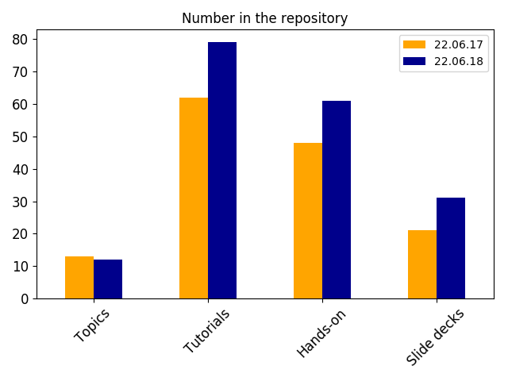<!-- .element width="70%" -->

----
### New + restructed topics

<!-- .element width="80%" -->

----
### New + restructed tutorials

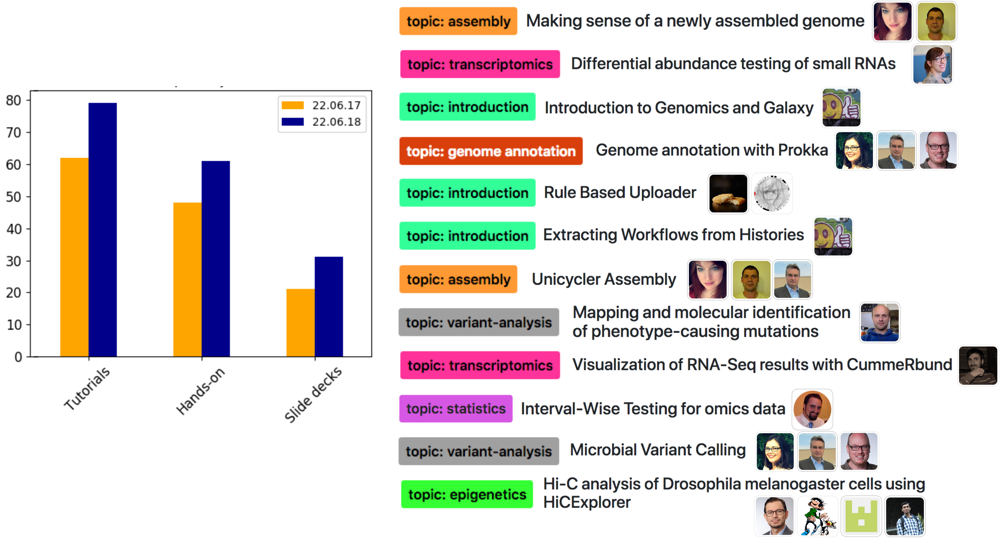

Note:

Some tutorials has been restructured, improved or updated to use the state of the art tools

----
### Train the Trainers --> Contributing

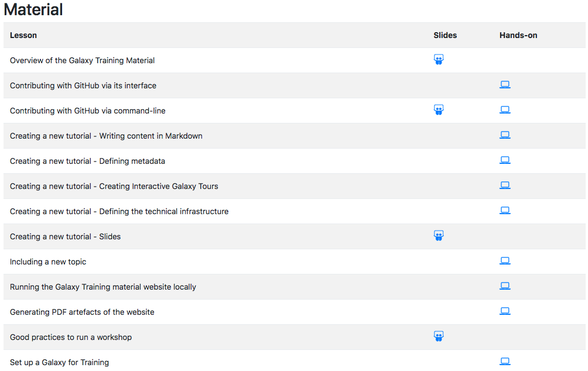<!-- .element width="90%" -->

---
### A fruitful year:  more technical support for training

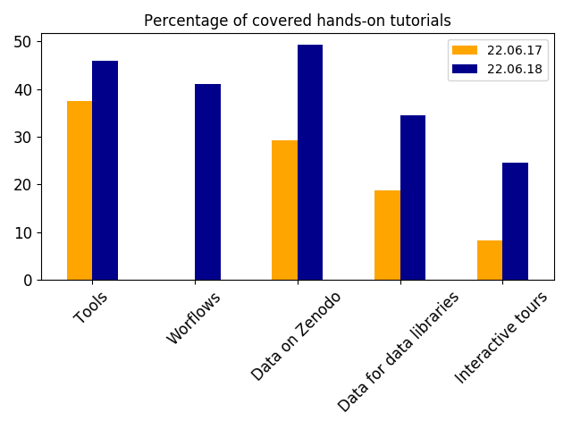<!-- .element width="70%" -->

----
### Galaxy Tour Builder

A web extension to develop interactive tours

 <!-- .element width="85%" -->

https://github.com/TailorDev/galaxy-tourbuilder

----
### Annotation with public Galaxy instances

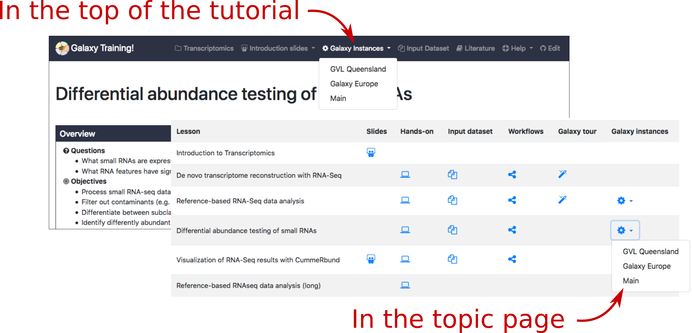 <!-- .element width="100%" -->

----
### Training Infrastructure as a Service (TIaaS)  on [usegalaxy.eu](usegalaxy.eu)

 <!-- .element width="80%" -->

---
### A fruitful year:  am improved website

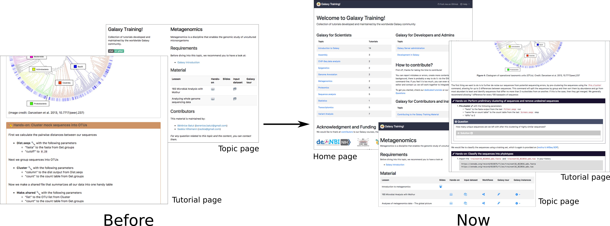 <!-- .element width="90%" -->

https://training.galaxyproject.org

Note:
- Bio.schemas support

----
### Tags, expandable boxes and co

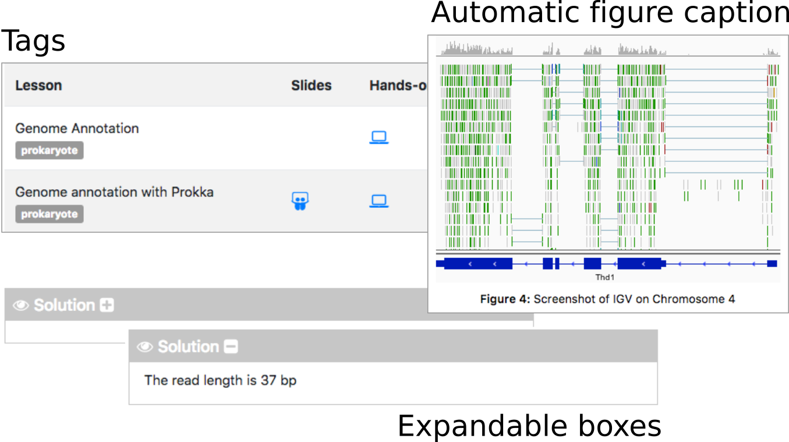 <!-- .element width="100%" -->

----
### FAQ

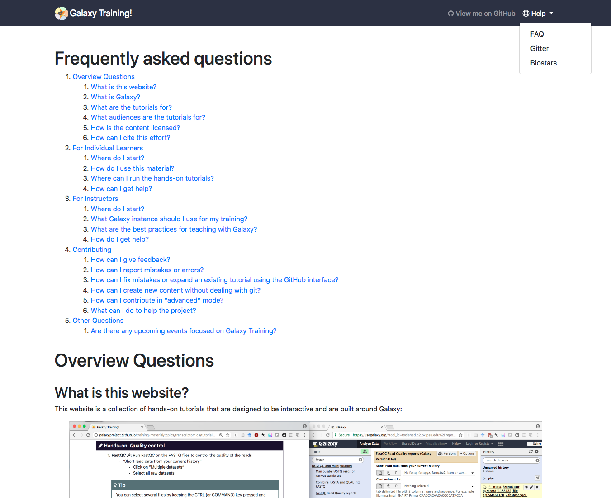<!-- .element width="65%" -->

https://training.galaxyproject.org/faq

---
### A fruitful year:  a great article

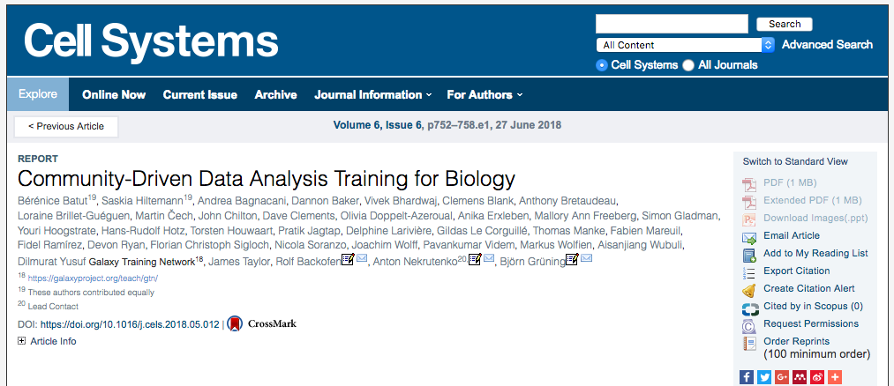 <!-- .element width="80%" -->

<i class="fa fa-award"></i> Released this morning!

[Community-driven data analysis training for biology](https://bit.ly/2lEvhJW)

---
<!-- .slide: data-background="images/contributors.png" data-state="dim-background-2"-->
## A fruitful year:  an AWESOME community!

Note:
- > 70 contributors
- + >30 compared to last year

----
### Hall of fame

 <!-- .element width="75%" -->

https://training.galaxyproject.org/hall-of-fame

----
### Contribution Fests

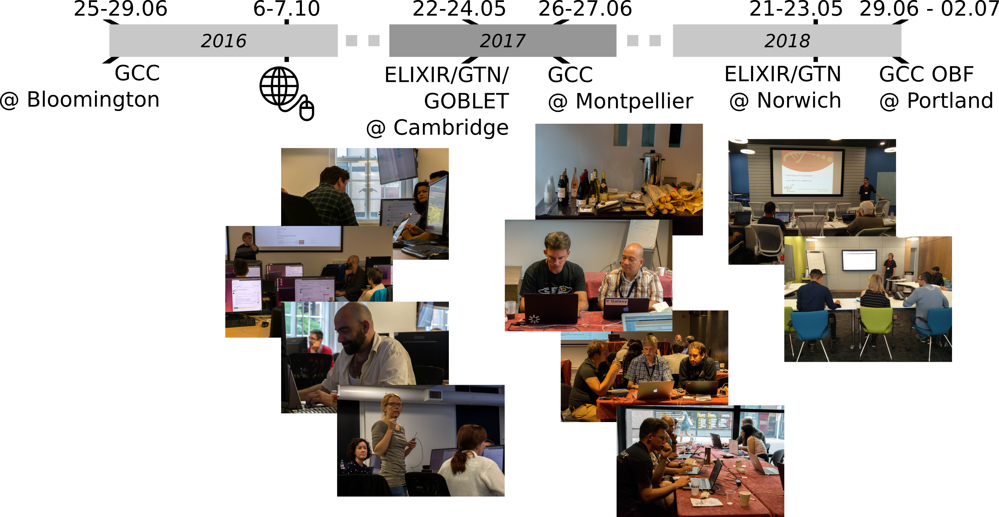

---
## A Similarly Fruitful Future?

- For Users
    - More content!
    - Topic-specific curriculum
    - Internationalization
- For Instructors
    - Mentorship
    - Train the trainers (ELIXIR and The Carpentries)?
- For Contributors
    - Improvement of the contribution experience
    - Per-tutorial article?

----
## A Similarly Fruitful Future?

More Contribution Fests!
   

---
## Thank you!

 <!-- .element width="75%" -->
 

Poster G31 (tonight)

<section style="text-align: left; margin-top: 2em;">
BoF Tomorrow at lunch  

<i class="fa fa-file"></i> [Community-driven data analysis training for biology](https://bit.ly/2lEvhJW)  

<i class="fa fa-globe"></i> [training.galaxyproject.org](http://training.galaxyproject.org)  

<i class="fa fa-github"></i> [github.com/galaxyproject/training-material](http://github.com/galaxyproject/training-material)  
</section>

 <!-- .element width="110%" -->

