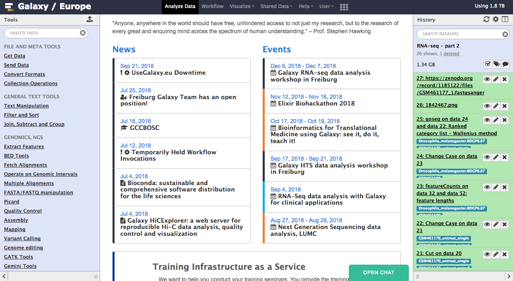
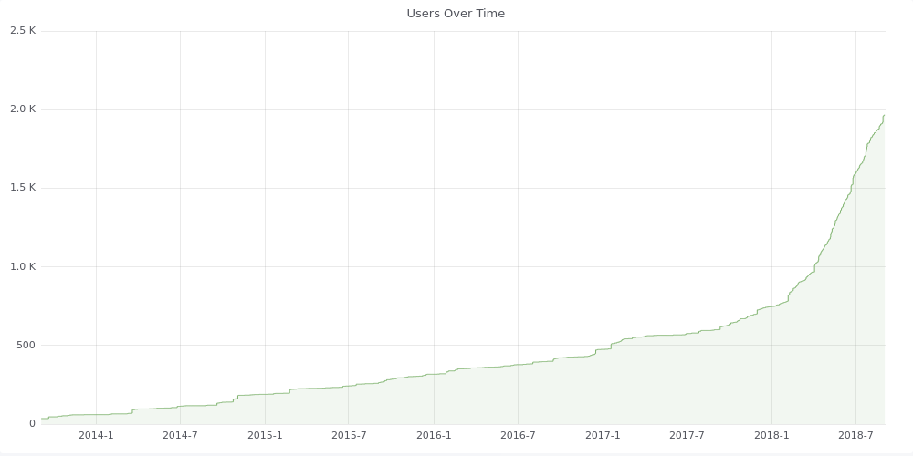
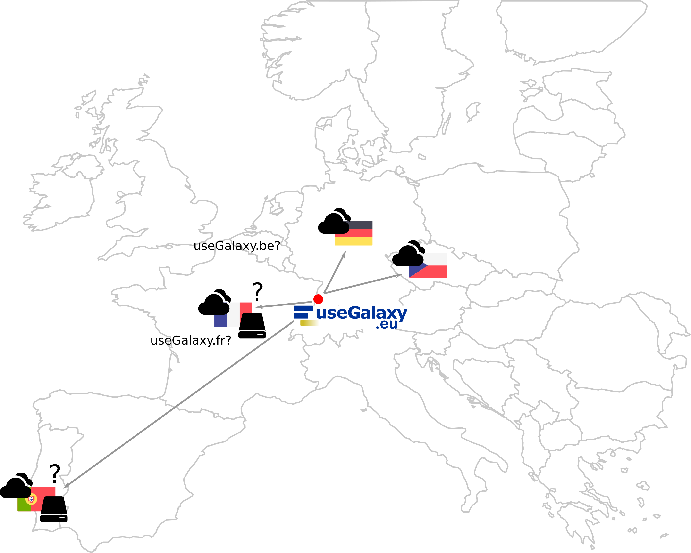
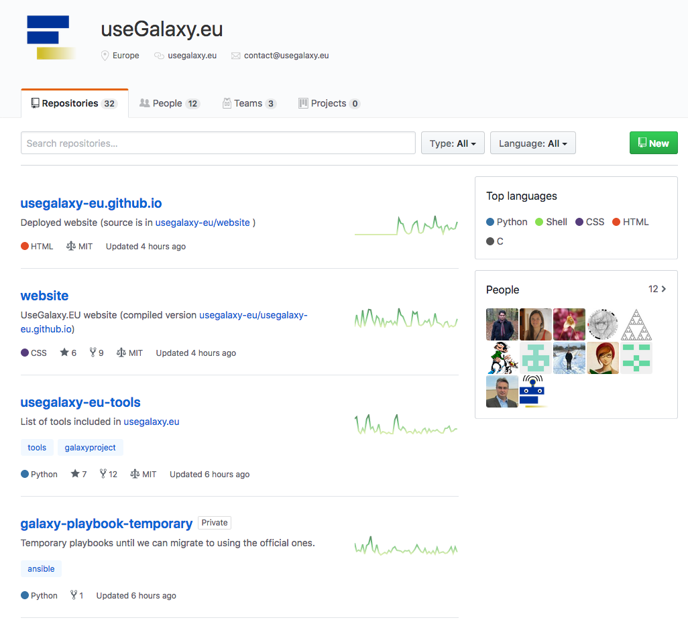
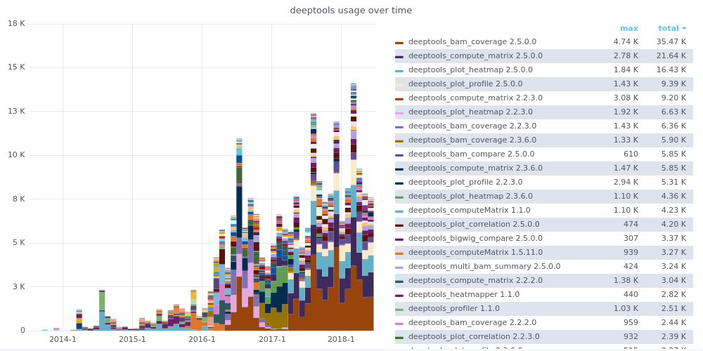
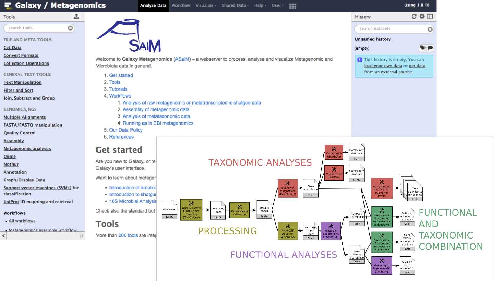
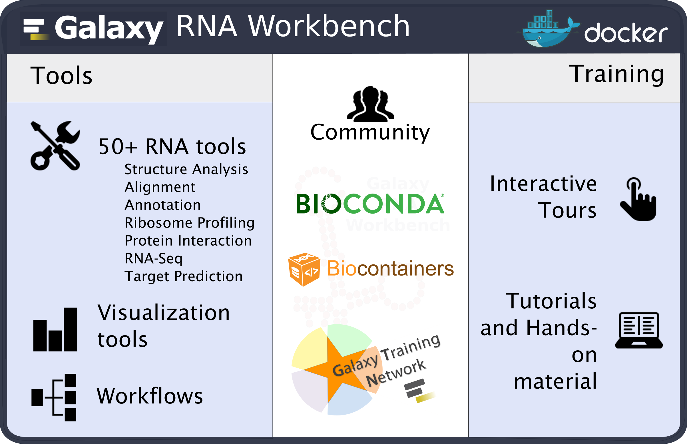
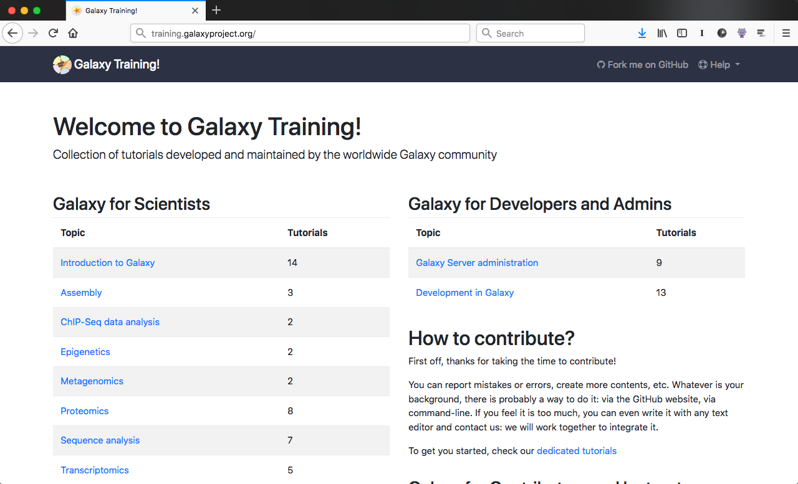
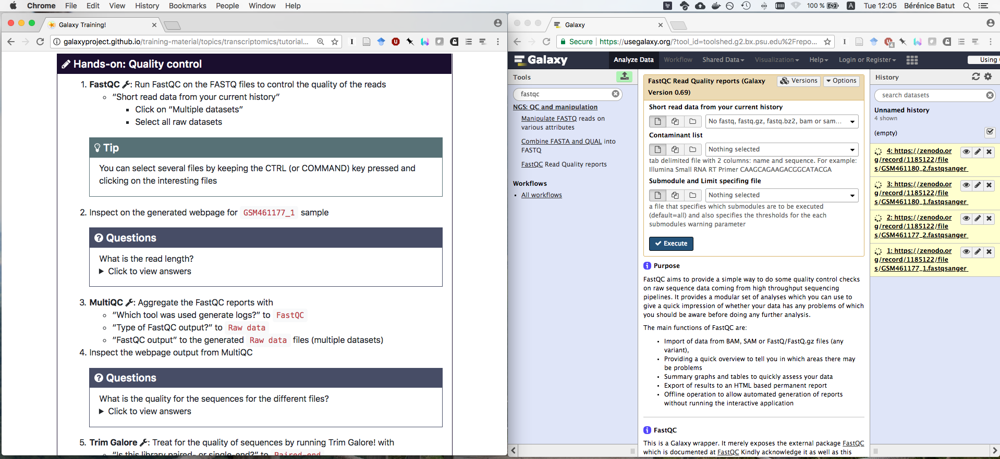
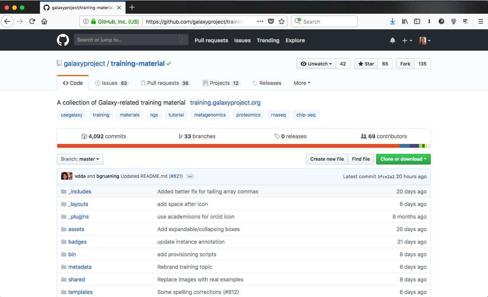

Hello! I am [Bérénice](http://bebatut.fr/), the author of following slides.

<small>
This slide does not exist in original deck. It is useful if you are not familiar with [Reveal.JS](https://github.com/hakimel/reveal.js), used here.
</small>

The easiest way to navigate this slide deck is by hitting `[space]`on your keyboard.

---
### useGalaxy.eu and Galaxy Training

Bérénice Batut

<small>
Septembre 2018
</small>

---
## useGalaxy.eu

The European Galaxy instance

 <!-- .element width="70%" -->

https://usegalaxy.eu/

----
## useGalaxy.eu

 <!-- .element width="100%" -->

----
### An european infrastructure

 <!-- .element width="70%" -->

----
### Openly maintained

 <!-- .element width="55%" -->

https://github.com/usegalaxy-eu/

----
### Stastitics for tool usage

 <!-- .element width="100%" -->

https://stats.usegalaxy.eu/

----
### Thematic subdomains

 <!-- .element width="80%" -->

Example: https://metagenomics.usegalaxy.eu

----
### Soon a RNA subdomain

 <!-- .element width="80%" -->

<small>
[doi.org/10.1093/nar/gkx409](https://academic.oup.com/nar/article/45/W1/W560/3860633#90596284)

http://bgruening.github.io/galaxy-rna-workbench/
</small>

---
## Galaxy Training materials

 <!-- .element width="70%" -->

https://training.galaxyproject.org

<small>
One website, aggregating training material covering many current research topics
</small>

----
### Interactive learning via hands-on tutorials  built around a "research story"

 <!-- .element width="100%" -->

<small>
Usable by individual users & instructors
</small>

----
### Developed and maintained  by the community on GitHub

 <!-- .element width="75%" -->

https://github.com/galaxyproject/training-material

---
## Thank you!

