Hello! I am [Bérénice](http://bebatut.fr/), the author of following slides.

<small>
This slide does not exist in original deck. It is useful if you are not familiar with [Reveal.JS](https://github.com/hakimel/reveal.js), used here.
</small>

The easiest way to navigate this slide deck is by hitting `[space]`on your keyboard.

---

### The daily life of a bioinformatician
#### Multi-faceted computational analysis of a biological system

Bérénice Batut

<small>
Basel Computational Biology Seminar - October 2018
</small>

---
### Brain cells

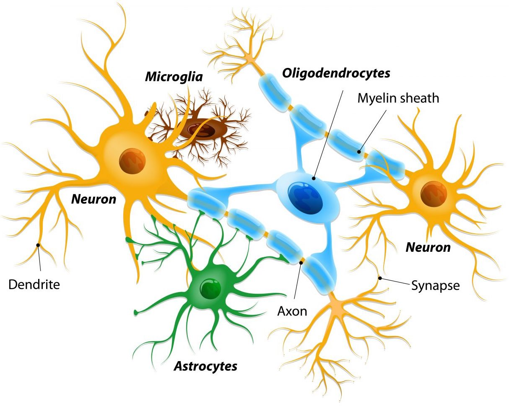 <!-- .element width="70%" -->

<small>
[Source](https://huntingtonsdiseasenews.com/2015/11/06/huntingtons-research-sheds-light-proteins-shift-fibrous-solids/)
</small>

----
### Microglia

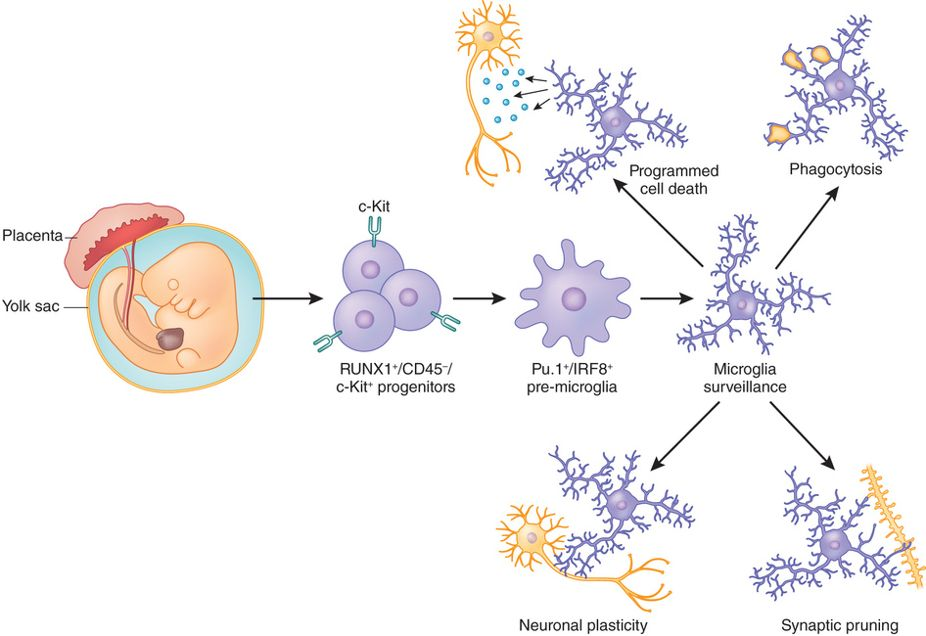 <!-- .element width="80%" -->

<small>
[Salter & Stevens, 2017](https://www.nature.com/articles/nm.4397)
</small>

Note:

Microglia
- Embryonically seeded macrophages
- Contribute to brain development, homeostasis, and pathologies

It is thus essential to decipher how microglial properties are temporally regulated by intrinsic and extrinsic factors, such as sexual identity and the microbiome. 

Microglia develop from myeloid progenitors in the yolk sac that express the transcription factor RUNX1 and the receptor tyrosine kinase c-Kit, also known as CD117, but not CD45, and enter the CNS during early embryonic development (embryonic day 8.5 in mice). Microglia have normal roles in brain development and CNS homeostasis, including programmed cell death and clearance of apoptotic newborn neurons, as well as pruning developing axons and synapses. Later in development and into adulthood, microglia processes are highly motile and continually survey their local environment, contacting neurons, axons, and dendritic spines. Microglia have diverse physiological roles, including regulating neuronal and synaptic plasticity

----
### Microglia life cycle

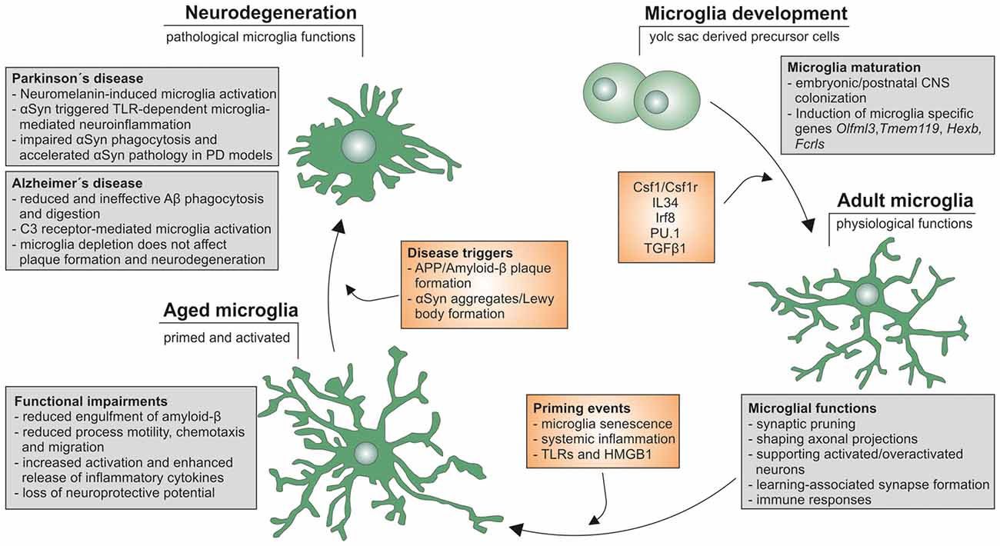 <!-- .element width="100%" -->

<small>
[Spittau, 2017](https://www.frontiersin.org/articles/10.3389/fnagi.2017.00194/full)
</small>

Note:

schematic summary of microglial development, maturation as well as aging and the functional changes influencing onset, severity and progression of neurodegeneration in Alzheimer’s disease (AD) and Parkinson’s disease (PD).

----
## Gut microbiota

 <!-- .element width="70%" -->

----
### The aging gut microbiota

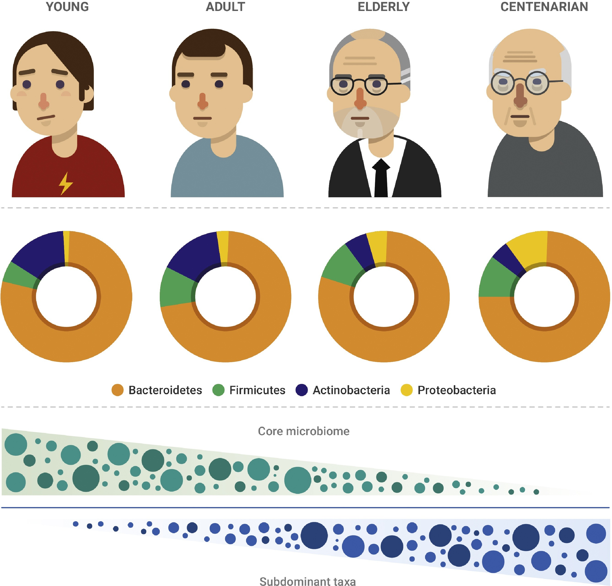 <!-- .element width="60%" -->

<small>
[Vaiserman et al, 2017](https://www.sciencedirect.com/science/article/pii/S1568163716302653)
</small>

Note:

- Child: increase of microbial diversity following weaning and intake of solids
- Adult
    - dominant phyla: firmicutes, bacteroidetes, actinobacteria
    - less abundant phyla: proteobacteria, verrucomicrobia
- Elderly (compared to healthy adults):
    - generalized decrease in microbial diversity
    - reduction in firmicutes and an increase in Bacteroidetes and proteobacteria

----
### Microbiome–gut–brain axis

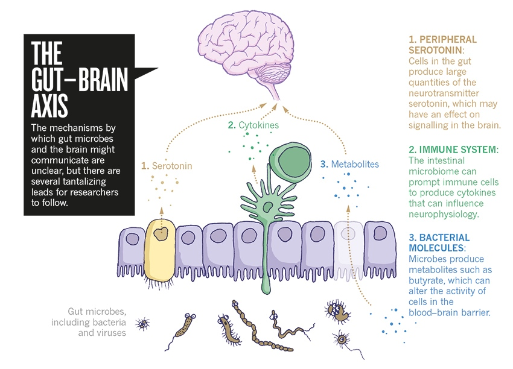 <!-- .element width="70%" -->

<small>
[Smith, 2015](https://www.nature.com/news/the-tantalizing-links-between-gut-microbes-and-the-brain-1.18557)
</small>

Note:

gut-brain axis includes
- the central nervous system
- neuroendocrine and neuroimmune systems with the hypothalamic–pituitary–adrenal axis (HPA axis), sympathetic and parasympathetic arms of the autonomic nervous system, including the enteric nervous system and the vagus nerve
- gut microbiota

----

### Microbiome–gut–brain axis

 <!-- .element width="55%" -->

<small>
Figure 4 from [Grenham et al, 2011](https://www.frontiersin.org/articles/10.3389/fphys.2011.00094/full)
</small>

Note:

Role of the gut microbiota in the biochemical signaling events that take place between the GI tract and CNS

----
### Influence of microbiota in microglia maturation

 <!-- .element width="100%" -->

Note:

Immature microglia in GF mice:
↑ CSF1R, F4/80 & CD31
↑ proliferation
↑ cell density

Diminished response to bacterial and viral challenge

[Thion et al, 2017](https://www.sciencedirect.com/science/article/pii/S0092867417314320)
- Microglia undergo differentiation phases, different in adult males and females
- Time and sexually dimorphic impact of the absence of microbiome both prenatally and postnatally
    - microglia were more profoundly perturbed in male embryos and female adults
    - Antibiotic treatment of adult mice triggered sexually biased microglial responses revealing both acute and long-term effects of microbiota depletion

Microglia respond to environmental challenges in a sex- and time-dependent manner from prenatal stages

---

### A system: Microbiome–gut–brain axis

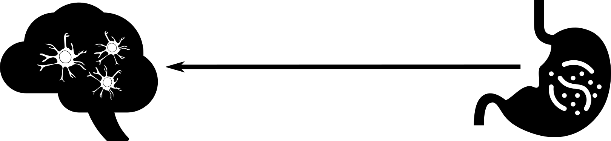 <!-- .element width="100%" -->

#### An hypothesis: The host microbiota contributes to the aging of microglia

---

### Influence of microbiome on microglial gene expression

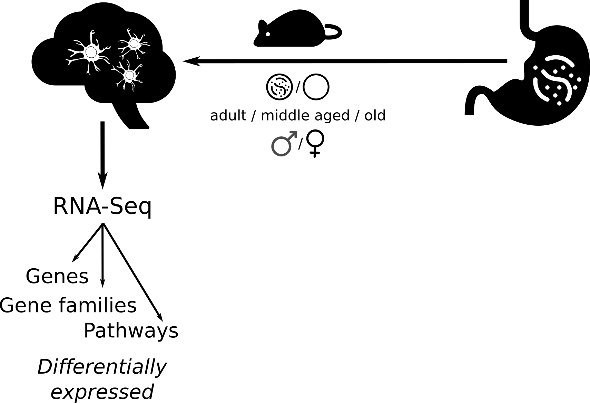 <!-- .element width="80%" -->

----
### RNA sequencing

![Within the organisms, genes are transcribed and spliced (in eukaryotes) to produce mature mRNA transcripts (red). The mRNA is extracted from the organism, fragmented and copied into stable ds-cDNA (blue). The ds-cDNA is sequenced using high-throughput, short-read sequencing methods. These sequences can then be aligned to a reference genome sequence to reconstruct which genome regions were being transcribed. This data can be used to annotate where expressed genes are, their relative expression levels, and any alternative splice variants.](images/rna_seq.png) <!-- .element width="70%" -->

<small>Credit: [Thomas Shafee](https://commons.wikimedia.org/wiki/File:Summary_of_RNA-Seq.svg)</small>

Note:

Within the organisms, genes are transcribed and spliced (in eukaryotes) to produce mature mRNA transcripts (red). The mRNA is extracted from the organism, fragmented and copied into stable ds-cDNA (blue). The ds-cDNA is sequenced using high-throughput, short-read sequencing methods. These sequences can then be aligned to a reference genome sequence to reconstruct which genome regions were being transcribed. This data can be used to annotate where expressed genes are, their relative expression levels, and any alternative splice variants.

- RNA quantification at single base resolution
- Cost efficient analysis of the whole transcriptome in a high-throughput manner

----
### The data of microglya cells of mice

Type | Gender | Age | Replicates
---  | ---  | --- | ---
 <!-- .element width="35%" style="margin:0px 0px;" --> - SPF |  <!-- .element width="20%" style="margin:0px 0px;" --> | 2mth | 5
 | | 12mth | 6
 | | 24mth | 3
 |  <!-- .element width="30%" style="margin:0px 0px;" -->  | 2mth | 4
 | | 12mth | 5
 | | 24mth | 14
 <!-- .element width="30%" style="margin:0px 0px;" --> - GF |  <!-- .element width="20%" style="margin:0px 0px;" --> | 2mth | 5
 | | 12mth | 6
 | | 24mth | 3
 |  <!-- .element width="30%" style="margin:0px 0px;" --> | 2mth | 4
 | | 12mth | 4
 | | 24mth | 5

Note:

SPF = specific-pathogen-free

61 datasets

----

### Quality control and trimming

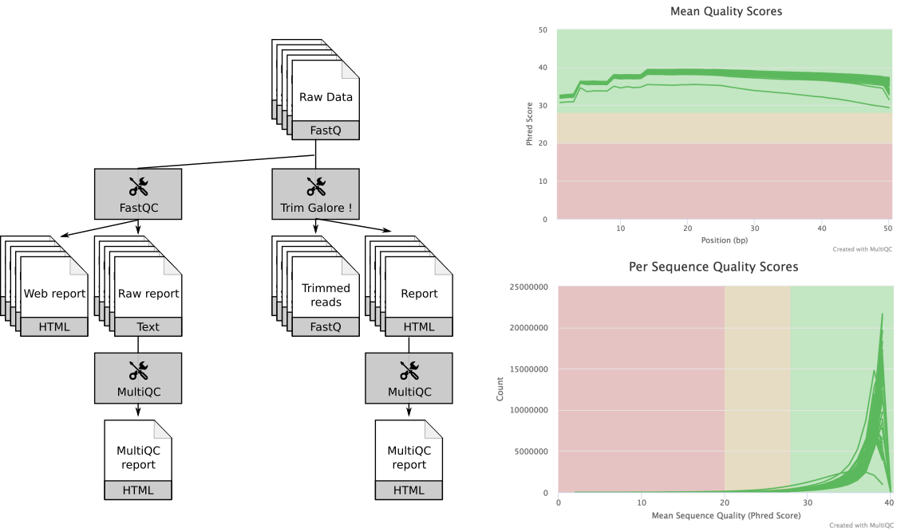

----
### Mapping

 <!-- .element width="55%" -->

<small>Credit: [Rgocs](https://en.wikipedia.org/wiki/File:RNA-Seq-alignment.png)</small>

Note:

Simple mapping on a reference genome? More challenging

RNA-Seq alignment with intron-split short reads. Graphical representation of the alignment of mRNA sequence obtained via high throughput sequencing, and the expected bevaviour of the alignment to the reference genome when the read falls in an exon-exon junction.

----
### Mapping

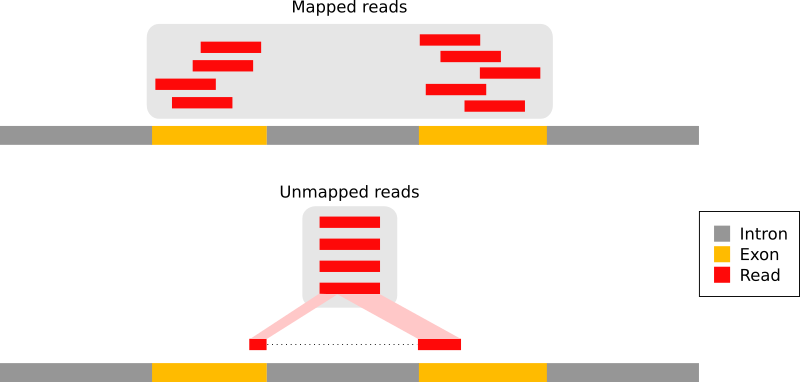 <!-- .element width="90%" -->

Spliced mappers: TopHat, TopHat2, HISAT2, STAR

Note:

Several spliced mappers have been developed over the year with the explosion of RNA-seq data.

- TopHat (Trapnell et al, Bioinformatics, 2009) was one of the first tools designed specifically to address this problem. In TopHat reads are mapped against the genome and are separated into two categories: (1) those that map, and (2) those that initially unmapped (IUM). “Piles” of reads representing potential exons are extended in search of potential donor/acceptor splice sites and potential splice junctions are reconstructed. IUMs are then mapped to these junctions.

    - Map reads to whole genome with Bowtie
    - Mapped reads
        - Assemble consensus of covered regions
        - Generate possible splices between neighboring exons
    - Unmapped reads
        - Collect them
        - Build seed table index from unmappable reads
    - Map reads to possible splices via seed-and-extend

- TopHat2

    1. Genome alignment
    2. Splice alignment of the multi-exon spanning reads
        1. Segment alignment to genome
        2. Identification of splice sites (including indels and fusion break points)
        3. Segments aligned to junction flanking sequences
        4. Segments alignements stitched together to form whole read alignments
        5. Re-alignment of reads minimally overlapping introns

- HISAT: To further optimize and speed up spliced read alignment Kim et al (Nat Methods, 2015) developed HISAT. It uses a set of FM-indices consisting one global genome-wide index and a collection of ~48,000 local overlapping 42 kb indices (~55,000 56 kb indices in HISAT2). This allows to find initial seed locations for potential read alignments in the genome using global index and to rapidly refine these alignments using a corresponding local index

    A part of the read (blue arrow) is first mapped to the genome using the global FM index. HISAT then tries to extend the alignment directly utilizing the genome sequence (violet arrow). In (a) it succeeds and this read is aligned as it completely resides within an exon. In (b) the extension hits a mismatch. Now HISAT takes advantage of the local FM index overlapping this location to find the appropriate mapping for the remainder of this read (green arrow). The (c) shows a combination these two strategies: the beginning of the read is mapped using global FM index (blue arrow), extended until it reaches the end of the exon (violet arrow), mapped using local FM index (green arrow) and extended again (violet arrow).

- STAR: fast alternative for mapping RNA-seq reads against a reference genome utilizing an uncompressed suffix array. It operates in two stages:
    1. seed search: Here a read is split between two consecutive exons. STAR starts to look for a maximum mappable prefix (MMP) from the beginning of the read until it can no longer match continuously. After this point it start to look for a MMP for the unmatched portion of the read (a). In the case of mismatches (b) and unalignable regions (c) MMPs serve as anchors from which to extend alignments
    2. At the second stage STAR stitches MMPs to generate read-level alignments that (contrary to MMPs) can contain mismatches and indels. A scoring scheme is used to evaluate and prioritize stitching combinations and to evaluate reads that map to multiple locations. STAR is extremely fast but requires a substantial amount of RAM to run efficiently.

----
### Mapping
 
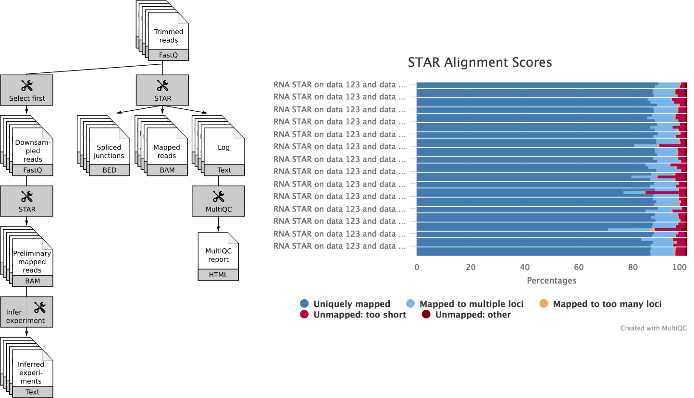 <!-- .element width="90%" -->

----
### Gene counting

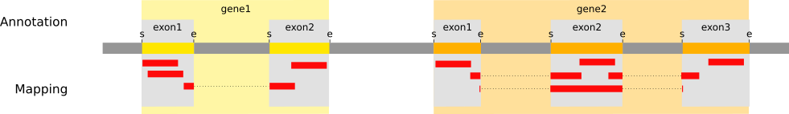 <!-- .element width="100%" -->

Tools: HTSeq-count, featureCounts

----
### Gene counting
 
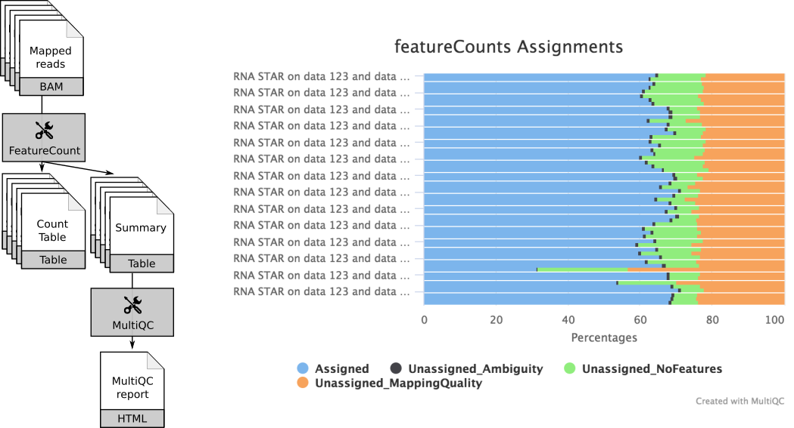 <!-- .element width="100%" -->

----
### Gene count normalization

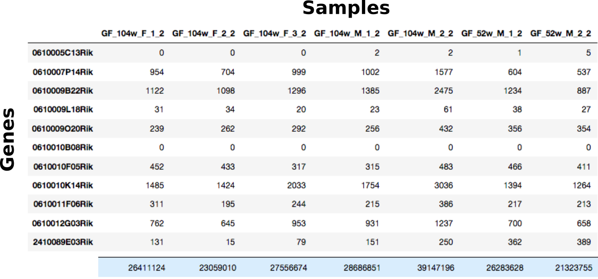 <!-- .element width="100%" -->

Differences in library size and in library composition

Note:

1. Correction for library size and sequencing depth: RPKM, ...
2. Adjustement for differences in library composition: last line

https://www.youtube.com/watch?v=UFB993xufUU

----
### Normalization with DESeq2

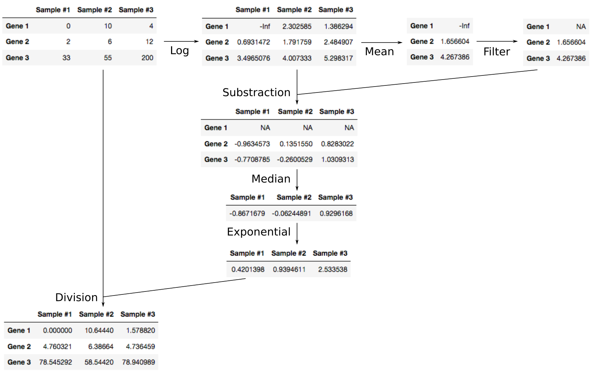 <!-- .element width="90%" -->

Note:

Goal: calculate a scaling factor for each sample, that takes read depth and library composition into account

1. take the log of all the values
2. average each row

    average of log values not easily swayed by outliers

3. filter out genes with infinity

    this step filters out genes with 0 read counts in one or more samples

    remove genes only transcribed in a tissue

    helps focus the scaling factors on the house keeping genes: genes transcribed at similar levels regardless of tissue type or condition

4. substract the average log value from the log counts
5. calculate the median of the ratios for each sample

    using median: another way to avoid extreme genes from swaying the value too much in one direction

    genes with huge differences in expression have no more influence on the median than genes with minor differences

    since genes with huge differences will most likely be rare, the effect is to give more influence to moderate differences and "house-keeping" genes

6. convert the median to "normal numbers" to get the scaling factors
7. divide the original read counts by the scaling factors

----
### Gene co-expression network

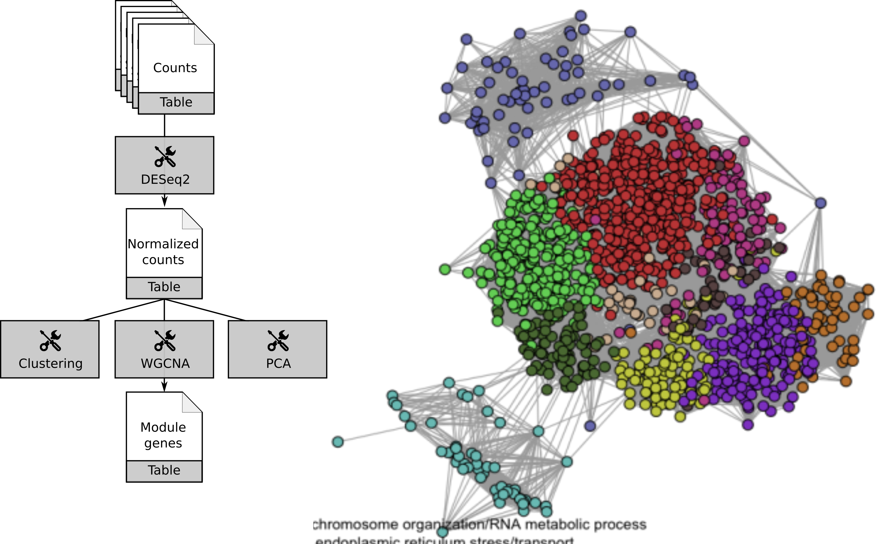 <!-- .element width="90%" -->

----
### Differential gene expression analyses

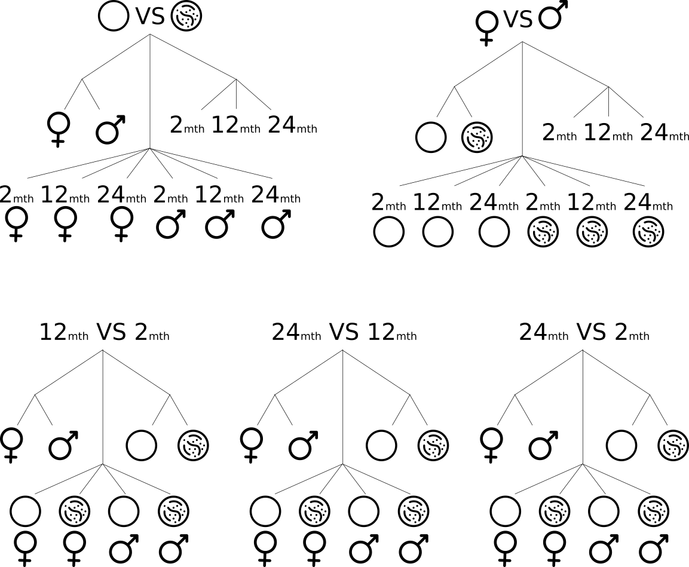 <!-- .element width="70%" -->

Note:

Number

----
### Differential gene expression analyses with DESeq2

`model = gender + type + age + gender:type + gender:age + type:age`

Factor | Explanation (% of genes with LRT padj < 0.05)
--- | ---
`gender` | 17.37% - 21.83%
`type` | 8.9% - 9.5%
`age` | 17.92% - 23.13%
`gender:type` | 0.07% - 0.38%
`gender:age` | 11.36% - 12.43%
`type:age` | 3.59% - 4.31%

----
### DEG: Stats

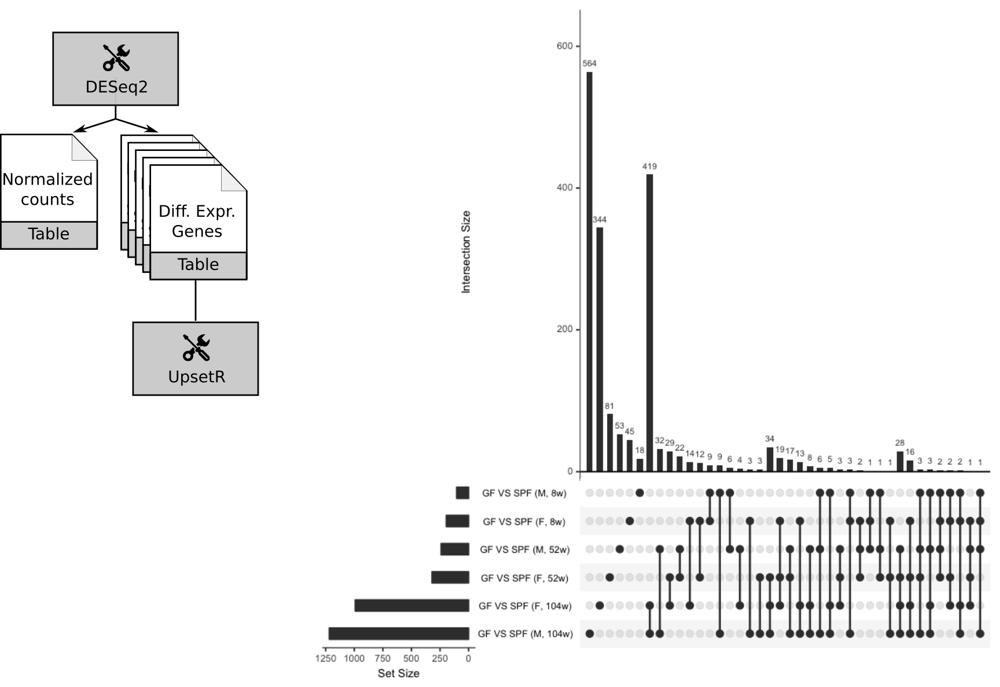 <!-- .element width="80%" -->

----
### DEG: Z-score

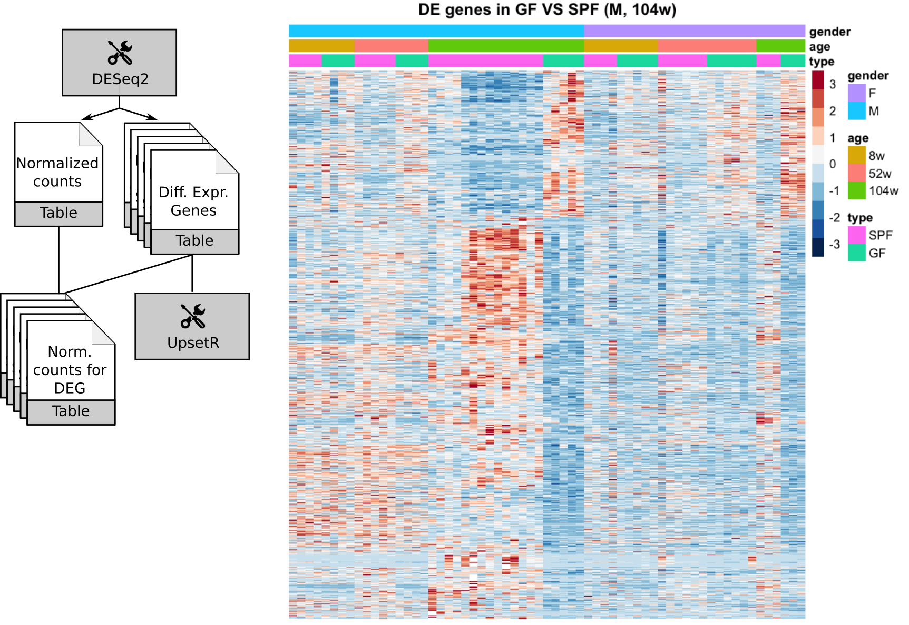 <!-- .element width="80%" -->

Note:

Z-score = 

----
### GO enrichment analysis

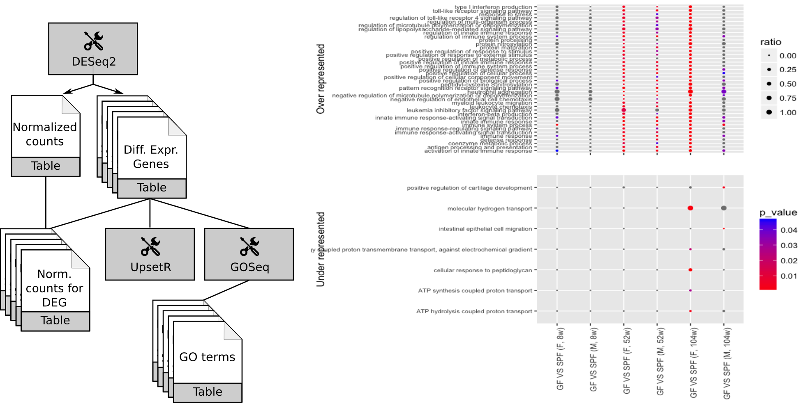 <!-- .element width="100%" -->

----
### GO enrichment analysis

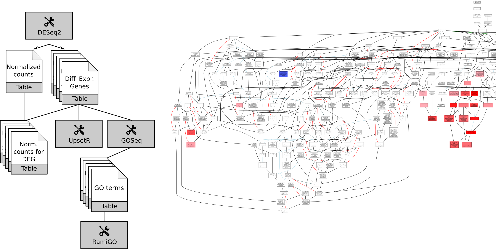 <!-- .element width="100%" -->

----
### KEGG enrichment analysis

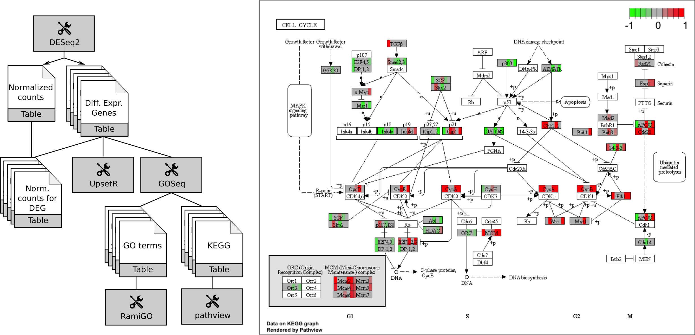 <!-- .element width="100%" -->

----
### RNA-Seq workflow

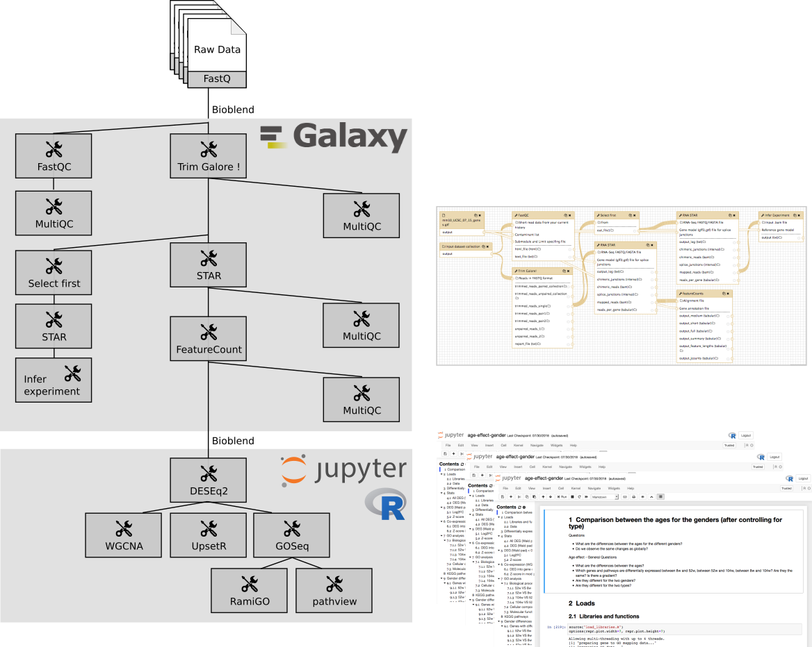 <!-- .element width="70%" -->

Note:

- Analysis
    - Until DESeq into Galaxy: data library, workflow, BioBlend
    - DESeq and after: several Jupyter notebooks with a shared functions
    - conda environment

----
### More technical comments and though

 <!-- .element width="90%" -->

<small>Slide from [Rachael Ainsworth](https://zenodo.org/record/1464853) and [Tweet](https://twitter.com/jxtx/status/1052570058336165888)</small>

----
### More technical comments and though

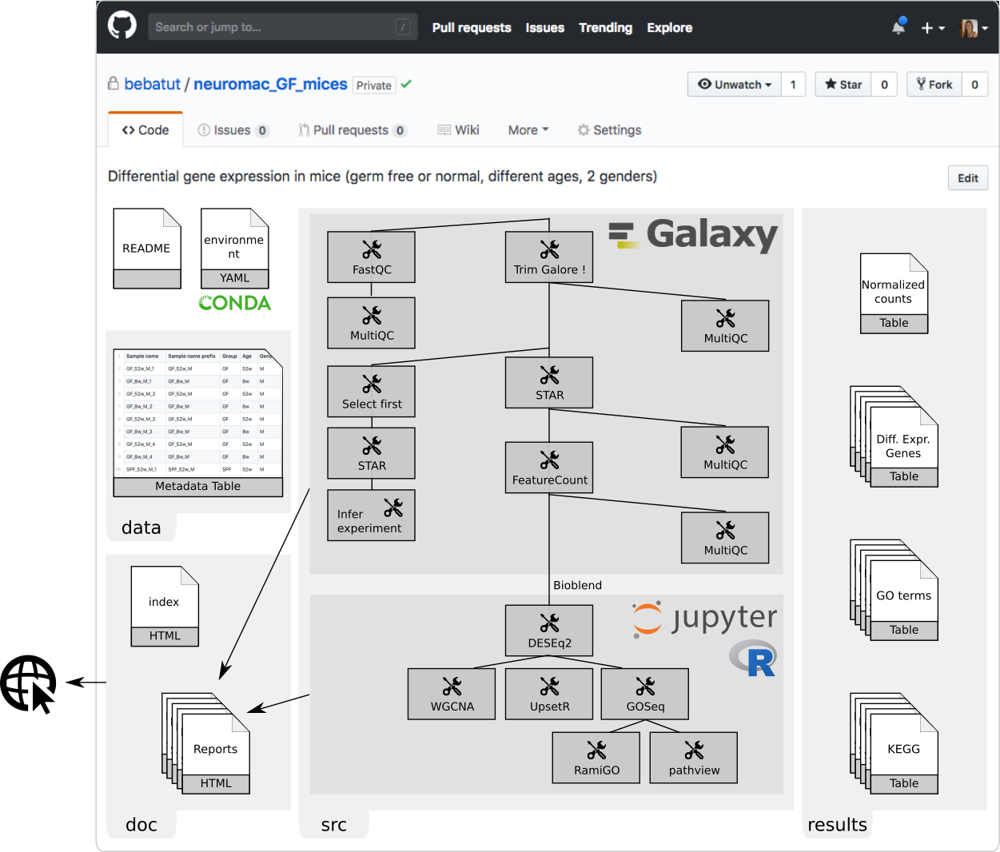 <!-- .element width="65%" -->

Note:

Collaboration
- Sharing with biologists
    - Private GitHub repository
    - Small website
        - Link to private data on the GitHub repo
        - Light HTML report of the Jupyter notebooks (hidden code)

Open science
- GitHub repo
- Workflow
- Jupyter notebook
- Documentation

---

### Influence of microbiome on microglia

 <!-- .element width="80%" -->

----

### Identify the microorganisms

 <!-- .element width="80%" -->

| Amplicon | Metagenomics
--- | --- | ----
Sequence | Specific genes | All DNA
Information | Community | Community + functions
Complexity | Low | High
Cost | Cheap | High

----

### Identify the microorganisms

 <!-- .element width="80%" -->

----
### Identify the functions

 <!-- .element width="80%" -->

---

### Influence of microbiome on microglia

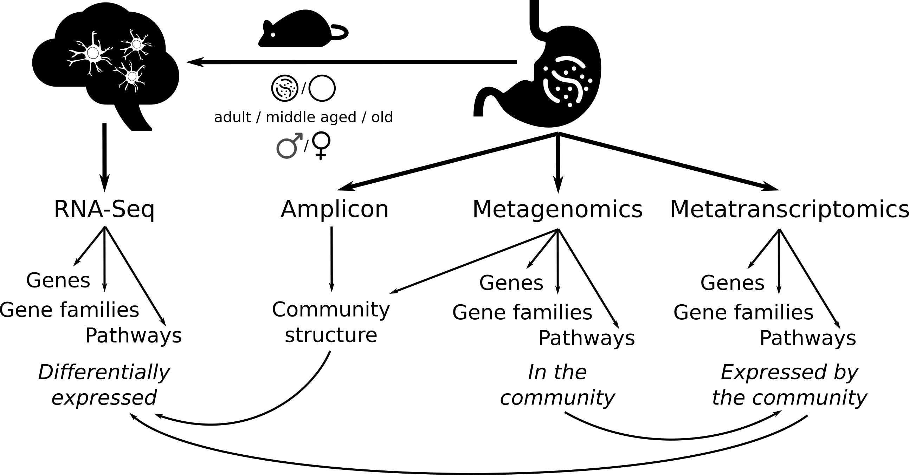 <!-- .element width="100%" -->

---
## Thank you!

 <!-- .element width="60%" -->

Collaborators: Omar Mossad and Thomas Blank, Uniklinik, Freiburg

---
### Wants to learn how to do that?

- Training
    - Galaxy Training Material
    - 4OSS
    - GitHub flow
