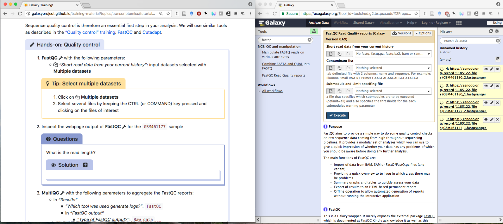
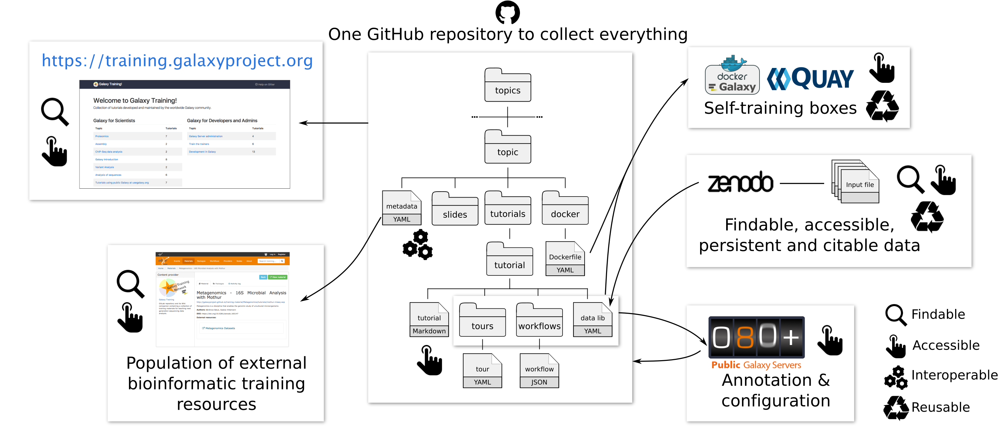
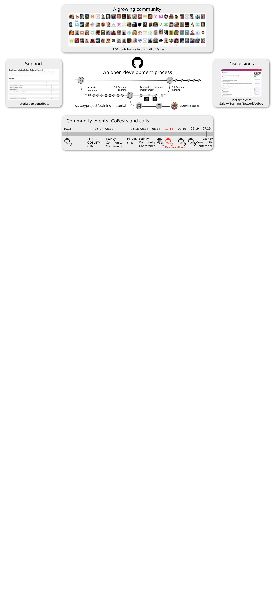
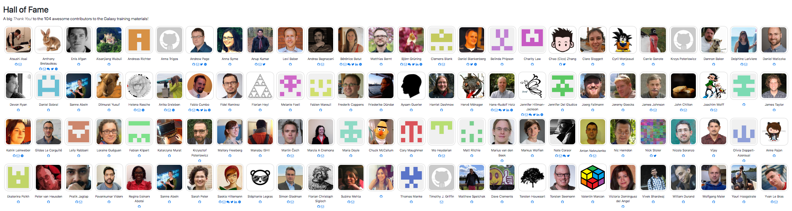

Hello! I am [Bérénice](http://bebatut.fr/), the author of following slides.

<small>
This slide does not exist in original deck. It is useful if you are not familiar with [Reveal.JS](https://github.com/hakimel/reveal.js), used here.
</small>

The easiest way to navigate this slide deck is by hitting `[space]`on your keyboard.

---

### Galaxy training material

 <!-- .element width="60%" -->

Bérénice Batut, Saskia Hiltemann, The Galaxy Training Network

<small>
Biohackathon - Paris - November 2018
</small>

---
### Need and demand for bioinformatic training

> Bioinformatics has become too central to biology to be left to specialist bioinformaticians 

 <!-- .element width="80%" -->

<small>Graphs of [Brazas et al, 2017](http://biorxiv.org/content/early/2017/02/27/098996)</small>

---
### Galaxy: a great solution !

 <!-- .element width="60%" -->

- Web interface for numerous bioinformatics tools
- No issue with computer configuration during training

---
### Online training material covering  many current research topics

 <!-- .element width="70%" -->

https://training.galaxyproject.org

---
### Interactive learning via hands-on tutorials  built around a "research story"

 <!-- .element width="100%" -->

Usable for effective training for individual users & instructors

Note:

Designed to be interactive and built around Galaxy

Built around a "research story"
- Introduction
- Data upload (downsampling)
- Hands-on with different steps

Metadata to help trainees and instructors to keep track of the training goads
- Learning objectives
- Prerequisites
- Questions: Regular assessments with question boxes

---
### An effective (FAIR) training infrastructure

 <!-- .element width="100%" -->

Note:

Audit in collaboration with the FAIR training working group

---
### Community-driven

 <!-- .element width="100%" -->

GTN hackathon this Thursday

---
### Many ideas for this week!  [ <!-- .element width="10%" -->](https://github.com/galaxyproject/training-material/issues?q=is%3Aissue+is%3Aopen+sort%3Aupdated-desc+label%3ACoFest)

- <i class="fa fa-copy"></i> Content
    - New topics, new tutorials
    - Training handbook
- <!-- .element: class="fragment" data-fragment-index="1" --> <i class="fa fa-sitemap"></i> Global infrastructure
    - FAIRness evaluation of the training
    - Plan internationalisation and localisation support
- <!-- .element: class="fragment" data-fragment-index="2" --> <i class="fa fa-cogs"></i> Technical support 
    - Workflow testing
    - Docker images
- <!-- .element: class="fragment" data-fragment-index="3" --> <i class="fa fa-users"></i> Community 
    - More visibility for training events
    - Instructors and training philosophy

---
### Why should you join?

**No specific knowledge or skills required, just motivation!**

- Become part of an awesome community!
- Learn about training, Galaxy, and bioinformatics
- Share your insights and knowledge with the community
- Earn a place in our Hall of Fame

 <!-- .element width="90%" -->

*This project would not be possible without its contributors*

---
## Thank you!
### Join us for this hackathon!

 <!-- .element width="20%" -->

<i class="fa fa-github"></i> [github.com/galaxyproject/training-material](http://github.com/galaxyproject/training-material)

 <!-- .element width="60%" -->

