Hello! I am [Bérénice](http://bebatut.fr/), the author of following slides.

<small>
This slide does not exist in original deck. It is useful if you are not familiar with [Reveal.JS](https://github.com/hakimel/reveal.js), used here.
</small>

The easiest way to navigate this slide deck is by hitting `[space]`on your keyboard.

---

### RNA-Seq data analysis in Galaxy
#### Lessons learned and what next?

Bérénice Batut

<small>
European Galaxy Days - November 2018
</small>

---
### Brain cells

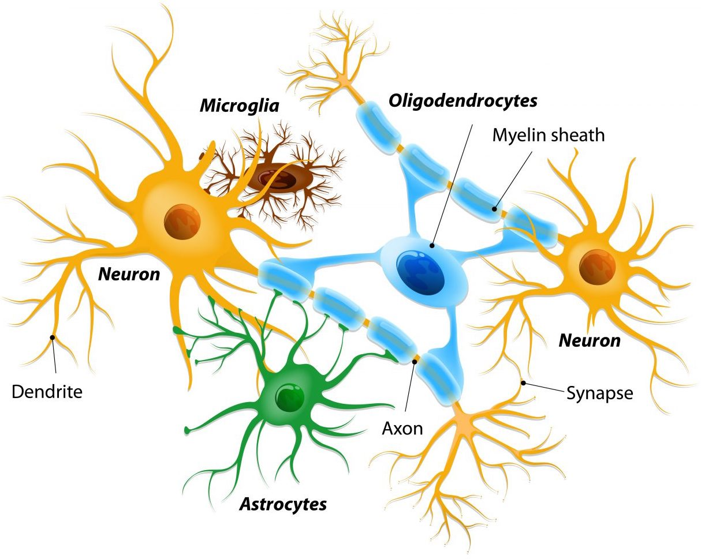 <!-- .element width="70%" -->

<small>
[Source](https://huntingtonsdiseasenews.com/2015/11/06/huntingtons-research-sheds-light-proteins-shift-fibrous-solids/)
</small>

----
### Microglia

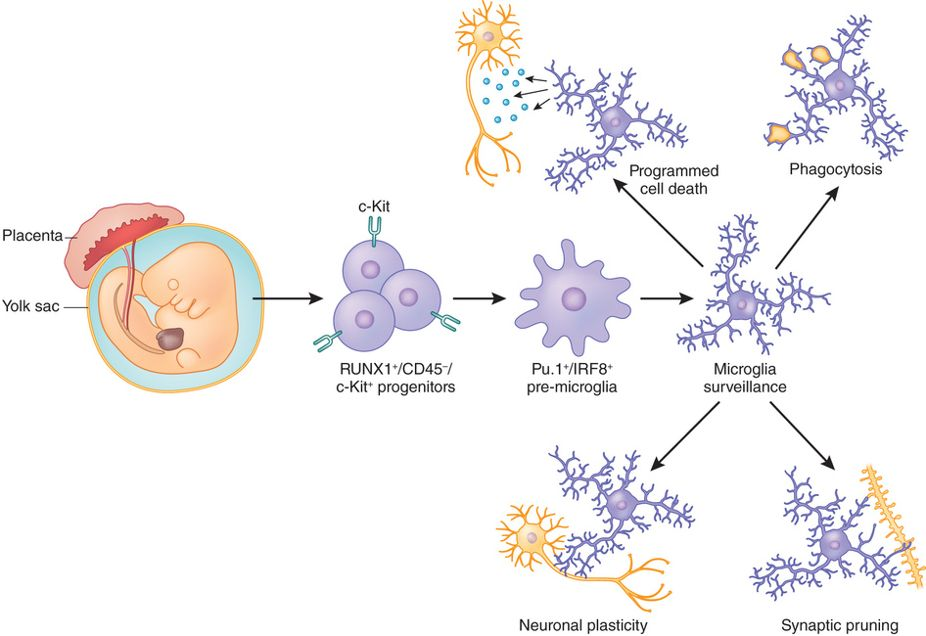 <!-- .element width="80%" -->

<small>
[Salter & Stevens, 2017](https://www.nature.com/articles/nm.4397)
</small>

Note:

Microglia
- Embryonically seeded macrophages
- Contribute to brain development, homeostasis, and pathologies

It is thus essential to decipher how microglial properties are temporally regulated by intrinsic and extrinsic factors, such as sexual identity and the microbiome. 

Microglia develop from myeloid progenitors in the yolk sac that express the transcription factor RUNX1 and the receptor tyrosine kinase c-Kit, also known as CD117, but not CD45, and enter the CNS during early embryonic development (embryonic day 8.5 in mice). Microglia have normal roles in brain development and CNS homeostasis, including programmed cell death and clearance of apoptotic newborn neurons, as well as pruning developing axons and synapses. Later in development and into adulthood, microglia processes are highly motile and continually survey their local environment, contacting neurons, axons, and dendritic spines. Microglia have diverse physiological roles, including regulating neuronal and synaptic plasticity

----
## Gut microbiota

 <!-- .element width="70%" -->

----

### Microbiome–gut–brain axis

 <!-- .element width="55%" -->

<small>
Figure 4 from [Grenham et al, 2011](https://www.frontiersin.org/articles/10.3389/fphys.2011.00094/full)
</small>

Note:

Role of the gut microbiota in the biochemical signaling events that take place between the GI tract and CNS

----
### Influence of microbiota in microglia maturation

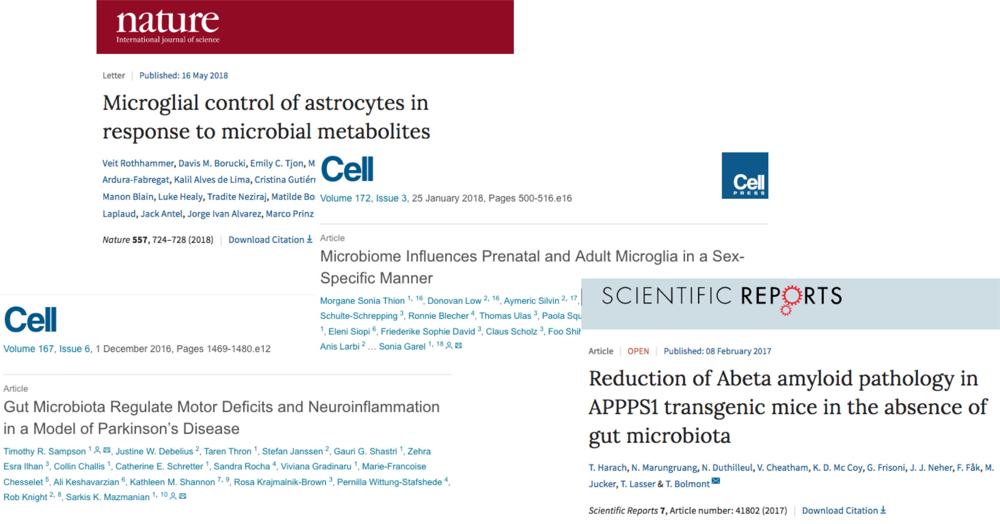 <!-- .element width="100%" -->

Note:

Immature microglia in GF mice:
↑ CSF1R, F4/80 & CD31
↑ proliferation
↑ cell density

Diminished response to bacterial and viral challenge

[Thion et al, 2017](https://www.sciencedirect.com/science/article/pii/S0092867417314320)
- Microglia undergo differentiation phases, different in adult males and females
- Time and sexually dimorphic impact of the absence of microbiome both prenatally and postnatally
    - microglia were more profoundly perturbed in male embryos and female adults
    - Antibiotic treatment of adult mice triggered sexually biased microglial responses revealing both acute and long-term effects of microbiota depletion

Microglia respond to environmental challenges in a sex- and time-dependent manner from prenatal stages

---

### Influence of microbiome on microglial gene expression

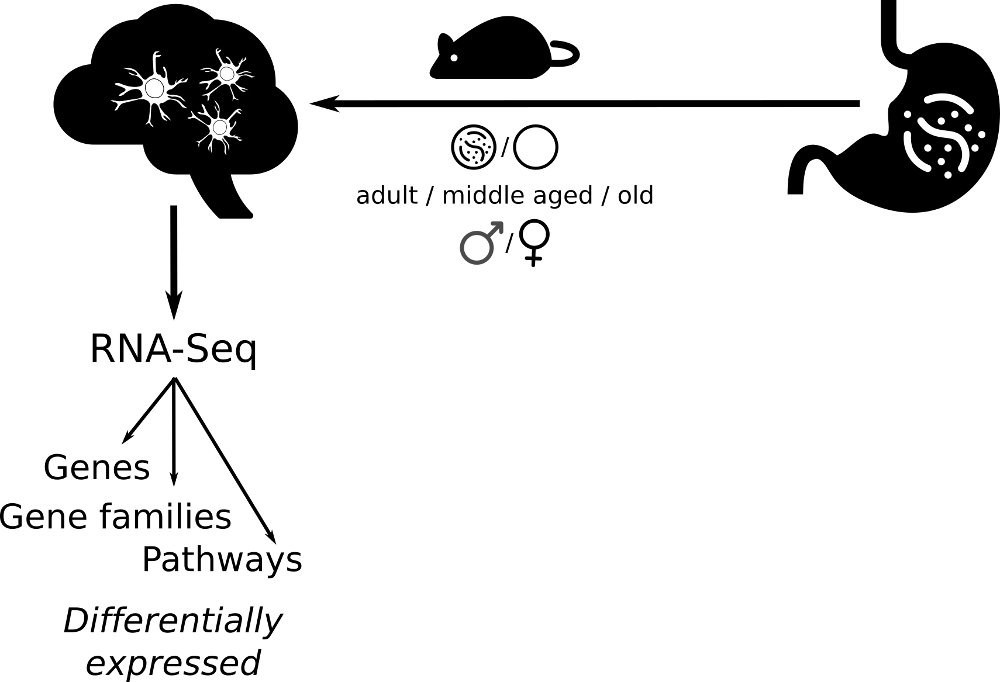 <!-- .element width="80%" -->

----
### The data of microglya cells of mice

Type | Gender | Age | Replicates
---  | ---  | --- | ---
 <!-- .element width="35%" style="margin:0px 0px;" --> - SPF |  <!-- .element width="20%" style="margin:0px 0px;" --> | 2mth | 5
 | | 12mth | 6
 | | 24mth | 3
 |  <!-- .element width="30%" style="margin:0px 0px;" -->  | 2mth | 4
 | | 12mth | 5
 | | 24mth | 14
 <!-- .element width="30%" style="margin:0px 0px;" --> - GF |  <!-- .element width="20%" style="margin:0px 0px;" --> | 2mth | 5
 | | 12mth | 6
 | | 24mth | 3
 |  <!-- .element width="30%" style="margin:0px 0px;" --> | 2mth | 4
 | | 12mth | 4
 | | 24mth | 5

Note:

SPF = specific-pathogen-free

61 datasets

----

### Quality control and trimming

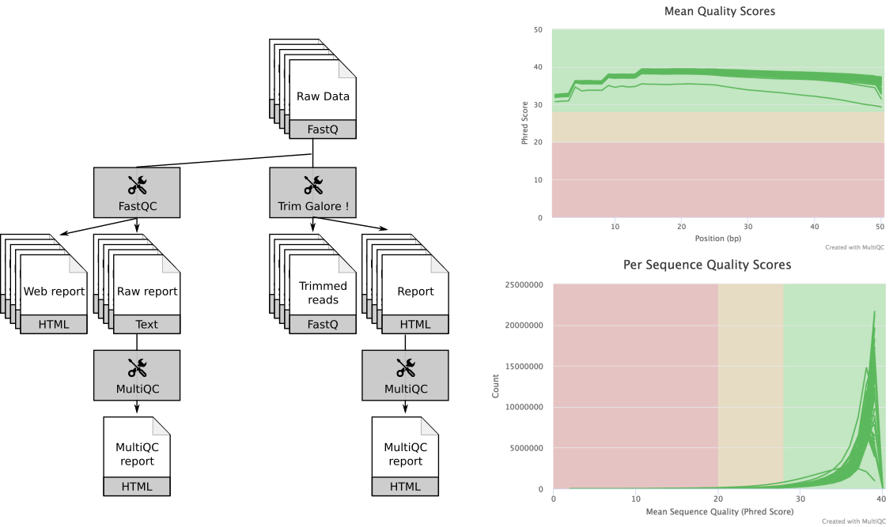

----
### Mapping
 
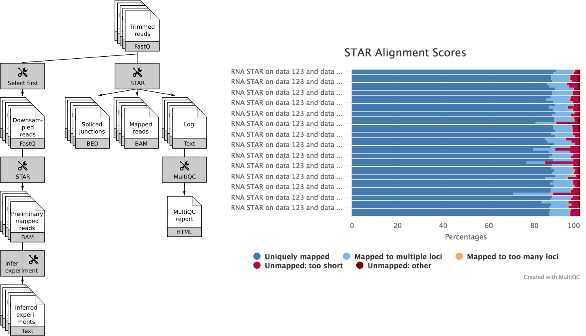 <!-- .element width="90%" -->

----
### Gene counting
 
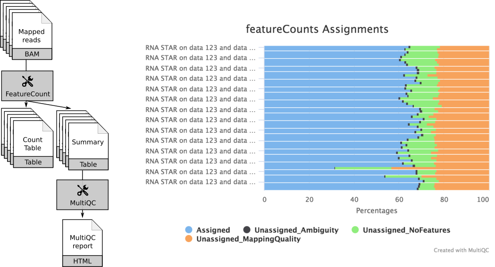 <!-- .element width="100%" -->

----
### Differential gene expression analyses

 <!-- .element width="60%" -->

<small>
`model = gender + type + age + gender:type + gender:age + type:age`
</small>

----
### Gene co-expression network

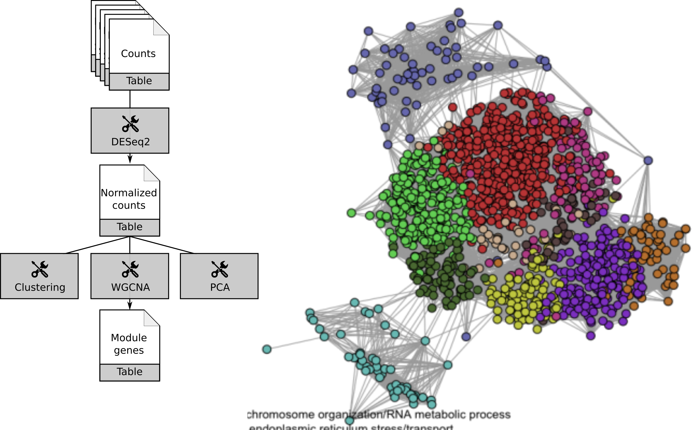 <!-- .element width="90%" -->

----
### DEG: Stats

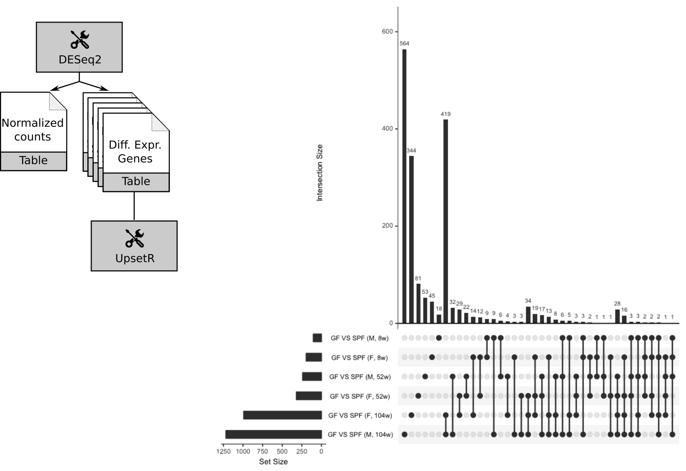 <!-- .element width="80%" -->

----
### DEG: Z-score

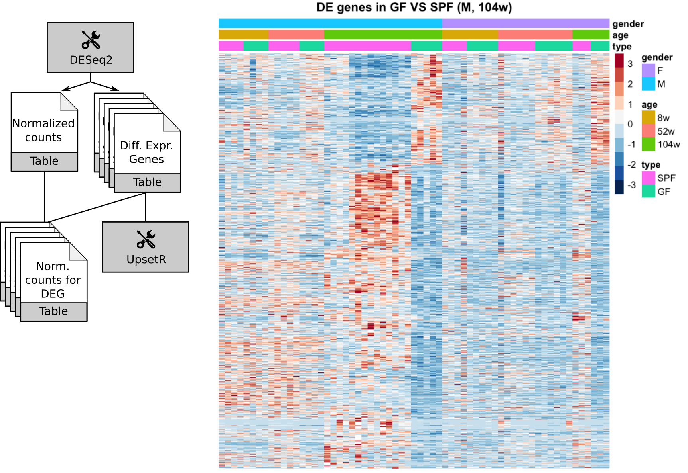 <!-- .element width="80%" -->

Note:

Z-score = 

----
### GO enrichment analysis

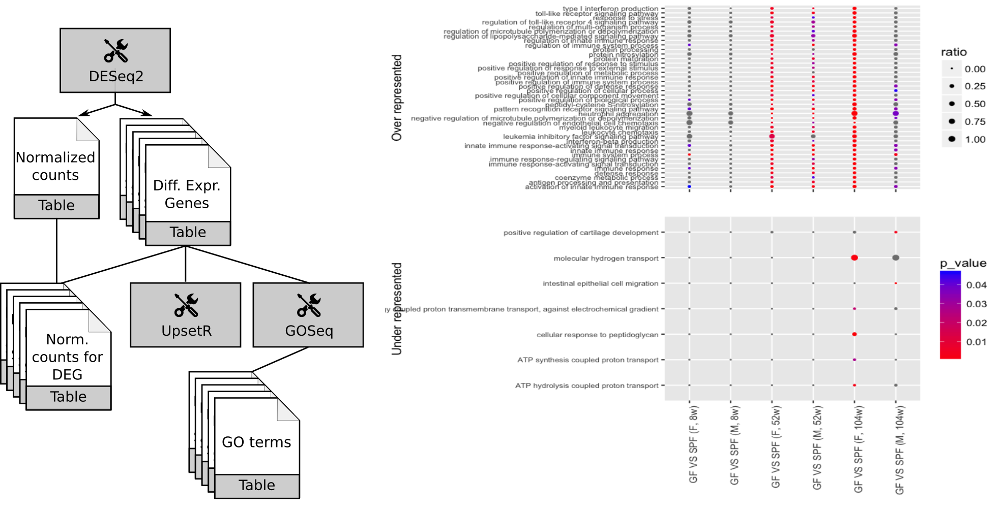 <!-- .element width="100%" -->

----
### GO enrichment analysis

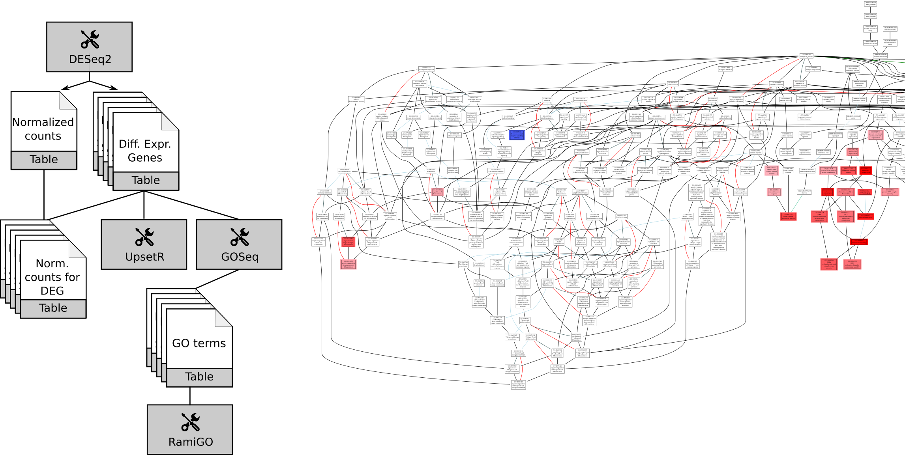 <!-- .element width="100%" -->

----
### KEGG enrichment analysis

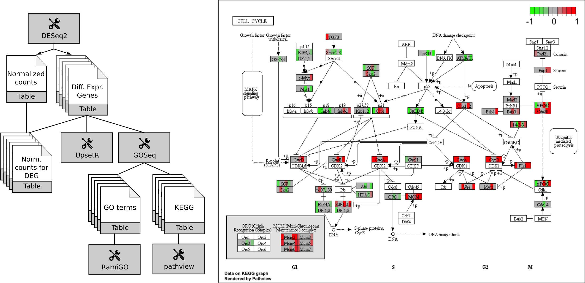 <!-- .element width="100%" -->

---
### How?

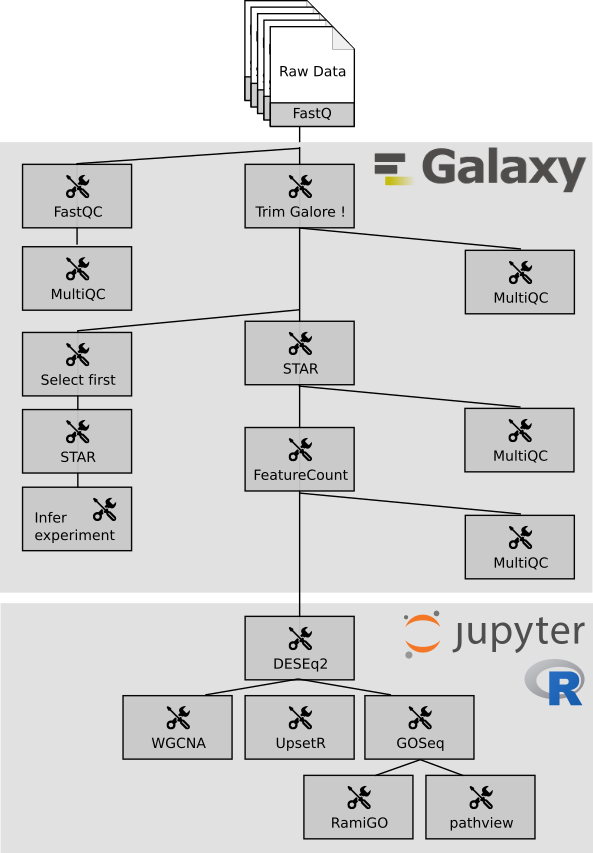 <!-- .element width="40%" -->

Note:

- Analysis
    - Until DESeq into Galaxy: data library, workflow, BioBlend
    - DESeq and after: several Jupyter notebooks with a shared functions
    - conda environment

----
### How?

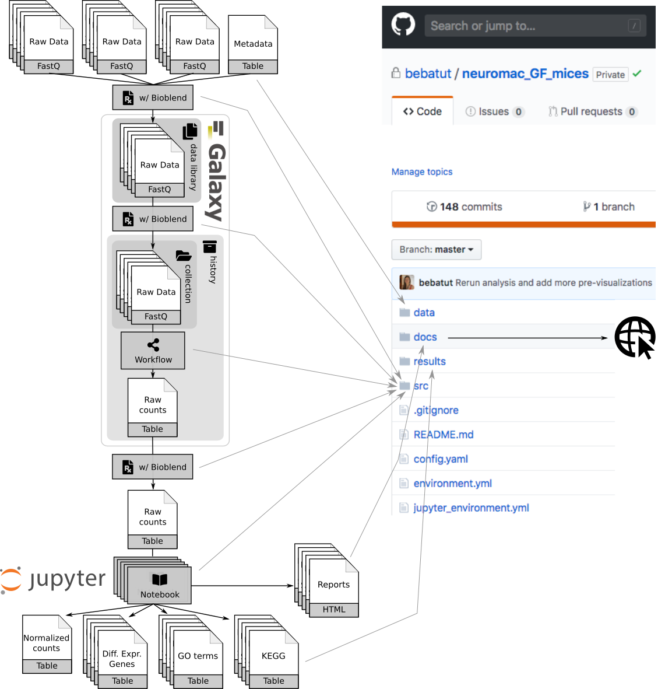 <!-- .element width="55%" -->

---
### Lesson learned: What to do?

- Tools
    - DESEq2: support for complex setup
    - Missing tools: WGCNA, UpsetR, GOSeq, RamiGO, pathview
    - Automatic MultiQC
- Data and FAIRness  <!-- .element: class="fragment" data-fragment-index="1" -->
    - Tags: API, visible on tool form
    - Rule based upload
        - Support for data library and local data
        - Population of metadata
        - API support
- Notebooks: Stable in Galaxy, Get/Generate datasets in history  <!-- .element: class="fragment" data-fragment-index="2" -->
- Collaboration: Report generation  <!-- .element: class="fragment" data-fragment-index="3" -->
- Training: tutorials for complex RNA-Seq analysis and R <!-- .element: class="fragment" data-fragment-index="4" -->

---
## Thank you!

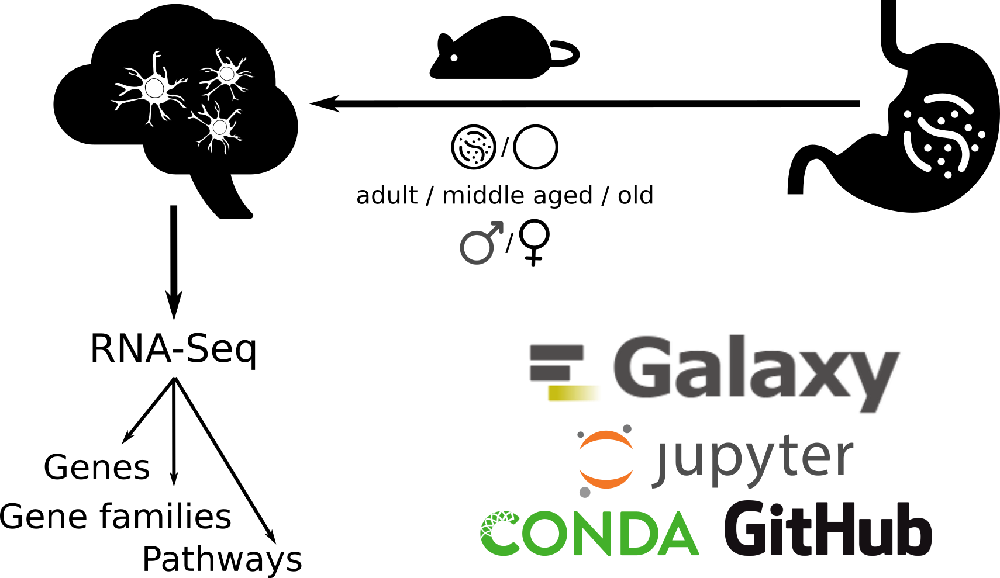 <!-- .element width="60%" -->

Collaborators: Omar Mossad and Thomas Blank, Uniklinik, Freiburg
