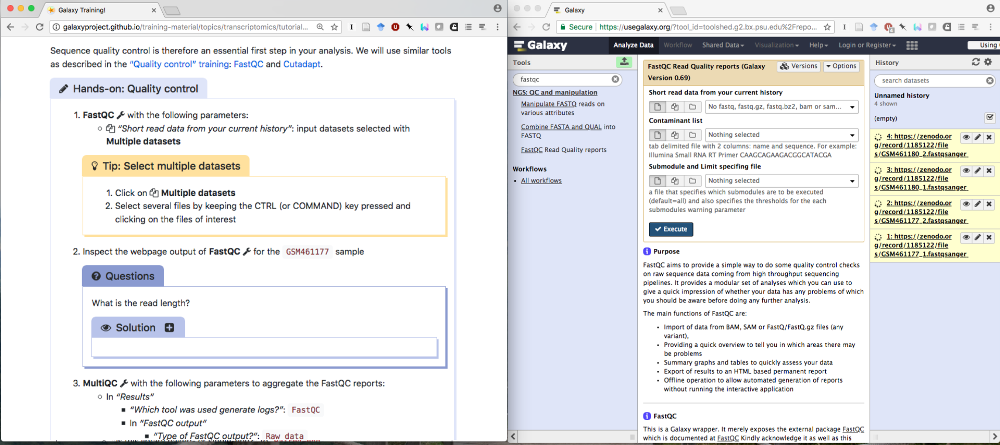
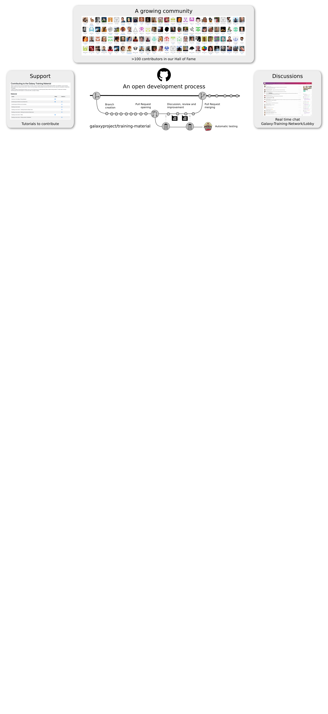
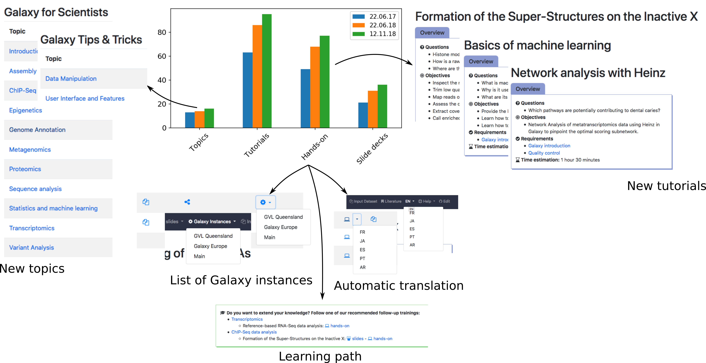
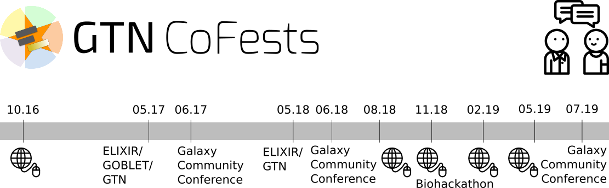
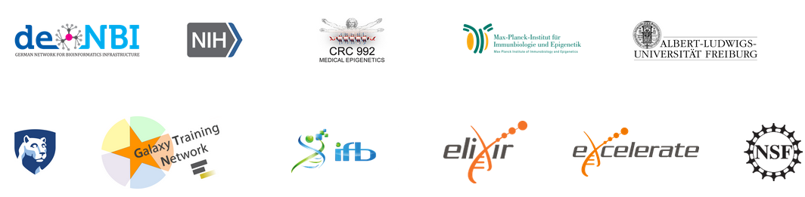

Hello! I am [Bérénice](http://bebatut.fr/), the author of following slides.

<small>
This slide does not exist in original deck. It is useful if you are not familiar with [Reveal.JS](https://github.com/hakimel/reveal.js), used here.
</small>

The easiest way to navigate this slide deck is by hitting `[space]`on your keyboard.

---
### Update on the Galaxy Training Network

 <!-- .element width="60%" -->

Bérénice Batut

<small>
European Galaxy Days - November 2018
</small>

---
### Galaxy Training materials

 <!-- .element width="70%" -->

https://training.galaxyproject.org

<small>
Online training material covering many current research topics
</small>

----
### Interactive learning via hands-on tutorials  built around a "research story"

 <!-- .element width="100%" -->

Usable for effective training for individual users & instructors

Note:

Designed to be interactive and built around Galaxy

Built around a "research story"
- Introduction
- Data upload (downsampling)
- Hands-on with different steps

Metadata to help trainees and instructors to keep track of the training goads
- Learning objectives
- Prerequisites
- Questions: Regular assessments with question boxes

----
### Community-driven

 <!-- .element width="120%" -->

---
### An update!

----
### For Users: New content + instance annotation

Note:
- Number of topic & tutorials
- New topics & tutorials
- Annotations
- Translation

----
### For Contributors: Simplified contribution path

----
### For Instructors: More support and visibility

- Ready to use training material
- Training Handbook and philosophies
- Mentoring / discussions
- Training Infrastructure as a Service (TIaaS)

 <!-- .element width="55%" -->

----
### For all these communities

 <!-- .element width="100%" -->

More interaction with external communities: ELIXIR, GOBLET

---
## Thank you!

 <!-- .element width="100%" -->

<section style="text-align: right; margin-right: 2em;">
 <!-- .element width="50%" -->
</section>

<section style="text-align: left;">
<i class="fa fa-github"></i> [github.com/galaxyproject/training-material](http://github.com/galaxyproject/training-material)

 <!-- .element width="100%" -->
</section>

