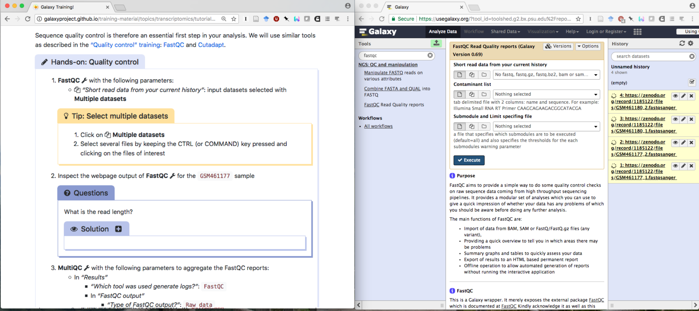
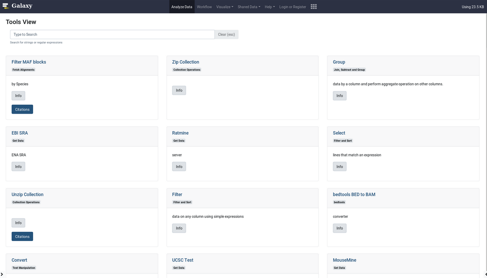

Hello! I am [Bérénice](http://bebatut.fr/), the author of following slides.

<small>
This slide does not exist in original deck. It is useful if you are not familiar with [Reveal.JS](https://github.com/hakimel/reveal.js), used here.
</small>

The easiest way to navigate this slide deck is by hitting `[space]`on your keyboard.

---

### Galaxy Training Network and Schema.org

 <!-- .element width="60%" -->

Bérénice Batut

<small>
Boost Your Visibility – Improving F of FAIR for Dutch Training and Data Resources through Bioschemas - February 2019
</small>

---
### Galaxy: a great solution to deliver training

 <!-- .element width="60%" -->

- Web interface for numerous bioinformatics tools
- No issue with computer configuration during training

---
### Galaxy Training materials

 <!-- .element width="70%" -->

https://training.galaxyproject.org

<small>
Online training material covering many current research topics
</small>

Note:

17 topics

----
### Interactive learning via hands-on tutorials <br>built around a "research story"

 <!-- .element width="100%" -->

Usable for effective training for individual users & instructors

Note:

Designed to be interactive and built around Galaxy

Built around a "research story"
- Introduction
- Data upload (downsampling)
- Hands-on with different steps

Metadata to help trainees and instructors to keep track of the training goads
- Learning objectives
- Prerequisites
- Questions: Regular assessments with question boxes

----
### Training material infrastructure 

 <!-- .element width="100%" -->

----
### Schemas.org support for tutorials

 <!-- .element width="100%" -->

----
### Schema.org support for tutorials

```json
{
  "@context": "http://schema.org",
  "@type": "CreativeWork",
  "name": Title from metadata,
  "accessModeSufficient": "visual",
  "accessibilityControl": "fullMouseControl",
  "accessibilityFeature": ["alternativeText", "tableOfContents"],
  "audience": {
    "@type": "EducationalAudience",
    "educationalRole": "students"
  },
  "inLanguage": {
    "@type": "Language",
    "name": "English",
    "alternateName": "en"
  },
  "interactivityType": "mixed",
  "isAccessibleForFree": true,
  "license": Link to LICENSE.md on GitHub,
  "learningResourceType": "",
  "url": Automatically generated,
  "mentions": List of "Thing" with input data, workflow, interactive tours,
  "timeRequired": Time formatted from metadata,
  "contributor": List of "Person" with the contributors from the metadata,
  "description": Text with questions, learning objectives and keypoints from metadata,
  "keywords": List of tags from the metadata
}
```

---
### Galaxy community events

 <!-- .element width="80%" -->

https://galaxyproject.org/

----
### Schemas.org support for events

 <!-- .element width="100%" -->

----
### Schemas.org support for events

```json
{
  "@context": "http://schema.org/",
  "@type": "Event",
  "name": Title from metadata,
  "url": External URL from metadata, 
  "duration": Time formatted from metadata, 
  "location": {
    "@type": "Place",
    "address": Location from metadata,
    "url": Location URL from metadata
  },
  "eventType": "workshops and courses",
  "contact": {
    "@type": "person",
    "name": Name from metadata
  },
  "startDate": Date from metadata
}
```

---
### Schemas.org support for Galaxy tools?

 <!-- .element width="100%" -->

---
## Thank you!

 <!-- .element width="100%" -->

<div id="left">
<section style="text-align: left;">
Training
<br>
<i class="fa fa-globe"></i> [training.galaxyproject.org](http://training.galaxyproject.org)
<br>
<i class="fa fa-github"></i> [github.com/galaxyproject/training-material](http://github.com/galaxyproject/training-material)
</section>
</div>

<div id="right">
<section style="text-align: left;">
Community Hub
<br>
<i class="fa fa-globe"></i> [galaxyproject.org](http://galaxyproject.org)
<br>
<i class="fa fa-github"></i> [github.com/galaxyproject/galaxy-hub](http://github.com/galaxyproject/galaxy-hub)
</section>
</div>