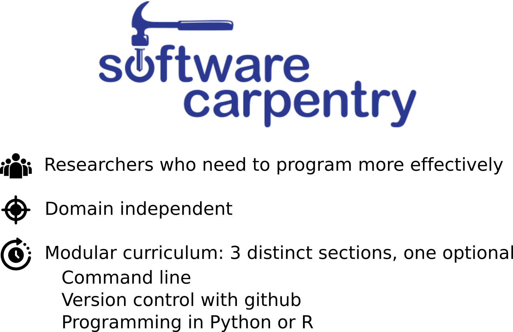
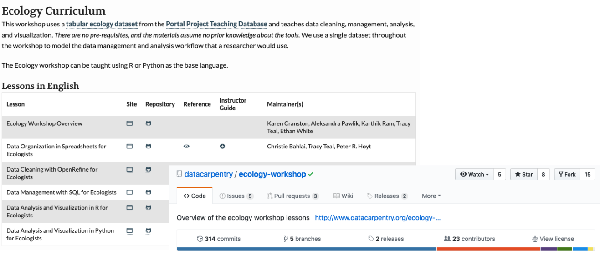
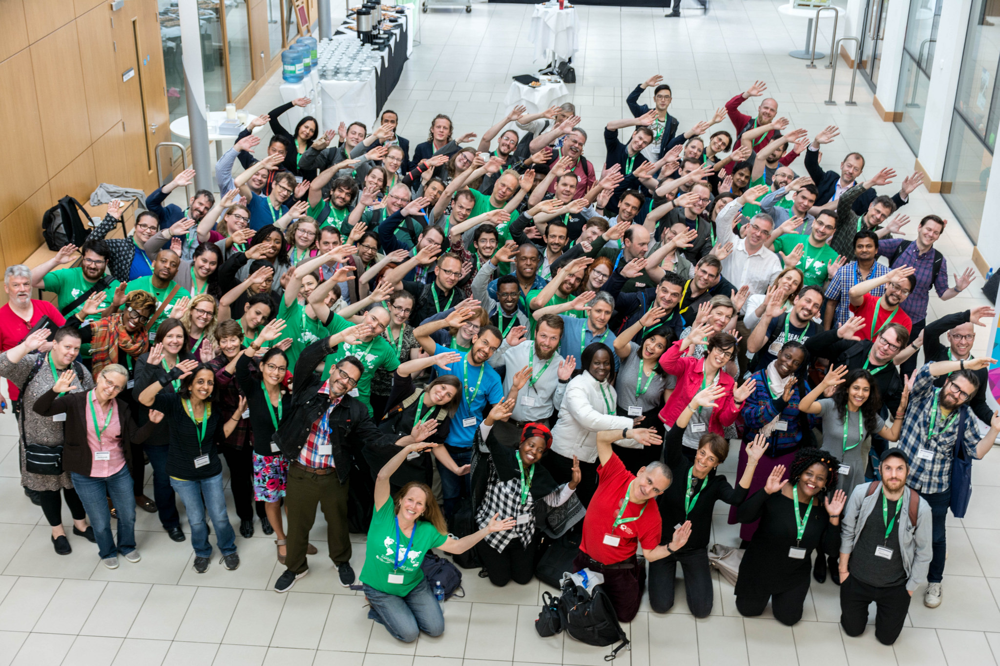
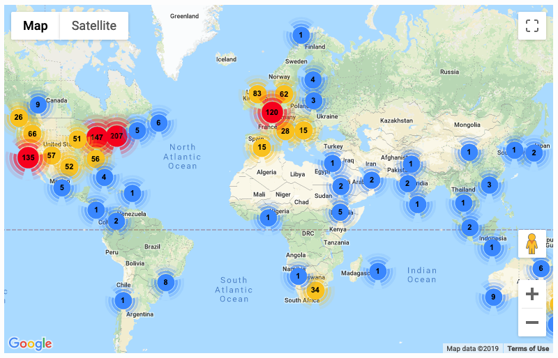
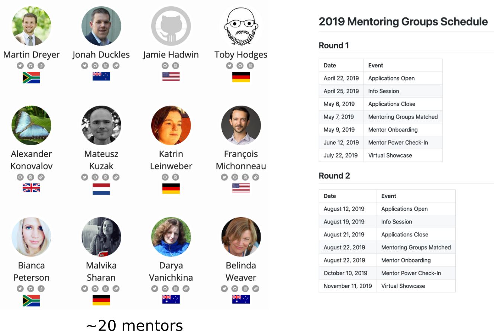
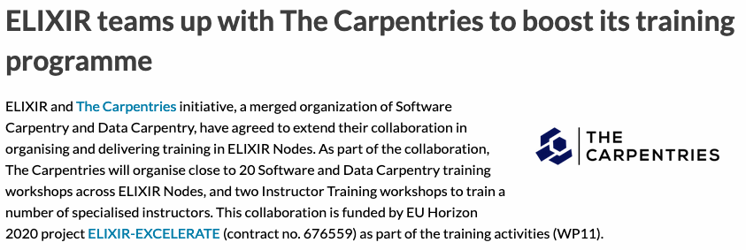

 <!-- .element width="60%" -->

#### Software, Data and Library Carpentry

Bérénice Batut

<small>
ELIXIR Bioinformatics Training Tools Workshop - Febuary 2019
</small>

---
### Perspectives and needed skills to work with software and data

  <!-- .element width="80%" -->

<small>
Source: [Magnai17 on Wikimedia](https://commons.wikimedia.org/wiki/File:Defining-big-data1.png)
</small>

Note:

Skills and perspectives to work with software and data are increasingly important as we generate more data

Big data 4V

This has only become more important as code and software development is integral or forms the basis of so much of our work. With the emergence of our ability to generate increasing amounts of data, research and work in almost every domain has a data and computational component, including the whole new field of data science.

----
### Researchers are very interested in learning these skills

Survey by Bioinformatics Resource Australia on what it would be most useful for them to offer

http://braembl.org.au/news/braembl-community-survey-report-2013

Note:

It’s not just reports that say that people need to learn these skills. Engineers and researchers themselves want to learn these skills. A lack of these skills is limiting the full potential of people in their research and careers.

----
### Current unmet needs

 <!-- .element width="90%" -->

<small>
Source: [Barone et al, 2017](https://journals.plos.org/ploscompbiol/article?id=10.1371/journal.pcbi.1005755)
</small>

Note:

In a survey of biology NSF PIs, the top 3 unmet needs are around training

---

## How do we scale  data and software skills  along with data production?

Note:

How do we scale software and data skills training along with this data production. This is what SWC and DC do ,and I’m going to talk about what we do in SWC and DC and some of our outcomes with this approach.

---
### Building Skills and Community

- Create training 'in the gaps' that is
    - accessible
    - approachable
    - aligned
    - applicable
- Provide open and collaborative lesson materials
- Organize peer-led hands-on intensive workshops
- Build and support a community of volunteer instructors

 <!-- .element width="60%" -->

Note:

We teach skills and perspectives and build communities through – peer-led 2-day hands on intensive workshops, - volunteer instructors – open and collaborative lessons – support for community

The Carpentries: a non-profit organization that:
- Trains people in software development and data science skills for more effective work and career development
- Builds community and local capacity for teaching and learning these skills and perspectives

Software and Data Carpentry are non-profit organizations that – train people in software development and data science skills for more effective research and work and for career development and – build community and local capacity for teaching and sharing these skills and perspectives

---
### Workshops

 <!-- .element width="80%" -->

- 2-days, active learning
- Trained instructors
- Friendly learning environment
- Feedback to learners throughout the workshop

Note:

Workshops:
- 2-day, hands-on, interactive
- friendly learning environment (CoC)
- teaching the foundational skills and perspectives for working with software and data

----
### Workshop goals

- Teach skills
- Get people started and introduce them to what’s possible
- Build confidence in using these skills
- Encourage people to continue learning
- Positive learning experience

 <!-- .element width="60%" -->

<small>
Source: [Ten Thousand - xkcd](https://xkcd.com/1053/)
</small>

Note:

Goals of the workshop, aren’t just to teach the skills, but to build self-efficacy and increase confidence and create a positive learning experience. We know we can’t teach everything in two days, but we want to teach the foundational skills and get people started and give them the confidence to continue learning. Many people have had demotivating experience when learning things like coding or computational skills, and we want to change that perspective.

@ the workshop we show:

- that anyone can learn to code
- not to be afraid of making mistakes
- learning through mistakes

@ the workshop
- don’t be afraid of not knowing
- don’t be afraid of asking question
- it’s not about knowing the answer but knowing
how to search for the answers

---

 <!-- .element width="70%" -->

----

 <!-- .element width="90%" -->

Note:

Working effectively with data and includes domain-specific content

Data Carpentry is focused on data science and data skills and teaches domain-specific workshops on working with data. This includes effective data organization, data cleaning and data analysis and visualization using R or Python

Data Carpentry has curriculum in several domains, working with the data type and examples from that field, and has others in development

----

 <!-- .element width="90%" -->

Note:

Software Carpentry is focused on software development skills and teaches the command line, version control with github and R or Python

----

 <!-- .element width="90%" -->

Note:

Library Carpentry workshops teach people working in library- and information-related roles how to: 
- Cut through the jargon terms and phrases of software development and data science and apply concepts from these fields in library tasks; 
- Identify and use best practice in data structures; 
- Learn how to programmatically transform and map data from one form to another; 
- Work effectively with researchers, IT, and systems colleagues; 
- Automate repetitive, error prone tasks.

- Introduction to Data

    An introduction to data structures, regular expressions, and computing terms (Jargon Busting & Pattern Matching) 

- The Unix Shell 
    
    An introduction to command line interfaces and task automation using the Unix shell (Text-based) 

- Introduction to Git

    An introduction to version control using Git and GitHub for collaboration (GitHub Focus) 

- OpenRefine 

    An introduction to cleaning up and enhancing a dataset using OpenRefine (Journal Metadata Cleaning)

---
### Our Workshops

 <!-- .element width="70%" -->

Note:

- 1.7K workshopts run
- 7 continents
- 46 countries

----
### Our learners

 <!-- .element width="60%" -->

Note:

38K learners reached

### Who takes workshops?

Career stage of people taking workshops. Notice many graduate students and postdocs, but also faculty who are looking not necessarily to learn the skills themselves but establish better practices in their labs.

----

 <!-- .element width="100%" -->

 <!-- .element width="100%" -->

Note:

Short and long term surveys show that people are learning the skills, putting them into practice in their work and have more confidence in their ability to do computational work.

Also, they just like the workshop, feeling it was a good use of their time and that they would recommend it to a colleague or friend.

And one of the things people like most are the instructors, which is great for learners for their experience, but also seeing peers as role models in this space, and when the instructors get this kind of feedback they feel like their contributions and teaching are valued.

Green dots are pre-workshop responses. Blue dots are post workshop. We can see that in just two days, people’s confidence in their ability to use the tools and solve challenges has increased significantly.

WriteProgram: I can write a small program/script/macro to solve a problem in my own work.
TechnicalQuestions: I know how to search for answers to my technical questions online.
RawData: Having access to the original, raw data is important to be able to repeat an analysis.
ProgrammingEasier: Using a programming language (like R or Python) can make my analyses easier to reproduce.
OvercomeProblem: While working on a programming project, if I get stuck, I can find ways of overcoming the problem.
ImmediatelyApply: I can immediately apply what I learned at this workshop.
ConfidentProgramming: I am confident in my ability to make use of programming software to work with data.
ConfidenceSoftware: Using a programming language (like R or Python) can make me more efficient at working with data.
ComfortableLearning: I felt comfortable learning in this workshop environment.

----
### People have more confidence and continue learning 6 months or more after workshops

 <!-- .element width="100%" -->

Note:

Do these improved outcomes continue after a workshop? We just are running a longer term survey, of people who took a workshop 6 months or more ago. So far we have over 500 responses, and we continue to see positive outcomes in all these categories. Importantly, we see that people are continuing to learn after the workshop, so it has set them on a pathway of learning.
Do these improved outcomes continue after a workshop? We just are running a longer term survey, of people who took a workshop 6 months or more ago. So far we have over 500 responses, and we continue to see positive outcomes in all these categories. Importantly, we see that people are continuing to learn after the workshop, so it has set them on a pathway of learning.

People use the tools more frequently after workshops and continue to report more confidence in using them

---
### Training Material

 <!-- .element width="100%" -->

Online, Openly and collaboratively developed with continual improvement and up-to-date

Note:

Curriculum. Also, all our teaching materials are open and available and colalboratively developed. This means the lessons are a public resource both for contributions to the lessons and for people to be able to use. Because of this, they get better because they’re being taught hundreds of times, and also because they can be udpated, they’re kept current with the tools and approaches people are using in their work and research.

---

 <!-- .element width="90%" -->

Note:

A group of people excited about software and data skills and about sharing them with others
- Mentoring program and instructor onboarding
- Discussion groups and community calls
- Email lists
- Teaching at other institutions

Community. One of the un-intended consequences of building this training program has been the growth of a community. Our learners and volunteer instructors in particulr list being part of the community as one of the primary reasons they work witth the Carpentries. It’s a group of people excited about computational skills, but also about teaching and sharing them. We have a mentoring program to help new instructors, discussion sessions for people to talk about workshops, onboarding process for new instructors and because people go to different institutes to teach, opportunities to travel and grow their network and meet other instructors and learners.

----
### Instructors

 <!-- .element width="60%" -->

- Over 1,600 volunteer instructors on 6 continents
- Instructor training program teaching educational pedagogy

Note:

Instructor training program that teaches educational pedagogy. How to teach generally as well as for Carpentries workshops.

A big part of this positive workshop experience is our instructors. We have over 900 volunteer instructors on 6 continents. We have an instructor training program that teaches educational pedagogy and emphasizes creating an approachable and inclusive environment, including with our CoC. For many of our instrucotrs, they say this is the first time they’ve had access to training on how to teach. The instructors are generally active researchers, graduate students, postdocs or research scientists who have computational skills, often having had to struggle to learn them on their own, and are passionate about sharing these skills with others.

----
### Community Discussions

- **Pre- and Post-Workshop Discussions**, to get ready to teach or discuss workshop with the community
- **Themed Discussion Sessions**, around a particular topic
- **Carpentries Conversations**, hosted by one of our Committees or Task Forces
    - African Task Force
    - Carpentries en Latinoamérica
    - CarpentryCon Task Force
    - Code of Conduct Committee
    - Instructor Development Committee
    - Lesson Infrastructure Committee
    - The Carpentries Executive Council

----
### Mentoring

Guide small groups of no more than five mentees  toward a particular outcome

 <!-- .element width="70%" -->

---
## And ELIXIR in that?

 <!-- .element width="100%" -->

<small>Source: [ELIXIR](https://www.elixir-europe.org/news/elixir-carpentries-agreement)</small>

----
### Current and previous events

 <!-- .element width="90%" -->

<small>Source: [TeSS](https://tess.elixir-europe.org/events?include_expired=true&q=carpentr%2A#map)</small>

----
### 4OSS

 <!-- .element width="80%" -->

<small>Source: 4OSS [website](https://softdev4research.github.io/4OSS-lesson/) and [GitHub](https://github.com/SoftDev4Research/4OSS-lesson)</small>

---
## Thank you!
